# Session 21 – Final DevOps Project: TaskBoard

**Author:** Ankit Kumar · **Repo:** [ankit14-dev/devops-heros](https://github.com/ankit14-dev/devops-heros) · **Pipeline:** [Final Project – TaskBoard CI/CD](https://github.com/ankit14-dev/devops-heros/actions/workflows/final-devops-project.yml)

An end-to-end DevOps project built on the instructor's Session 21 **TaskBoard** capstone app (React + FastAPI + PostgreSQL). It takes the app from source code all the way to a monitored, GitOps-managed Kubernetes deployment, using everything from the course.

## Contents

1. [Project overview](#1-project-overview)
2. [Architecture](#2-architecture)
3. [Technologies used](#3-technologies-used)
4. [Application setup](#4-application-setup)
5. [Docker setup](#5-docker-setup)
6. [Kubernetes deployment](#6-kubernetes-deployment)
7. [Helm deployment](#7-helm-deployment)
8. [Terraform infrastructure](#8-terraform-infrastructure)
9. [CI/CD pipeline](#9-cicd-pipeline)
10. [DevSecOps](#10-devsecops)
11. [Monitoring](#11-monitoring)
12. [GitOps](#12-gitops)
13. [Final troubleshooting challenge](#13-final-troubleshooting-challenge)
14. [Lessons learned](#14-lessons-learned)

```text
final-devops-project/
├── application/        backend/ (FastAPI, SQLAlchemy, Alembic, pytest)  frontend/ (React + Vite, nginx)
├── docker/             docker-compose.yml (full local stack)
├── kubernetes/         plain manifests: Namespace, ConfigMap, Secret template, PostgreSQL StatefulSet+PVC,
│                       Deployments with probes, Services, Ingress, HPA
├── helm/taskboard/     Helm chart (+ values-dev / values-prod, Grafana dashboard, alert rules, helm test)
├── terraform/          AWS: VPC, subnet, IGW, routes, SG, IAM, EC2 running k3s, S3 backup bucket
├── .github/workflows/  ci-cd.yml -> ../../.github/workflows/final-devops-project.yml (GitHub runs it from the repo root)
├── security/           Trivy, gitleaks, Bandit configs + security gate policy
├── monitoring/         kube-prometheus-stack values, traffic generator
├── gitops/             Argo CD Application + values-gitops.yaml (image tags bumped by CI)
├── troubleshooting/    break.sh (5 injected faults) + fix.sh
└── screenshots/
```

---

## 1. Project overview

**TaskBoard** is a small project-management SaaS app: create tasks, move them TODO → IN PROGRESS → DONE, and see stats.

| Layer | What I built / changed |
|---|---|
| Application | Instructor's app, plus: deps upgraded and pinned (old pins had CVEs and no wheels for new Python), `lifespan` instead of the deprecated `on_event`, configurable CORS/env, **3 → 11 tests (100% coverage)** run against real PostgreSQL in CI, frontend deps pinned with a lockfile, nginx backend URL configurable via template |
| Containers | Non-root images (backend uid 10001, `nginx-unprivileged` frontend), healthchecks, multi-stage frontend build |
| Kubernetes / Helm | My own chart: StatefulSet + PVC, init container waiting for the DB, startup/readiness/liveness probes, HPA, Ingress, auto-generated or existing Secret, ServiceMonitor, PrometheusRule, Grafana dashboard, `helm test` |
| CI/CD + DevSecOps | 12-job GitHub Actions pipeline: test → SAST/SCA/secrets → build → Trivy → gate → GHCR → Helm deploy on kind → GitOps tag bump |
| GitOps | Argo CD multi-source app; CI commits the new tag, Argo CD deploys it |
| Infra | Terraform for AWS (VPC + EC2/k3s + S3 backups + least-privilege IAM) |

## 2. Architecture

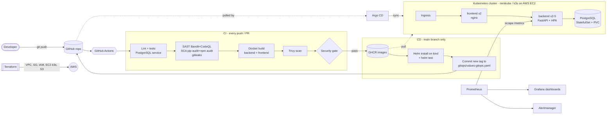

Request path inside the cluster: `Ingress /` → **frontend** (static React) · `Ingress /api` → **backend** Service → backend pods → `taskboard-postgres` (headless Service) → PostgreSQL pod with its own PVC.

## 3. Technologies used

| Area | Tools |
|---|---|
| App | Python 3.12, FastAPI, SQLAlchemy 2.1, Alembic, PostgreSQL 16, React 19, Vite 8, nginx |
| Quality | pytest + pytest-cov, ruff |
| Containers | Docker, Docker Compose, GHCR |
| Orchestration | Kubernetes (minikube, kind in CI, k3s on AWS), Helm 3 |
| CI/CD | GitHub Actions |
| Security | Bandit, CodeQL, pip-audit, npm audit, gitleaks, Trivy |
| Observability | Prometheus Operator (kube-prometheus-stack), Grafana, Alertmanager, prometheus-fastapi-instrumentator |
| GitOps | Argo CD 3.5 |
| IaC / Cloud | Terraform, AWS (VPC, EC2, S3, IAM, SSM) |

## 4. Application setup

```bash
cd application/backend
python -m venv .venv && . .venv/bin/activate
pip install -r requirements-dev.txt
ruff check . && pytest -q --cov=app          # 11 passed, 100% coverage
```

| Endpoint | Purpose |
|---|---|
| `GET /health` | liveness (process up) |
| `GET /ready` | readiness (runs a DB query) |
| `GET/POST /api/tasks`, `GET/PUT/DELETE /api/tasks/{id}`, `GET /api/tasks/stats` | REST API |
| `GET /metrics` | Prometheus metrics |

## 5. Docker setup

```bash
cd docker && docker compose up -d --build     # http://localhost:3000
```

The backend container runs `alembic upgrade head` (migration `0001_create_tasks`) before uvicorn. Compose waits for PostgreSQL's healthcheck before starting it:

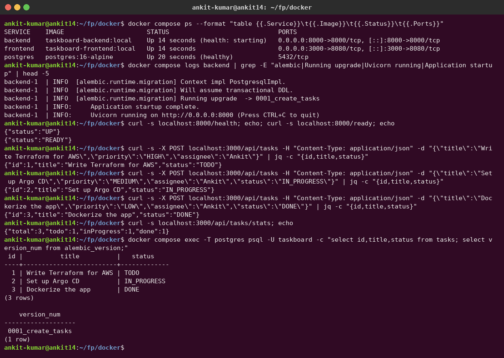

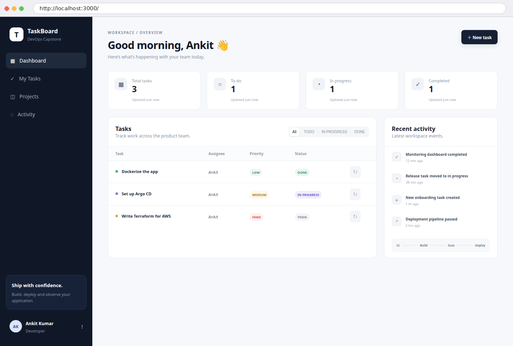

## 6. Kubernetes deployment

[`kubernetes/`](kubernetes) holds plain manifests (no Helm) for every required object:

| Requirement | File |
|---|---|
| Deployment | `04-backend.yaml`, `05-frontend.yaml` |
| Service | headless `postgres`, ClusterIP `backend` / `frontend` |
| ConfigMap | `01-configmap.yaml` (env, DB host/name/user, CORS) |
| Secret | `02-secret.example.yaml` (template only; the real Secret is created with `kubectl create secret`) |
| Ingress | `06-ingress.yaml` (`/api` → backend, `/` → frontend) |
| HPA | `07-hpa.yaml` (2–5 replicas at 60% CPU) |
| Probes | startup + readiness (`/ready` checks the DB) + liveness on the backend, `/healthz` on the frontend, `pg_isready` on PostgreSQL |
| Storage | PostgreSQL StatefulSet `volumeClaimTemplates` → PVC per pod |

```bash
kubectl apply -f kubernetes/00-namespace.yaml -f kubernetes/01-configmap.yaml
kubectl -n taskboard-k8s create secret generic taskboard-db --from-literal=postgres-password="$(openssl rand -base64 24)"
kubectl apply -f kubernetes/03-postgres.yaml -f kubernetes/04-backend.yaml -f kubernetes/05-frontend.yaml -f kubernetes/06-ingress.yaml -f kubernetes/07-hpa.yaml
```

## 7. Helm deployment

The same objects as a configurable chart, [`helm/taskboard`](helm/taskboard), plus monitoring objects:

```bash
helm lint helm/taskboard
helm upgrade --install taskboard helm/taskboard -n taskboard --create-namespace -f helm/taskboard/values-dev.yaml --wait
helm test taskboard -n taskboard
```

Chart highlights:
- `secret.yaml` generates a random DB password **once** (it uses `lookup` to keep it across upgrades and `resource-policy: keep`), or uses `postgresql.existingSecret`.
- A `checksum/config` annotation restarts the backend when the ConfigMap changes.
- A `wait-for-db` init container. Before I added it, the backend restarted twice on a fresh install because Alembic ran before PostgreSQL was ready.
- ServiceMonitor and PrometheusRule are only rendered when the Prometheus Operator CRDs exist (`.Capabilities.APIVersions.Has`), so the same chart installs on a bare kind cluster in CI.

## 8. Terraform infrastructure

[`terraform/`](terraform) provisions everything needed to run the project on AWS:

| Resource | Why |
|---|---|
| VPC `10.21.0.0/16`, public subnet, Internet Gateway, route table | network |
| Security group: 80/443 in, **no SSH** | access only through the Ingress; admin access via **SSM Session Manager** |
| IAM role + instance profile | `s3:PutObject/GetObject` on **only** the backup bucket + SSM; no access keys on the server |
| EC2 `t3.micro` (Ubuntu 24.04, encrypted gp3, IMDSv2 only) | runs **k3s**. [`bootstrap-k3s.sh.tftpl`](terraform/bootstrap-k3s.sh.tftpl) adds swap, installs k3s + Helm, clones this repo, creates the DB Secret and `helm install`s the chart with the GHCR image tag from CI |
| S3 bucket (versioned, private, 30-day lifecycle) | nightly `pg_dump` backups from a cron job |

```bash
cd terraform
terraform init && terraform fmt && terraform validate
terraform plan -out tfplan && terraform apply tfplan
terraform output taskboard_url
terraform destroy
```

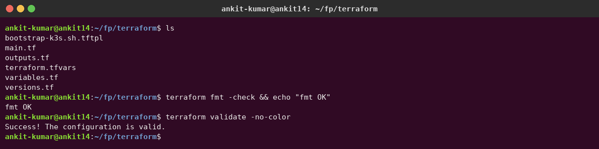

<!-- AWS-APPLY -->
> The AWS `plan` / `apply` / `destroy` evidence for this module will be added after AWS credentials are configured (Sessions 18 and 19 use the same account).

## 9. CI/CD pipeline

[`.github/workflows/final-devops-project.yml`](../.github/workflows/final-devops-project.yml): 12 jobs, path-filtered to this project.

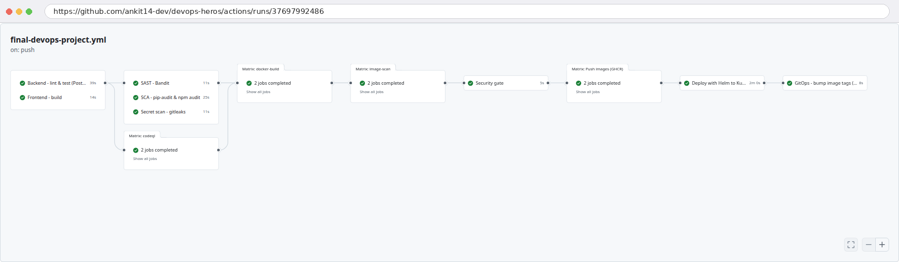

| Stage | Job(s) | Details |
|---|---|---|
| Build & test | `backend-test`, `frontend-build` | ruff, **Alembic migration against a PostgreSQL service container**, pytest + coverage (JUnit/XML artifacts); `npm ci && npm run build` |
| Security | `sast`, `codeql` (python + JS matrix), `sca`, `secret-scan` | see §10 |
| Docker build | `docker-build` (matrix) | images saved as artifacts, so the scanned image is exactly the pushed one |
| Image scan | `image-scan` (matrix) | Trivy with [`security/trivy.yaml`](security/trivy.yaml) |
| Gate | `security-gate` | blocks everything after it |
| Image push | `push-images` | GHCR `:<sha>` + `:latest`, `GITHUB_TOKEN` with `packages: write` only here |
| Kubernetes deployment | `deploy-test-cluster` | kind cluster → `helm upgrade --install` with the new tag → `helm test` → end-to-end POST/GET through the frontend |
| GitOps | `gitops-update` | commits `tag: <sha>` to `gitops/values-gitops.yaml` with `[skip ci]` |

The first run passed with **all 15 jobs green** (matrix jobs counted separately):

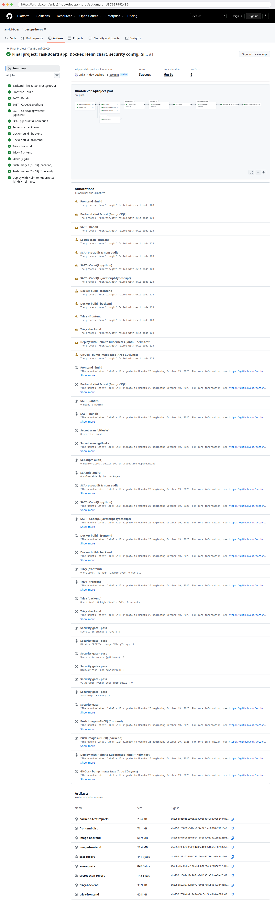

## 10. DevSecOps

| Control | Tool | Result on this project |
|---|---|---|
| SAST | Bandit (with [`security/bandit.yaml`](security/bandit.yaml)) + CodeQL Python & JavaScript | 0 high, 0 medium |
| SCA | pip-audit, `npm audit --omit=dev` | 0 vulnerable packages (after upgrading the old pins) |
| Secret scanning | gitleaks + [`security/.gitleaks.toml`](security/.gitleaks.toml) | 0 secrets |
| Container image scanning | Trivy (vulns + secrets, fixable only) | backend 0 critical / 0 high; frontend 0 critical / 42 high (Alpine/nginx packages; reported, not blocking) |
| Security gate | policy in [`security/security-gate-policy.md`](security/security-gate-policy.md) | ✅ pass, so push and deploy ran |

Runtime hardening: non-root containers, `allowPrivilegeEscalation: false`, dropped capabilities, resource limits, DB password never in Git (generated by Helm or created with kubectl), IMDSv2 and encrypted disks on EC2.

## 11. Monitoring

kube-prometheus-stack on minikube ([`monitoring/kube-prometheus-stack-values.yaml`](monitoring/kube-prometheus-stack-values.yaml)). The chart adds a **ServiceMonitor** (backend `/metrics` every 15 s), a **PrometheusRule** with 4 alerts, and a **Grafana dashboard** ConfigMap that the Grafana sidecar loads automatically.

I generated traffic with [`monitoring/traffic.sh`](monitoring/traffic.sh):

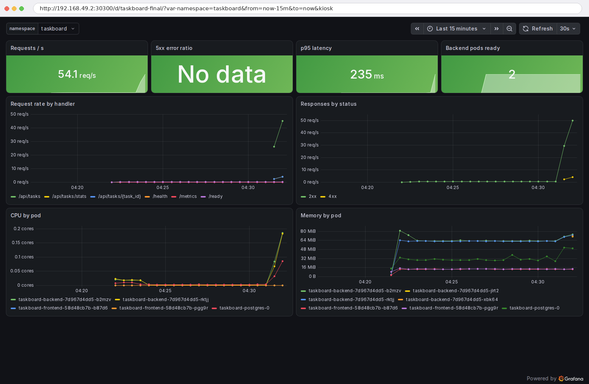

Live metrics: ~54 req/s, p95 235 ms, CPU and memory per pod. The `/api/tasks/{task_id}` 4xx line is the deliberate 404s from the traffic script. The **HPA scaled the backend 2 → 5** at `cpu: 241%/60%`:

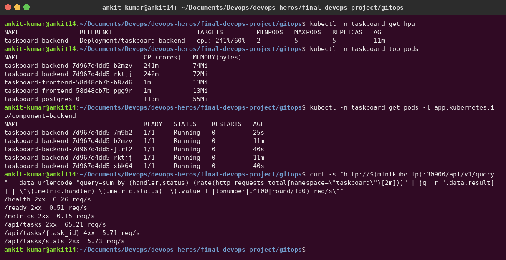

Alert rules loaded (inactive = healthy): `TaskboardBackendDown`, `TaskboardHighErrorRate`, `TaskboardHighLatencyP95`, `TaskboardPodRestarting`:

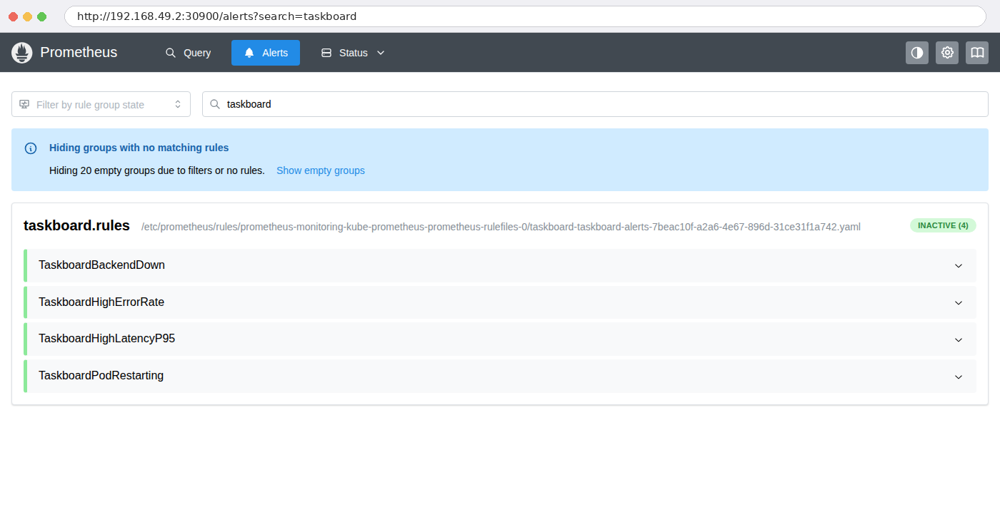

> I fixed one dashboard bug found here: the "5xx error ratio" panel showed *No data* instead of 0, because `sum()` over zero 5xx series returns nothing. It now uses `(sum(...) or vector(0))`.

## 12. GitOps

[`gitops/argocd-application.yaml`](gitops/argocd-application.yaml) is a **multi-source** Argo CD app: the chart comes from `helm/taskboard`, and `$values/final-devops-project/gitops/values-gitops.yaml` from the same repo. Auto-sync is on, with prune and self-heal.

**Bootstrap (one-time):** the DB Secret is created by hand (never in Git), then the Application is applied:

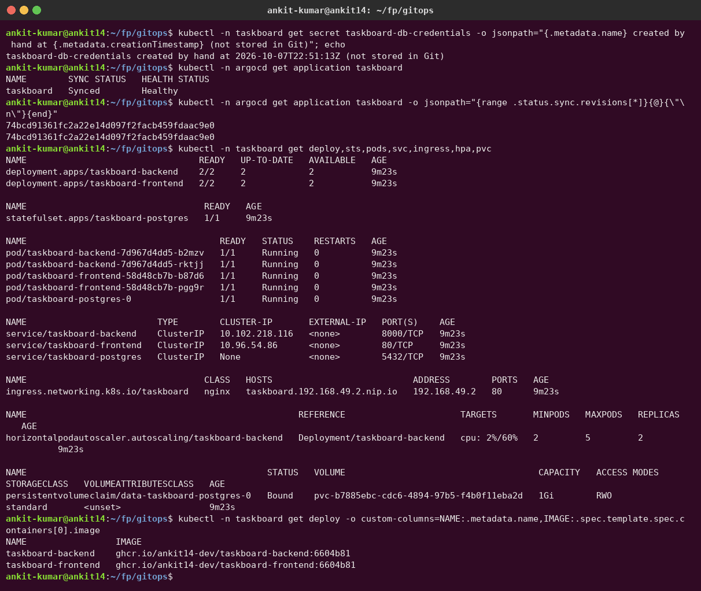

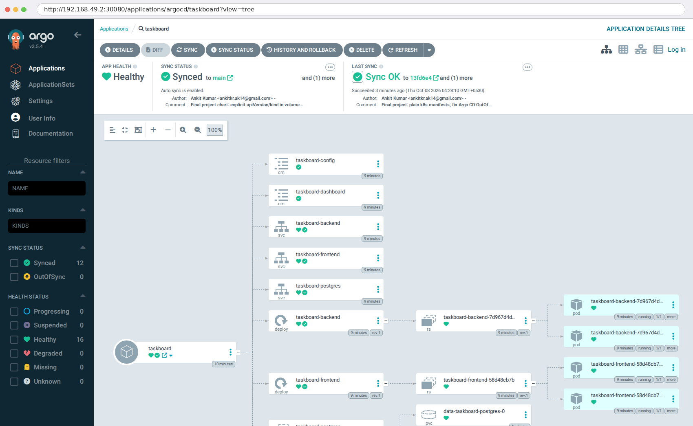

**The loop, for real:** I pushed a chart fix (`74bcd91`). The pipeline built, scanned, pushed and tested it, then `github-actions[bot]` committed `gitops: deploy taskboard 74bcd91 [skip ci]`. Argo CD saw the commit and rolled out `taskboard-backend:74bcd91` / `taskboard-frontend:74bcd91`, with **no kubectl and no cluster credentials in CI**:

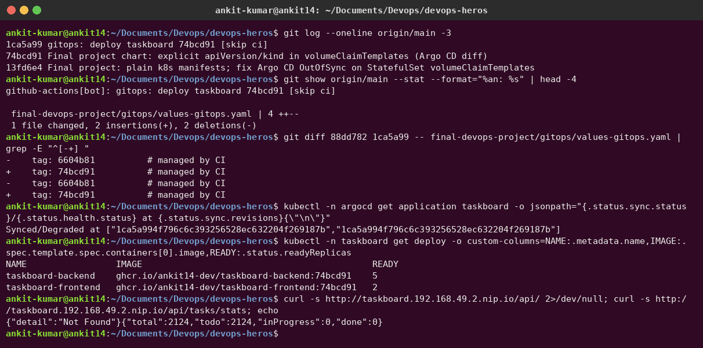

Problems I solved on the way:
1. **Permanent OutOfSync on the StatefulSet.** The API server adds `apiVersion`, `kind`, `volumeMode` and `status` to `volumeClaimTemplates`. I wrote the first three explicitly in the chart and added an `ignoreDifferences` for `status`.
2. **Generated passwords under GitOps.** Argo CD renders charts without cluster access, so `lookup` can't preserve a random password. GitOps mode therefore uses `postgresql.existingSecret`.
3. Right after a rollout Argo CD briefly showed **Degraded**: the HPA had `<unknown>` metrics until the new pods were scraped, and it became Healthy within a minute.

## 13. Final troubleshooting challenge

On a healthy, separate release (`helm install lab … -n taskboard-lab`), [`troubleshooting/break.sh`](troubleshooting/break.sh) injects **five faults at once**:

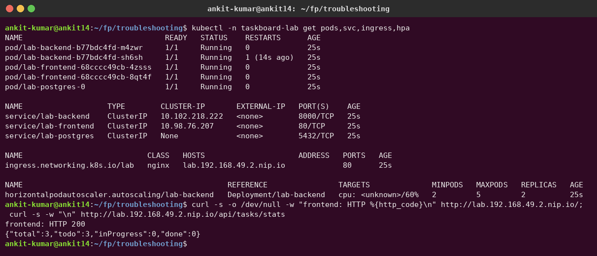

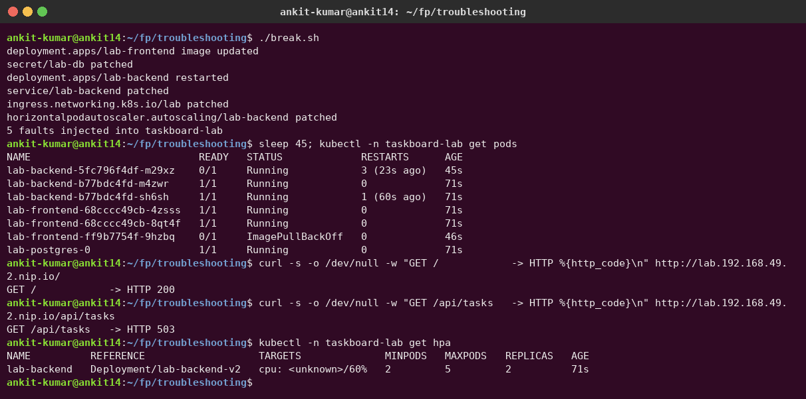

The symptoms are confusing on purpose: the UI still returns **200** (the old pods keep serving), but `/api` returns **503**, one backend pod is crash-looping, one frontend pod is in `ImagePullBackOff`, and the HPA shows `<unknown>`.

| # | Symptom | Investigation | Root cause | Fix |
|---|---|---|---|---|
| 1 | new frontend pod `ImagePullBackOff`, rollout stuck | `get pods -o custom-columns=…IMAGE…`, `describe pod` events | tag `v1.0.0-typo` doesn't exist in GHCR | `kubectl rollout undo deploy/lab-frontend` |
| 2 | new backend pod `CrashLoopBackOff` | `logs --previous` → `FATAL: password authentication failed`; `managedFields` shows the Secret was last changed by `kubectl-patch`; logging in with the DB's original password works, with the Secret's value fails | the Secret was "rotated" but PostgreSQL was never changed (old pods still work because env vars are read at start) | finish the rotation: `ALTER USER taskboard PASSWORD '<new>'`, then restart the backend |
| 3 | `/api` 503 | `get endpointslices` is empty; Service selector `component=backed` ≠ pod label `backend` | selector typo | patch the selector back |
| 4 | `/api` still 503 | `describe ingress` shows `lab-backend:8080 ()` while the Service only has port **8000** | wrong Service port in the Ingress | patch the port to 8000 |
| 5 | HPA `<unknown>` | `describe hpa` → `FailedGetScale … "lab-backend-v2" not found` | wrong `scaleTargetRef` | patch to `lab-backend` |

| | |
|---|---|
| 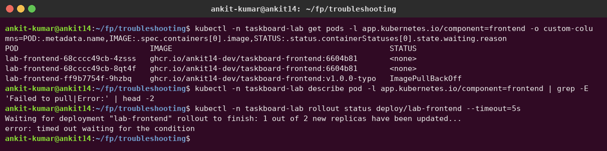 | 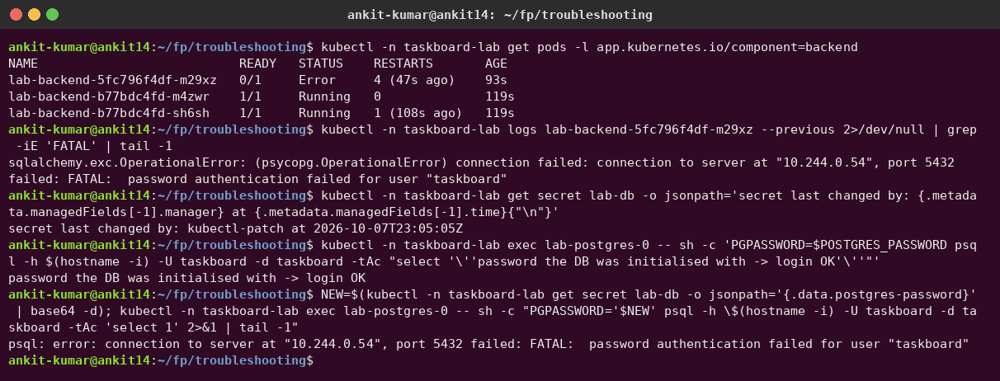 |
| 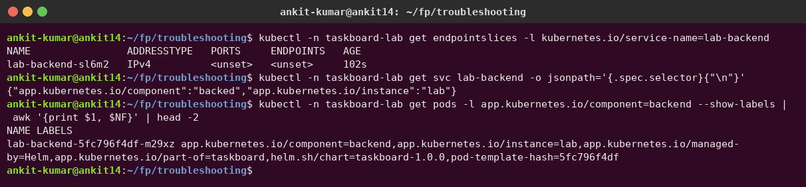 | 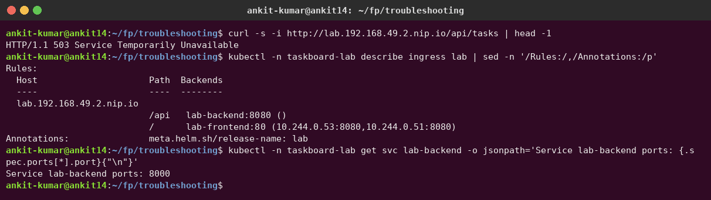 |
| 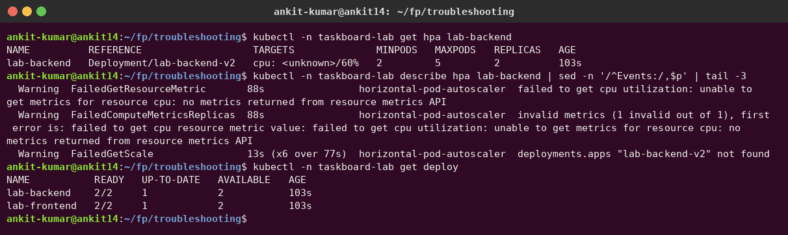 | 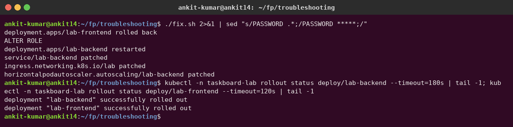 |

**Verified after** [`fix.sh`](troubleshooting/fix.sh): all pods `1/1` with 0 restarts, endpoints back, the Ingress resolving to pod IPs, the API returning data, and `helm test` **Succeeded**. The HPA reads CPU again once metrics arrive:

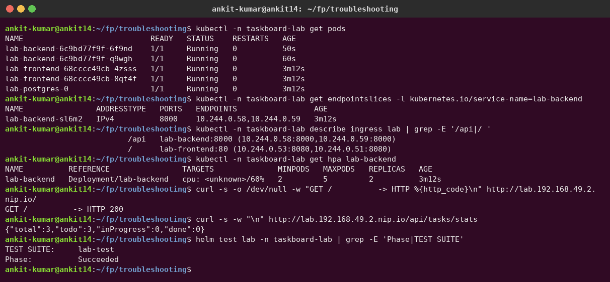

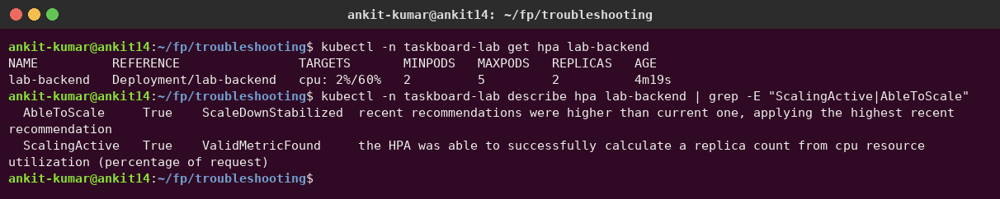

*Bonus observation:* in the **GitOps-managed** namespace these manual changes would not even stick. Argo CD's self-heal reverts drift within seconds (shown in Session 20), which is another reason to make every change through Git.

## 14. Lessons learned

- **"Running" is not "working".** Pods were Running while the API returned 503 and the DB rejected logins. Always check endpoints, logs and events, and test the real user path.
- **Fail fast, in the right place:** tests against a real PostgreSQL in CI, a security gate before any push, `helm test` after deploy, readiness probes that check dependencies.
- **Ship the artifact you tested:** save/load images between jobs and deploy immutable SHA tags, never `latest`.
- **GitOps shrinks CI's power:** CI only writes a tag to Git; the cluster pulls. No kubeconfig in GitHub secrets.
- **Secrets need a lifecycle,** not just a value. A half-done rotation took the app down; real rotation = update the consumer *and* the producer, ideally automated (External Secrets / Vault).
- Small details matter in real clusters: init containers for dependency ordering, explicit defaults to avoid GitOps diffs, `or vector(0)` in dashboards.
