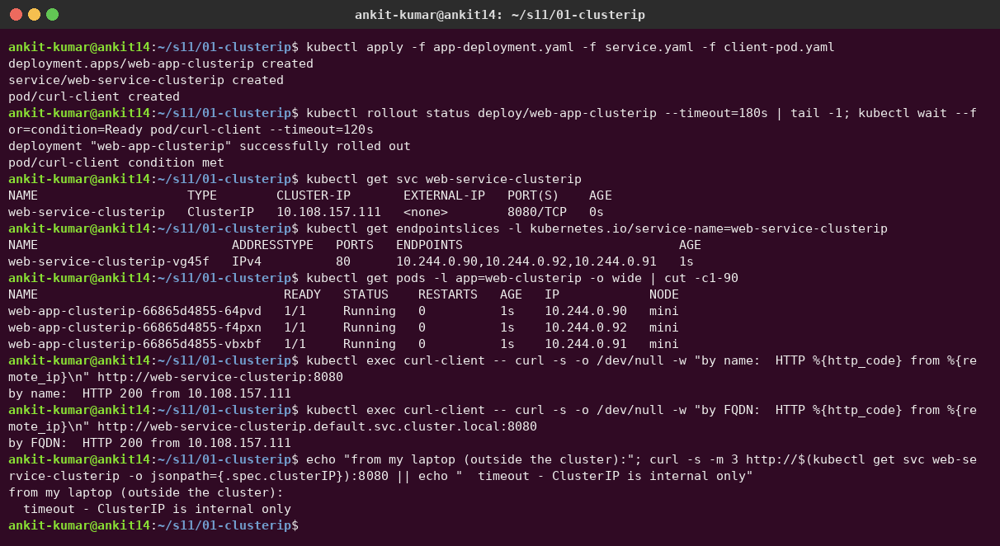
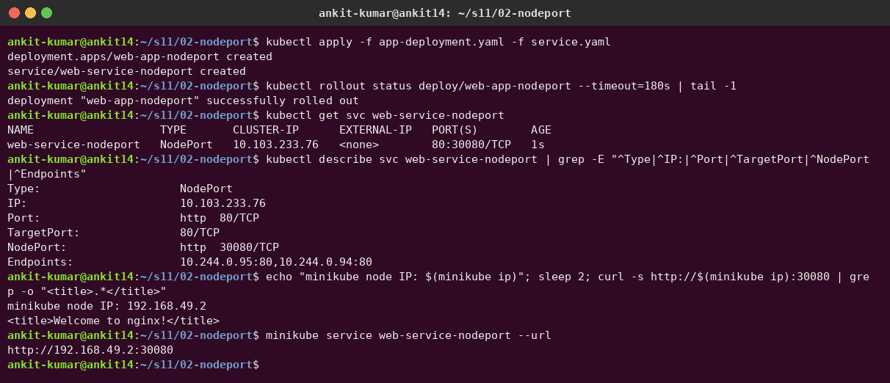
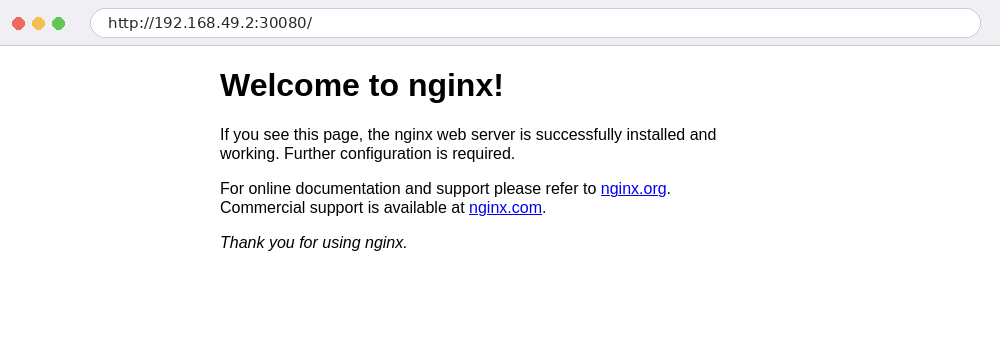
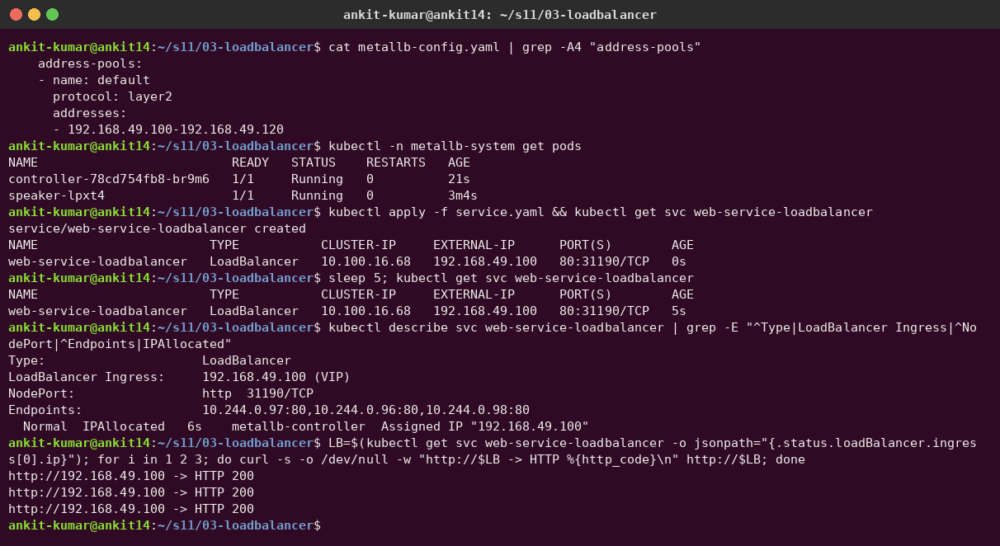
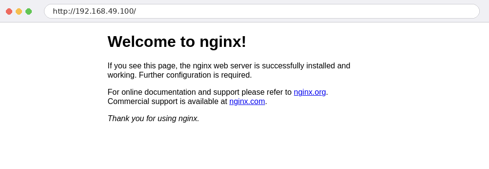
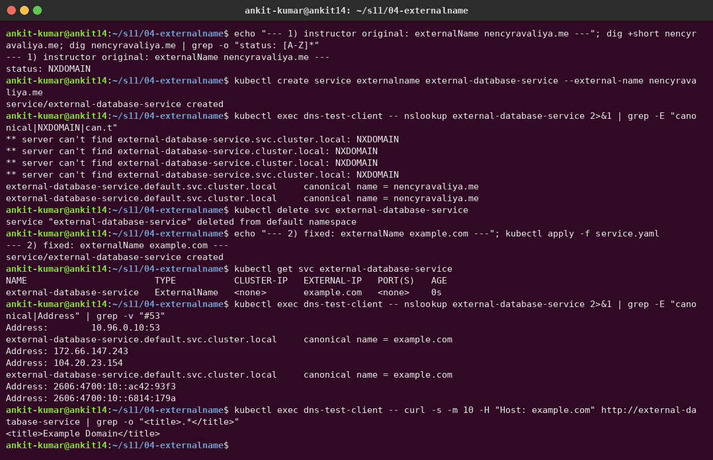
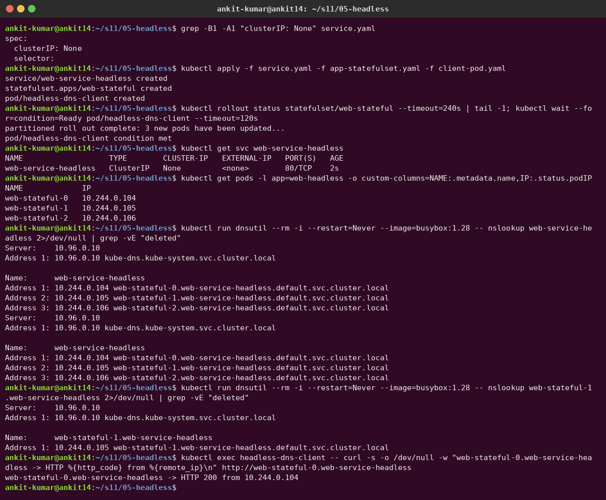

# Session 11 – Kubernetes Networking & Services

**Author:** Ankit Kumar
**Cluster:** minikube (Kubernetes v1.37.0) with the MetalLB addon for LoadBalancer IPs

| Deliverable | Where |
|---|---|
| Service YAML files | [`01-clusterip/`](01-clusterip) · [`02-nodeport/`](02-nodeport) · [`03-loadbalancer/`](03-loadbalancer) · [`04-externalname/`](04-externalname) · [`05-headless/`](05-headless) |
| Comparison documentation (Task 2) | [`k8s-object-comparison.md`](k8s-object-comparison.md) |
| FQDN (Task 3) | [`fqdn/README.md`](fqdn/README.md) |
| CoreDNS (Task 4) | [`coredns/README.md`](coredns/README.md) |
| Screenshots | [`screenshots/`](screenshots) |

---

## Task 1 – The 5 Service types

| Type | Reachable from | How | Use case |
|---|---|---|---|
| **ClusterIP** (default) | Inside the cluster only | Virtual IP + DNS name, load-balanced by kube-proxy | Pod-to-pod / microservice traffic |
| **NodePort** | Outside, via `<NodeIP>:30000-32767` | ClusterIP + a port opened on every node | Dev/test, on-prem without an LB |
| **LoadBalancer** | Outside, via an external IP | NodePort + an external load balancer (cloud LB / MetalLB) | Production entry point on cloud |
| **ExternalName** | Inside the cluster | DNS **CNAME** to an external hostname, no proxying | Alias for an external DB/API |
| **Headless** (`clusterIP: None`) | Inside the cluster | No VIP; DNS returns **pod IPs** directly | StatefulSets, client-side load balancing |

### 1. ClusterIP

```bash
kubectl apply -f 01-clusterip/app-deployment.yaml -f 01-clusterip/service.yaml -f 01-clusterip/client-pod.yaml
kubectl exec curl-client -- curl http://web-service-clusterip:8080
```

The Service `web-service-clusterip` got the virtual IP **10.108.157.111** on port **8080 → targetPort 80**, with 3 pod endpoints. From a pod, both the short name and the FQDN return **HTTP 200**. From my laptop the ClusterIP **times out**: it's internal only.



### 2. NodePort

```bash
kubectl apply -f 02-nodeport/app-deployment.yaml -f 02-nodeport/service.yaml
curl http://$(minikube ip):30080
```

Port **30080** is opened on the node (`192.168.49.2`), so I can reach nginx from my laptop:





### 3. LoadBalancer

On a laptop there is no cloud load balancer, so a `LoadBalancer` service stays `<pending>` forever (I saw that first). Instead of `minikube tunnel` (which needs sudo), I enabled the **MetalLB** addon. [`metallb-config.yaml`](03-loadbalancer/metallb-config.yaml) gives it the IP pool `192.168.49.100-120` from the minikube Docker network:

```bash
minikube addons enable metallb
kubectl apply -f 03-loadbalancer/metallb-config.yaml
kubectl apply -f 03-loadbalancer/app-deployment.yaml -f 03-loadbalancer/service.yaml
```

MetalLB assigned **EXTERNAL-IP 192.168.49.100** (event `IPAllocated`), and HTTP to that IP returns 200. A LoadBalancer Service also has a ClusterIP and a NodePort (`80:31190/TCP`), because each type builds on the previous one.





### 4. ExternalName

**Real problem I found:** the instructor's YAML uses `externalName: nencyravaliya.me`, but that domain now returns **NXDOMAIN**. The Service was created, but lookups only returned a CNAME to a name that doesn't resolve. An ExternalName service is just a DNS alias: Kubernetes doesn't check the target. I changed my copy to `example.com`. Now the cluster DNS returns `canonical name = example.com` plus its IPs, and `curl http://external-database-service` (with `Host: example.com`) returns the *Example Domain* page. There is no ClusterIP and there are no endpoints.



### 5. Headless

```yaml
spec:
  clusterIP: None      # headless
```

`kubectl get svc` shows `CLUSTER-IP None`. A DNS lookup of `web-service-headless` returns **all 3 pod IPs** (instead of one VIP), and every StatefulSet pod gets its own stable DNS name, e.g. `web-stateful-1.web-service-headless.default.svc.cluster.local → 10.244.0.105`. I curled `web-stateful-0` directly by name.



---

## Task 2 – Kubernetes object comparison

Full write-up with real outputs: **[k8s-object-comparison.md](k8s-object-comparison.md)**

- **Deployment vs ReplicaSet:** a Deployment *owns* ReplicaSets (one per pod-template version) and adds rolling updates and rollback. I captured the `ownerReferences` chain Pod → ReplicaSet → Deployment.
- **Deployment vs DaemonSet vs StatefulSet:** stateless replicas vs one pod per node vs ordered pods with stable identity and their own PVCs (`db-0/1/2` + `data-db-0/1/2`).
- **ReplicaSet vs Service:** the RS keeps N pods alive. The Service gives them one stable IP/DNS name, and its EndpointSlice tracks pod IPs as pods come and go (shown live by deleting a pod).

## Task 3 – FQDN

**[fqdn/README.md](fqdn/README.md)**. Format `<service>.<namespace>.svc.cluster.local`. Demo: two namespaces (`dev`, `prod`) each have a Service called `backend`; `backend` vs `backend.prod` resolve to different ClusterIPs. It also covers SRV and pod DNS records.

## Task 4 – CoreDNS

**[coredns/README.md](coredns/README.md)**. It covers the real Corefile, query logs showing the ndots search expansion, and a simulated outage (CoreDNS scaled to 0) with diagnosis and fix.

---

## Cleanup

```bash
kubectl delete -f 01-clusterip -f 02-nodeport -f 03-loadbalancer/service.yaml -f 03-loadbalancer/app-deployment.yaml -f 04-externalname -f 05-headless
kubectl delete -f comparison-demo -f fqdn/fqdn-demo.yaml
```
