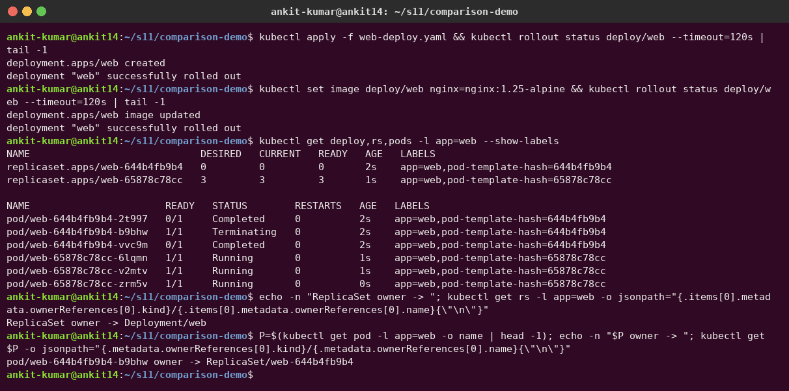
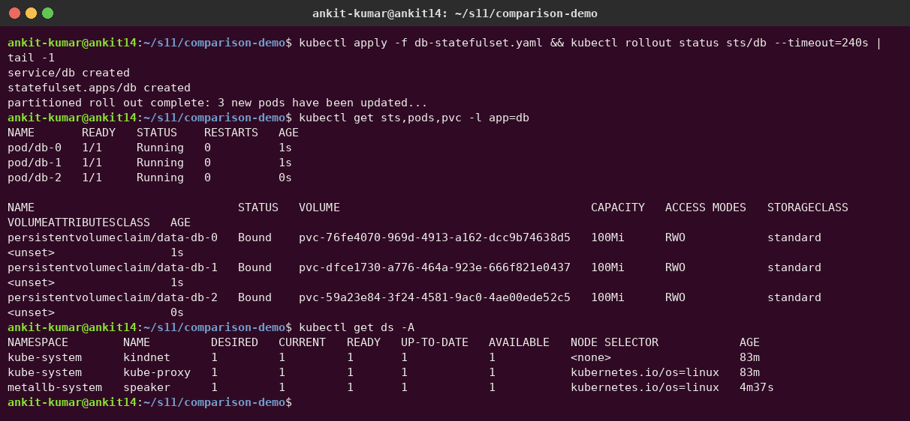
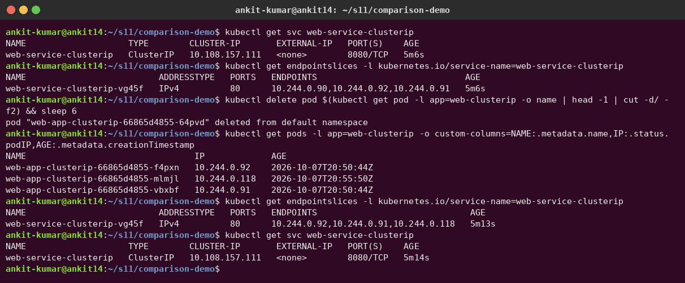

# Task 2 – Kubernetes Object Comparison

**Author:** Ankit Kumar

This note compares the workload objects I keep mixing up, and explains where a **Service** fits next to them.

---

## (a) Deployment vs ReplicaSet

### What each one does

| | ReplicaSet | Deployment |
|---|---|---|
| Purpose | Keep **N identical Pods** running at all times | Manage **versions** of an app declaratively (rollout, rollback) |
| Manages | Pods directly | ReplicaSets (which then manage Pods) |
| Scaling | `kubectl scale rs ... --replicas=N` | `kubectl scale deploy ... --replicas=N` (passed down to the active RS) |
| Rolling update | **No** – changing the Pod template does not touch existing Pods | **Yes** – creates a new RS and shifts Pods gradually |
| Rollback | No | `kubectl rollout undo` to any revision kept in history |
| Pause / resume rollout | No | `kubectl rollout pause/resume` |
| Created by hand? | Rarely | Yes, this is what we normally write |

### How they are related

- A Deployment **owns** one or more ReplicaSets. Each RS has `metadata.ownerReferences` pointing to the Deployment, and each Pod has an `ownerReference` pointing to its RS. Deleting the Deployment garbage-collects both.
- Every change to `spec.template` creates a **new ReplicaSet** = a new **revision**. Old ReplicaSets are kept scaled to 0 (up to `revisionHistoryLimit`, default 10) so a rollback is just scaling an old RS back up.
- The Deployment controller adds a **`pod-template-hash`** label to each RS and its Pods (and to the RS selector). This hash of the Pod template keeps the old and new ReplicaSets from fighting over the same Pods during an update. That's why the RS and Pod names look like `web-7c5ddbdf54` and `web-7c5ddbdf54-x2k8p`.

```text
Deployment: web  (revision 2)
 ├── ReplicaSet web-7c5ddbdf54  (pod-template-hash=7c5ddbdf54, replicas 3)  <- current
 │     ├── Pod web-7c5ddbdf54-x2k8p
 │     ├── Pod web-7c5ddbdf54-9mtq4
 │     └── Pod web-7c5ddbdf54-ln7wz
 └── ReplicaSet web-6b9f8d7c4d  (replicas 0)                                <- revision 1, kept for rollback
```

### Rolling update strategy

```yaml
apiVersion: apps/v1
kind: Deployment
metadata:
  name: web
spec:
  replicas: 3
  revisionHistoryLimit: 5
  strategy:
    type: RollingUpdate        # or Recreate
    rollingUpdate:
      maxSurge: 1              # at most 1 extra Pod above replicas during update
      maxUnavailable: 0        # never go below 3 ready Pods
  selector:
    matchLabels:
      app: web
  template:
    metadata:
      labels:
        app: web
    spec:
      containers:
        - name: nginx
          image: nginx:1.27
          ports:
            - containerPort: 80
```

```bash
kubectl apply -f web-deploy.yaml
kubectl set image deploy/web nginx=nginx:1.28
kubectl rollout status deploy/web
kubectl rollout history deploy/web
kubectl rollout undo deploy/web --to-revision=1
```

**Real output** (my demo in [`comparison-demo/web-deploy.yaml`](comparison-demo/web-deploy.yaml) used `nginx:1.24-alpine` → `nginx:1.25-alpine`). After one image update there are **two ReplicaSets**: the old one scaled to 0 and kept for rollback, and the new one with 3 pods. Each has its own `pod-template-hash` label:



Checking the ownership chain:

```bash
kubectl get rs -l app=web -o jsonpath='{.items[0].metadata.ownerReferences[0].kind}/{.items[0].metadata.ownerReferences[0].name}{"\n"}'
kubectl get pod <pod-name> -o jsonpath='{.metadata.ownerReferences[0].kind}/{.metadata.ownerReferences[0].name}{"\n"}'
```

The last two commands in the screenshot above show the chain: **ReplicaSet → owner `Deployment/web`** and **Pod → owner `ReplicaSet/web-644b4fb9b4`**. Deleting the Deployment garbage-collects everything below it.

**My takeaway:** use a Deployment, never a bare ReplicaSet. The RS is an implementation detail the Deployment uses for versioning.

---

## (b) Deployment vs DaemonSet vs StatefulSet

| Feature | Deployment | DaemonSet | StatefulSet |
|---|---|---|---|
| Use case | Stateless apps | One agent per node | Stateful, clustered apps |
| Pod names | Random: `api-5d8f7b6c9-abcde` | Random suffix: `fluent-bit-x7k2p` (one per node) | Ordered & stable: `mysql-0`, `mysql-1`, `mysql-2` |
| How many Pods | `spec.replicas` | One per matching node (follows node count) | `spec.replicas` |
| Creation order | All in parallel | As nodes appear | **Ordered**: 0, then 1, then 2 (each must be Ready) by default |
| Scaling | `kubectl scale` | Not by replicas – add/remove nodes or change `nodeSelector`/tolerations | `kubectl scale`; scale-down removes highest ordinal first |
| Pod identity after restart | New name, new IP | New name, same node | **Same name**, same PVC, same DNS name (IP may change) |
| Networking | Normal Service (ClusterIP etc.) | Often `hostNetwork`/`hostPort`, or a Service | Requires a **headless Service** (`serviceName`) for per-Pod DNS |
| Storage | All replicas share one PVC (or none) | Usually `hostPath` to read node files | `volumeClaimTemplates` → **one PVC per Pod** (`data-mysql-0`, ...) |
| Update strategy | RollingUpdate / Recreate | RollingUpdate / OnDelete | RollingUpdate (reverse ordinal) / OnDelete, supports `partition` |
| Examples | nginx, REST API, frontend | fluent-bit, node-exporter, kube-proxy, CNI agents | MySQL, PostgreSQL, Kafka, Zookeeper, etcd |

### Prose comparison

- **Deployment** treats Pods as cattle: any replica can serve any request, so names, order and storage don't matter. If `api-5d8f7b6c9-abcde` dies, a new Pod with a different name replaces it.
- **DaemonSet** is about **placement**, not count. Its controller makes sure every (matching) node runs exactly one copy. When I add a node, a Pod appears on it automatically; this is why log collectors, monitoring agents and `kube-proxy` itself are DaemonSets. Tolerations are often added so it also runs on control-plane nodes.
- **StatefulSet** gives each Pod a **sticky identity**. `mysql-0` is always `mysql-0`, always gets PVC `data-mysql-0`, and is reachable at `mysql-0.mysql.default.svc.cluster.local` through the headless Service. Databases need this because a replica must find its own data again after a restart and peers need to address the primary by a stable name. By default, PVCs are **not** deleted when the StatefulSet is scaled down or deleted, which protects the data.

### Short YAML snippets

DaemonSet (one log agent per node):

```yaml
apiVersion: apps/v1
kind: DaemonSet
metadata:
  name: fluent-bit
  namespace: logging
spec:
  selector:
    matchLabels: { app: fluent-bit }
  template:
    metadata:
      labels: { app: fluent-bit }
    spec:
      tolerations:
        - key: node-role.kubernetes.io/control-plane
          effect: NoSchedule
      containers:
        - name: fluent-bit
          image: fluent/fluent-bit:3.1
          volumeMounts:
            - { name: varlog, mountPath: /var/log, readOnly: true }
      volumes:
        - name: varlog
          hostPath: { path: /var/log }
```

StatefulSet + headless Service:

```yaml
apiVersion: v1
kind: Service
metadata:
  name: mysql
spec:
  clusterIP: None            # headless -> DNS returns Pod IPs, gives per-Pod records
  selector: { app: mysql }
  ports:
    - port: 3306
---
apiVersion: apps/v1
kind: StatefulSet
metadata:
  name: mysql
spec:
  serviceName: mysql         # must match the headless Service
  replicas: 3
  selector:
    matchLabels: { app: mysql }
  template:
    metadata:
      labels: { app: mysql }
    spec:
      containers:
        - name: mysql
          image: mysql:8.4
          env:
            - { name: MYSQL_ROOT_PASSWORD, value: "changeme" }   # use a Secret in real life
          volumeMounts:
            - { name: data, mountPath: /var/lib/mysql }
  volumeClaimTemplates:
    - metadata:
        name: data
      spec:
        accessModes: ["ReadWriteOnce"]
        resources:
          requests:
            storage: 1Gi
```

**Real output.** To save download time I used an nginx-based StatefulSet called `db` ([`comparison-demo/db-statefulset.yaml`](comparison-demo/db-statefulset.yaml)) with the same `volumeClaimTemplates` idea. The pods are created **in order** with stable names `db-0`, `db-1`, `db-2`, and each gets **its own PVC** `data-db-N`. `kubectl get ds -A` shows the cluster's DaemonSets (`kube-proxy`, `kindnet`, MetalLB `speaker`): one pod per node.




---

## (c) ReplicaSet vs Service

These two are not alternatives – they solve different problems and are used together.

| | ReplicaSet (usually via a Deployment) | Service |
|---|---|---|
| Responsibility | **Availability**: keep N Pods running, replace dead ones | **Reachability**: give those Pods one stable address and load-balance across them |
| Works on | Pod lifecycle (create/delete) | Network traffic (no Pods are created) |
| Finds Pods by | Label selector (Pods it owns) | Label selector (any matching, Ready Pods) |
| Output | Pods | Stable ClusterIP + DNS name + EndpointSlices |
| Layer | Compute / scheduling | Networking (L4) |

### Why a Service is required

Pod IPs are **ephemeral**. When the ReplicaSet replaces a crashed Pod, the new Pod gets a new IP; scaling up adds new IPs, scaling down removes some. If my frontend hard-coded a Pod IP, it would break on the next restart. A Service gives:

1. a **stable virtual IP** (ClusterIP) that never changes for the Service's lifetime,
2. a **stable DNS name** (`backend.default.svc.cluster.local`) via CoreDNS,
3. **load balancing** across all Ready Pods, and
4. automatic removal of Pods that fail their readiness probe.

### How traffic reaches the Pods

1. The Service has `selector: app: backend`.
2. The **EndpointSlice controller** watches Pods with that label and writes their IPs/ports (only Ready ones count as ready endpoints) into **EndpointSlice** objects.
3. **kube-proxy** on every node watches Services + EndpointSlices and programs **iptables** (or **IPVS**/nftables) rules: "traffic to ClusterIP:port → DNAT to one of these Pod IPs".
4. The client Pod sends to the ClusterIP; the kernel rules on *its own node* pick a backend Pod and rewrite the destination; the CNI delivers the packet to that Pod, possibly on another node.

For other Service types the path just has extra entry points in front:

- **NodePort:** `NodeIP:30080` → kube-proxy rule → ClusterIP logic → Pod.
- **LoadBalancer:** cloud LB → `NodeIP:NodePort` on some node → ClusterIP logic → Pod.

```text
                       External client
                             |
              (LoadBalancer) |  cloud LB  ->  NodeIP:30080 (NodePort)
                             v
 +-------------+      +--------------------------------------------+
 | frontend Pod| ---> | ClusterIP 10.96.120.15:80  (Service backend)|
 +-------------+      +----------------------+---------------------+
   DNS: backend ->               |  kube-proxy iptables/IPVS rules
   10.96.120.15                  |  (built from EndpointSlices)
                   +-------------+--------------+
                   v             v              v
             10.244.0.12   10.244.1.7     10.244.1.9      <- Pod IPs (targetPort 8080)
             backend-…-a   backend-…-b    backend-…-c
                   ^             ^              ^
                   +---- created & replaced by ReplicaSet backend-xxxx ----+
```

```yaml
apiVersion: v1
kind: Service
metadata:
  name: backend
spec:
  type: ClusterIP
  selector:
    app: backend          # must match the Pod template labels of the Deployment/RS
  ports:
    - port: 80            # Service port
      targetPort: 8080    # container port
```

```bash
kubectl get svc backend
kubectl get endpointslices -l kubernetes.io/service-name=backend
kubectl delete pod <one-backend-pod>      # RS recreates it with a new IP...
kubectl get endpointslices -l kubernetes.io/service-name=backend   # ...and the slice updates automatically
```

**Real output** with my Session 11 ClusterIP service: I deleted one pod (`…-64pvd`, IP 10.244.0.90). The ReplicaSet created a replacement with a **new IP (10.244.0.118)**, the EndpointSlice updated automatically, and the Service **ClusterIP 10.108.157.111 stayed the same**. That is exactly why clients talk to the Service and not to pod IPs.



**Summary:** the ReplicaSet keeps the Pods alive; the Service keeps them reachable. Labels are the only glue between the two.
