# Session 12 – Kubernetes Ingress, ConfigMaps & Secrets

**Author:** Ankit Kumar
**Cluster:** minikube (Kubernetes v1.37.0) + `ingress` addon (ingress-nginx controller)

| Deliverable | File(s) |
|---|---|
| ConfigMap YAML | [`01-configmap/configmap.yaml`](01-configmap/configmap.yaml), [`pod-using-configmap.yaml`](01-configmap/pod-using-configmap.yaml) |
| Secret YAML | [`02-secret/secret.example.yaml`](02-secret/secret.example.yaml) (template only), [`pod-using-secret.yaml`](02-secret/pod-using-secret.yaml) |
| Ingress YAML | [`03-ingress/ingress.yaml`](03-ingress/ingress.yaml), [`ingress-tls.yaml`](03-ingress/ingress-tls.yaml) (+ app: `configmap.yaml`, `frontend.yaml`, `backend.yaml`) |
| Ingress vs Ingress Controller | [`04-ingress-vs-ingress-controller/README.md`](04-ingress-vs-ingress-controller/README.md) |
| Troubleshooting | [`05-troubleshooting/`](05-troubleshooting) – documented below |

---

## Task 1 – ConfigMap

A ConfigMap stores **non-sensitive** configuration as key/value pairs or whole files, so the same image can run with different settings in dev, staging and prod.

**Create it and store configuration values.** Three plain keys plus a whole `app.properties` file:

```bash
kubectl apply -f 01-configmap/configmap.yaml
kubectl describe configmap app-config
```

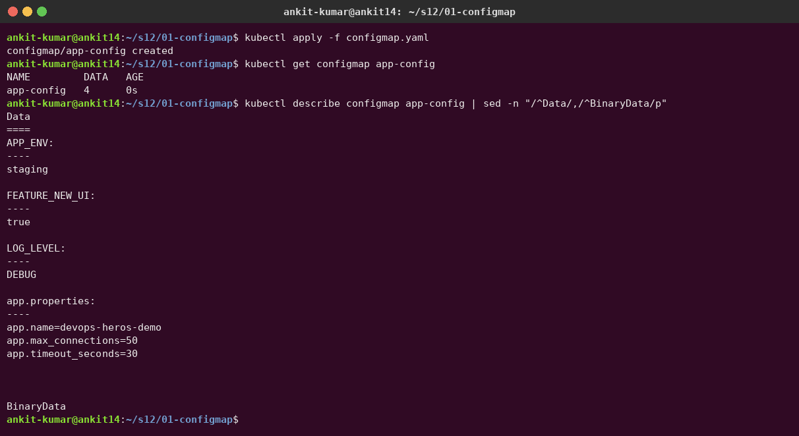

**Inject it into a Pod in three ways** ([`pod-using-configmap.yaml`](01-configmap/pod-using-configmap.yaml)):
1. `envFrom.configMapRef`: every key becomes an environment variable.
2. `env.valueFrom.configMapKeyRef`: one key under a new name (`UI_FLAG`).
3. A `configMap` **volume**: every key becomes a file in `/etc/app-config/`.

**Verify the values inside the container:**

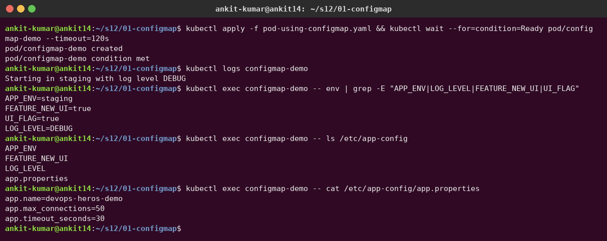

**What happens when the ConfigMap changes?** I patched `LOG_LEVEL` from DEBUG to INFO. The **mounted file was updated automatically** (the kubelet syncs it within about a minute), but the **environment variable still says DEBUG**, because env vars are read only when the container starts. A `kubectl rollout restart` is needed for env-based config.

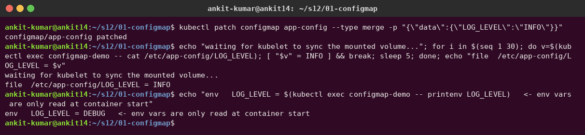

---

## Task 2 – Secret

A Secret holds **sensitive** data (passwords, tokens, keys). It works like a ConfigMap, but it is stored separately, can be encrypted at rest, gets its own RBAC, and is mounted on **tmpfs** (RAM, never written to the node's disk).

**Create the Secret without writing the password into any file:**

```bash
kubectl create secret generic db-credentials \
  --from-literal=DB_USER=app_user --from-literal=DB_PASSWORD='S3cr3t-Pa55!'
```

`describe` hides the values (only byte counts), but `-o jsonpath='{.data}'` shows them **base64-encoded, not encrypted**:

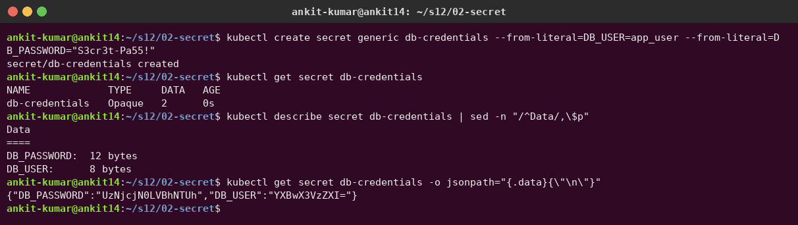

**Inject it into a Pod and verify inside the container.** With `secretKeyRef` env vars and a `secret` volume (`defaultMode: 0400`), the app sees the real value. The mount is `tmpfs (ro)`:

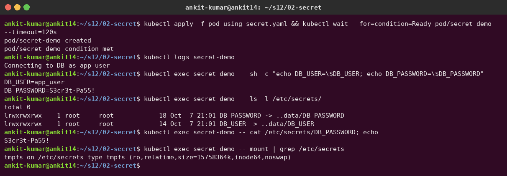

### Why Secrets must not be committed to Git

I made a throw-away repo, committed a Secret YAML to it, and ran **gitleaks** on it:

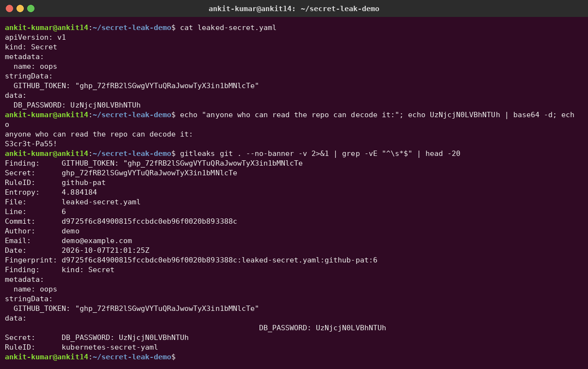

1. **base64 is an encoding, not encryption.** `echo UzNjcjN0LVBhNTUh | base64 -d` gives back the password instantly.
2. **Git never forgets.** Even if the file is deleted later, the value stays in the history and in every clone/fork. Once pushed, the only real fix is to **rotate** the credential.
3. **Scanners and attackers look for exactly this.** gitleaks flagged both the token (`github-pat`; the token in the demo is a random fake) and the Secret manifest (`kubernetes-secret-yaml`). Public repos are scanned by bots within minutes.

**What to do instead:** commit only a template ([`secret.example.yaml`](02-secret/secret.example.yaml)), create real secrets with `kubectl create secret` from CI/CD secret variables, or use **Sealed Secrets / SOPS** (encrypted in Git) or an **External Secrets Operator** with Vault / AWS Secrets Manager. Add a gitleaks check to CI (I do this in Session 17). That's also why my Ingress demo doesn't contain the instructor's `secret.yaml`: I create that secret with `kubectl` instead.

---

## Task 3 – Ingress

**Architecture:** `client → ingress-nginx controller (192.168.49.2:80/443) → Ingress rules → ClusterIP Service → Pods`

**Deploy the application and Services.** This is the instructor's full demo: an nginx frontend, a Python backend that prints its ConfigMap and Secret values, ClusterIP services and a ConfigMap. The Secret is created with kubectl and a random password:

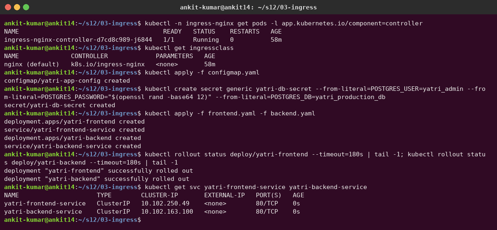

**Configure the Ingress.** Path rules: `/api(/|$)(.*)` → backend (rewritten to `/$2`) and `/` → frontend. I added a second host `yatri.192.168.49.2.nip.io` with the same rules. **nip.io** resolves `*.192.168.49.2.nip.io` to `192.168.49.2`, so I can use a real browser without editing `/etc/hosts` (which needs sudo). For `yatri.local` I used `curl --resolve`.

**Verify routing.** `/` → frontend nginx page, `/api/` → the backend showing values injected from **ConfigMap** (ENVIRONMENT, LOG_LEVEL, DEFAULT_CURRENCY) and **Secret** (POSTGRES_USER, POSTGRES_DB). An unknown host → **404** from the controller's default backend:

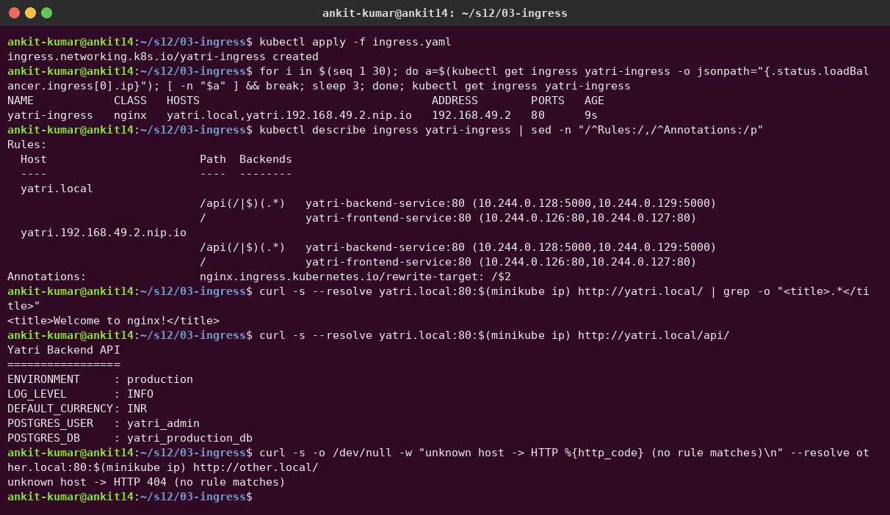

| `/` → frontend | `/api/` → backend |
|---|---|
| 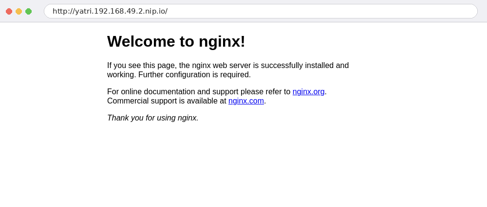 | 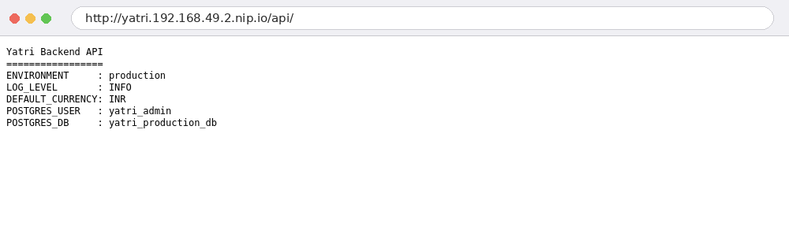 |

**Bonus – TLS.** A self-signed cert goes into a `kubernetes.io/tls` Secret, and [`ingress-tls.yaml`](03-ingress/ingress-tls.yaml) uses it. The controller terminates **TLS 1.3**, serves my certificate (`CN=secure.yatri.local`) and redirects plain HTTP with a **308**:

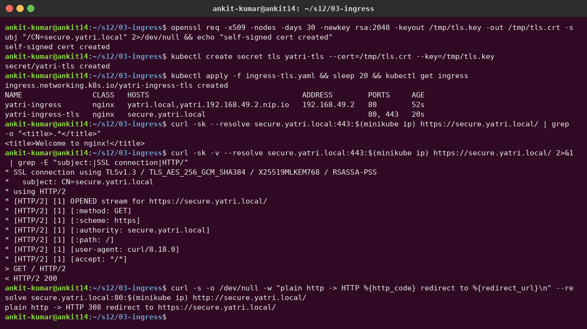

---

## Task 4 – Ingress vs Ingress Controller

See **[04-ingress-vs-ingress-controller/README.md](04-ingress-vs-ingress-controller/README.md)**.

In one line: an **Ingress** is just a set of routing rules (a YAML object). The **Ingress Controller** (ingress-nginx here) is the running reverse proxy that watches those objects and actually routes traffic. Without a controller, an Ingress does nothing.

---

## Task 5 – Troubleshooting: the trailing-newline Secret bug

I reproduced the incident from the instructor's [`troubleshooting/secret-base64-gotcha.md`](../troubleshooting/secret-base64-gotcha.md) for real, using PostgreSQL ([`05-troubleshooting/`](05-troubleshooting)):

- `postgres.yaml`: the PostgreSQL server; its password comes from `pg-server-secret` (created correctly with `--from-literal`).
- `app-client.yaml`: an "application" that connects every 5 s with `PGPASSWORD` from `app-db-secret`.
- `broken-secret.yaml`: the app secret made with `echo "mypassword" | base64` → `bXlwYXNzd29yZAo=`.

### 1. Identify the problem (before)

Both pods are `Running` with 0 restarts, so nothing *looks* wrong, but the app logs are full of `FATAL: password authentication failed for user "appuser"`:

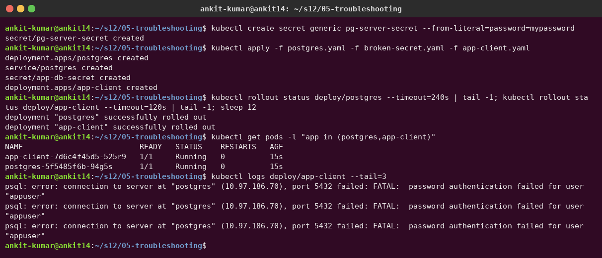

### 2–3. Investigate and find the root cause

| Check | Command | Result |
|---|---|---|
| Server-side reason | `kubectl logs deploy/postgres` | `password authentication failed`, with `pg_hba.conf … scram-sha-256` → it's the password, not network/host rules* |
| Network / DNS OK? | `kubectl exec deploy/app-client -- pg_isready -h postgres` | `accepting connections` → Service and DNS are fine |
| Compare the secrets byte by byte | `kubectl get secret … -o jsonpath='{.data.password}' \| base64 -d \| xxd` | server: `6d79…7264` (10 bytes); app: `6d79…7264 **0a**` |
| What the app actually has | `printf %s "$PGPASSWORD" \| wc -c` | **11** characters instead of 10 |

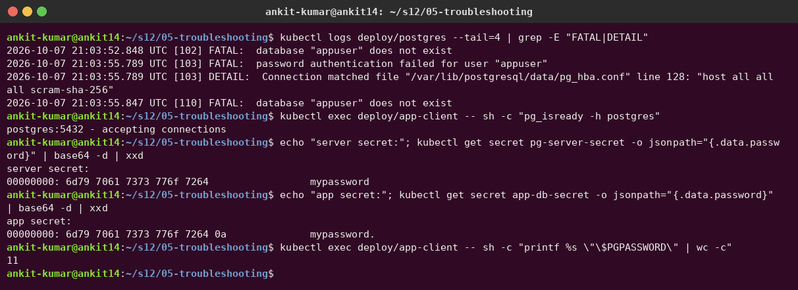

**Root cause:** the app Secret was encoded with `echo` **without `-n`**, so the value ends with a newline (`0x0a`, the `Ao=` at the end of the base64). The app sends `mypassword\n` and Postgres correctly rejects it.

\* The `database "appuser" does not exist` lines are a red herring I also found: they come from my readiness probe (`pg_isready -U appuser` connects to a database named after the user by default). They're harmless, but a good reminder to read logs carefully.

### 4–5. Fix and verify (after)

```bash
echo -n "mypassword" | base64      # bXlwYXNzd29yZA==   (no Ao=)
kubectl apply -f fixed-secret.yaml
kubectl rollout restart deploy/app-client   # env from Secret is only read at start!
```

The logs now show `connected as appuser`, and `xxd` shows exactly 10 bytes with no `0a`:

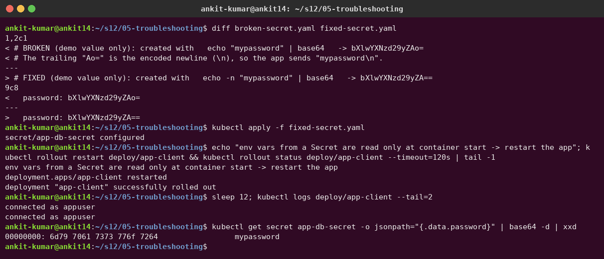

**Lessons:** always use `echo -n` (or better, `kubectl create secret --from-literal` / `stringData`, which avoid hand-encoding). "Running" does not mean "working": always read the app logs. And after changing a Secret used as env vars, restart the pods.

---

## Cleanup

```bash
kubectl delete -f 01-configmap -f 02-secret/pod-using-secret.yaml -f 03-ingress -f 05-troubleshooting
kubectl delete secret db-credentials yatri-db-secret yatri-tls pg-server-secret
```
