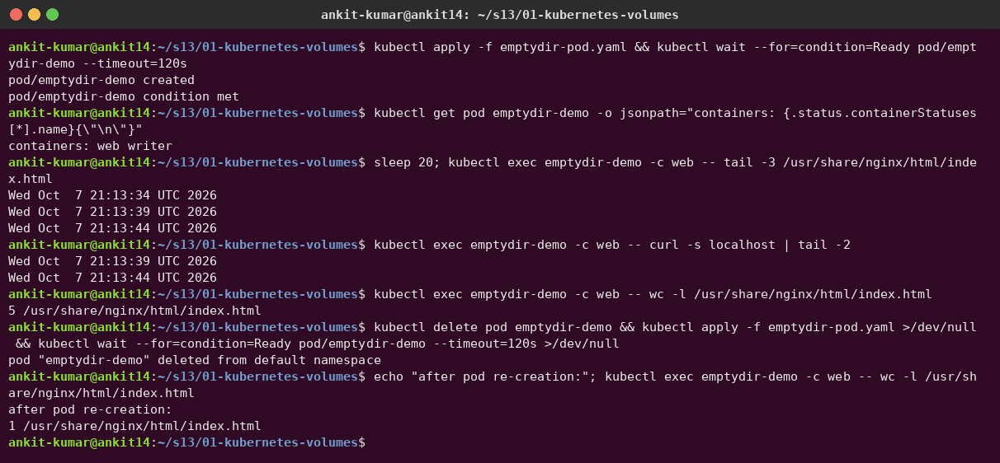
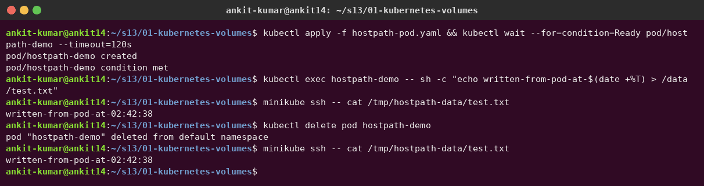
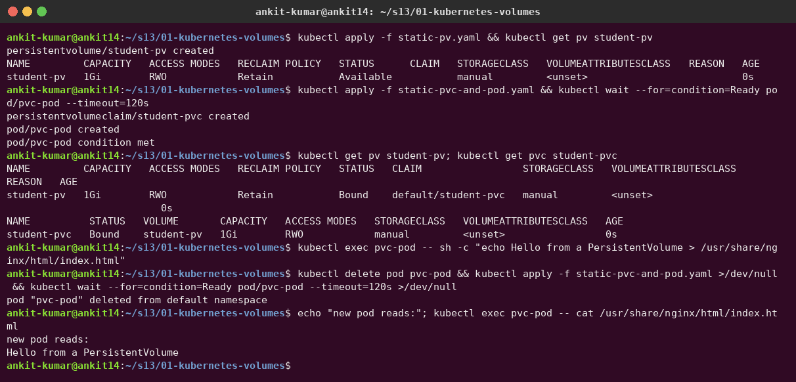
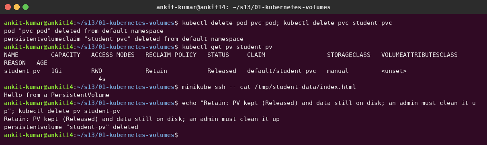
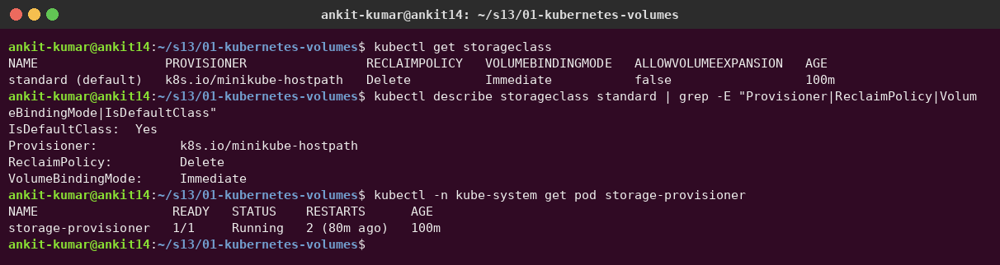
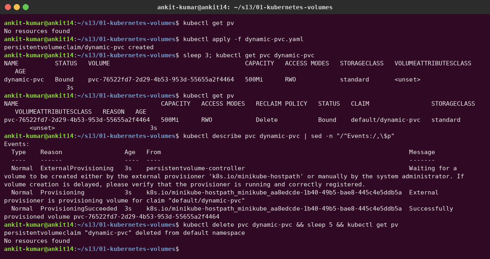

# Task 1 – Kubernetes Volumes

**Author:** Ankit Kumar

A container's filesystem is thrown away when the container restarts. Volumes fix that at different levels: some live as long as the **Pod**, some as long as the **node**, and some independently of both. This note covers each type with an example I can apply on minikube.

| Type | Lives as long as | Shared between | Typical use |
|---|---|---|---|
| `emptyDir` | the Pod | containers in the same Pod | scratch space, sidecar sharing, cache |
| `hostPath` | the node | Pods on the same node | node agents, reading node logs |
| PV + PVC | independent of Pods (until deleted/reclaimed) | depends on access mode | databases, uploads, any persistent data |

---

## 1. emptyDir

- Created **empty** when the Pod is scheduled to a node; **deleted** permanently when the Pod is removed from that node.
- Survives **container** restarts/crashes (it belongs to the Pod, not the container).
- Stored on the node's disk by default; `medium: Memory` uses a tmpfs (RAM) – fast, but counts against the container's memory limit and is lost on node reboot.
- `sizeLimit` caps usage; exceeding it gets the Pod evicted.

Sidecar example – one container writes, another serves the file:

```yaml
apiVersion: v1
kind: Pod
metadata:
  name: emptydir-demo
spec:
  containers:
    - name: writer
      image: busybox:1.36
      command: ["sh", "-c", "while true; do date >> /data/index.html; sleep 5; done"]
      volumeMounts:
        - name: shared
          mountPath: /data
    - name: web
      image: nginx:1.27
      volumeMounts:
        - name: shared
          mountPath: /usr/share/nginx/html
  volumes:
    - name: shared
      emptyDir:
        sizeLimit: 100Mi
        # medium: Memory     # uncomment for a RAM-backed tmpfs
```

```bash
kubectl apply -f emptydir-demo.yaml
kubectl exec emptydir-demo -c web -- tail -n 3 /usr/share/nginx/html/index.html
kubectl delete pod emptydir-demo     # the data is gone with the Pod
```

**Real output** ([`emptydir-pod.yaml`](emptydir-pod.yaml)). The `writer` container appends a timestamp every 5 s, and the `web` (nginx) container serves the **same files** through the shared emptyDir. After deleting and re-creating the pod, the file starts again from **1 line**: emptyDir data lives only as long as the pod.



---

## 2. hostPath

Mounts a file or directory **from the node's filesystem** into the Pod.

| `type` | Behaviour |
|---|---|
| `""` (default) | No checks |
| `DirectoryOrCreate` | Create the directory (0755) if missing |
| `Directory` | Must already exist |
| `FileOrCreate` | Create an empty file if missing |
| `File` | File must exist |
| `Socket` / `CharDevice` / `BlockDevice` | Must exist and be of that kind |

**Risks:**

- **Security** – a Pod can read/write the host filesystem (e.g. mounting `/` or `/var/run/docker.sock` ≈ root on the node). Pod Security "baseline"/"restricted" levels forbid hostPath.
- **Not portable** – data stays on one node; if the Pod is rescheduled to another node it sees a different (empty) directory.
- No capacity limits or quota.

**Use cases:** DaemonSets that need node data (log collectors reading `/var/log`, node-exporter reading `/proc` and `/sys`), single-node test clusters like minikube.

```yaml
apiVersion: v1
kind: Pod
metadata:
  name: hostpath-demo
spec:
  containers:
    - name: app
      image: nginx:1.27
      volumeMounts:
        - name: host-storage
          mountPath: /data
  volumes:
    - name: host-storage
      hostPath:
        path: /tmp/hostpath-data
        type: DirectoryOrCreate
```

```bash
kubectl apply -f hostpath-demo.yaml
kubectl exec hostpath-demo -- sh -c 'echo "hello from pod" > /data/test.txt'
minikube ssh -- cat /tmp/hostpath-data/test.txt    # same file, seen from the node
```

**Real output** ([`hostpath-pod.yaml`](hostpath-pod.yaml)). A file written in the pod shows up on the **minikube node** at `/tmp/hostpath-data` and is still there after the pod is deleted. It's tied to that one node, though.



---

## 3. PersistentVolume (PV)

A **PV** is a cluster-scoped piece of storage, provisioned by an admin (static) or by a StorageClass (dynamic). It has its own lifecycle, separate from any Pod.

Key fields:

- **capacity.storage** – size, e.g. `1Gi`.
- **accessModes**

  | Mode | Short | Meaning |
  |---|---|---|
  | ReadWriteOnce | RWO | Read-write by **one node** (several Pods on that node can share it) |
  | ReadOnlyMany | ROX | Read-only by many nodes |
  | ReadWriteMany | RWX | Read-write by many nodes (needs NFS, CephFS, EFS, Azure Files...) |
  | ReadWriteOncePod | RWOP | Read-write by **one Pod** only (CSI volumes) |

- **persistentVolumeReclaimPolicy** – what happens when the PVC is deleted:
  - `Retain` – PV becomes `Released`, data kept; admin must clean up and re-use manually.
  - `Delete` – PV and the underlying storage are deleted (default for dynamically provisioned volumes).
  - (`Recycle` is deprecated.)
- **volumeMode** – `Filesystem` (default, mounted as a directory) or `Block` (raw block device).
- **storageClassName** – a PVC only binds to a PV with the same class.

```yaml
apiVersion: v1
kind: PersistentVolume
metadata:
  name: student-pv
spec:
  capacity:
    storage: 1Gi
  accessModes:
    - ReadWriteOnce
  persistentVolumeReclaimPolicy: Retain
  volumeMode: Filesystem
  storageClassName: manual        # so the PVC below binds here instead of being dynamically provisioned
  hostPath:
    path: /tmp/student-data
```

PV status lifecycle: `Available` → `Bound` → `Released` (after PVC deletion, with Retain) → (manual cleanup) / `Failed`.

---

## 4. PersistentVolumeClaim (PVC)

A **PVC** is a namespaced **request** for storage: "I need 500Mi, RWO, class X". The control plane finds a matching PV (enough capacity, compatible access mode, same class) and **binds** them one-to-one. Pods only reference the PVC, never the PV directly.

```yaml
apiVersion: v1
kind: PersistentVolumeClaim
metadata:
  name: student-pvc
spec:
  storageClassName: manual
  accessModes:
    - ReadWriteOnce
  resources:
    requests:
      storage: 500Mi
---
apiVersion: v1
kind: Pod
metadata:
  name: pvc-pod
spec:
  containers:
    - name: app
      image: nginx:1.27
      volumeMounts:
        - name: data
          mountPath: /usr/share/nginx/html
  volumes:
    - name: data
      persistentVolumeClaim:
        claimName: student-pvc
```

Gotcha I noticed: if the PVC has **no** `storageClassName` and the cluster has a default StorageClass (minikube does), the PVC gets `standard` and is **dynamically provisioned** instead of binding my static PV. Setting the same class on both (or `""` on both) forces static binding. Also, a PVC requesting 500Mi binding to a 1Gi PV gets the whole 1Gi.

```bash
kubectl apply -f pv.yaml -f pvc-and-pod.yaml
kubectl get pv,pvc
kubectl exec pvc-pod -- sh -c 'echo "persistent!" > /usr/share/nginx/html/index.html'
kubectl delete pod pvc-pod && kubectl apply -f pvc-and-pod.yaml   # new Pod, same data
kubectl exec pvc-pod -- cat /usr/share/nginx/html/index.html
```

**Real output** ([`static-pv.yaml`](static-pv.yaml), [`static-pvc-and-pod.yaml`](static-pvc-and-pod.yaml)). The PV starts `Available`, becomes `Bound` to `default/student-pvc` (matched on `storageClassName: manual`, size and access mode), and the data written by the first pod is read back by a **new pod**:


After deleting the claim, the PV goes to **`Released`** (not deleted) because of `persistentVolumeReclaimPolicy: Retain`, and the data is still on the node's disk. It can't be re-bound until an admin cleans it up:



---

## 5. StorageClass

A **StorageClass** describes a "kind" of storage and **how to create it on demand**.

| Field | Meaning |
|---|---|
| `provisioner` | Which plugin creates volumes (e.g. `ebs.csi.aws.com`, `pd.csi.storage.gke.io`, `k8s.io/minikube-hostpath`) |
| `parameters` | Provisioner-specific options (disk type, IOPS, filesystem, encryption...) |
| `reclaimPolicy` | `Delete` (default) or `Retain` for PVs it creates |
| `volumeBindingMode` | `Immediate` – provision as soon as the PVC exists; `WaitForFirstConsumer` – wait until a Pod uses the PVC so the volume is created in the right zone/node |
| `allowVolumeExpansion` | If `true`, you can increase `spec.resources.requests.storage` on a PVC |

minikube ships a default class:

```bash
kubectl get storageclass
kubectl get storageclass standard -o yaml
```

**Real output from minikube.** `standard` is the **default** class, provisioner `k8s.io/minikube-hostpath`, reclaim policy `Delete`, binding mode `Immediate`. The provisioner itself runs as the `storage-provisioner` pod:



(The `fast-ssd` example above is the AWS EBS version, kept in [`storageclass-example.yaml`](storageclass-example.yaml) for reference. It needs the EBS CSI driver, so I didn't apply it on minikube.)

Its `provisioner` is `k8s.io/minikube-hostpath`, which creates directories on the minikube node under `/tmp/hostpath-provisioner/<namespace>/<pvc-name>`. A cloud-style example:

```yaml
apiVersion: storage.k8s.io/v1
kind: StorageClass
metadata:
  name: fast-ssd
  annotations:
    storageclass.kubernetes.io/is-default-class: "false"
provisioner: ebs.csi.aws.com
parameters:
  type: gp3
  encrypted: "true"
reclaimPolicy: Retain
volumeBindingMode: WaitForFirstConsumer
allowVolumeExpansion: true
```

---

## 6. Dynamic provisioning

With dynamic provisioning nobody creates PVs by hand:

```text
 Developer                      Kubernetes                             Storage backend
 ---------                      ----------                             ---------------
 kubectl apply PVC  ──►  PVC (Pending, class=standard)
                               │
                               ▼
                         StorageClass "standard"
                         provisioner: k8s.io/minikube-hostpath
                               │  (Immediate, or when a Pod is scheduled
                               │   if WaitForFirstConsumer)
                               ▼
                         Provisioner  ───────────────────────────►  create disk / directory
                               │                                    (/tmp/hostpath-provisioner/...)
                               ▼
                         PV pvc-<uid> created (reclaimPolicy from class)
                               │
                               ▼
                         PV ◄──bind──► PVC  (both Bound)
                               │
                               ▼
                         Pod mounts PVC by claimName
```

```yaml
apiVersion: v1
kind: PersistentVolumeClaim
metadata:
  name: dynamic-pvc
spec:
  accessModes:
    - ReadWriteOnce
  storageClassName: standard
  resources:
    requests:
      storage: 500Mi
```

```bash
kubectl apply -f dynamic-pvc.yaml
kubectl get pvc dynamic-pvc
kubectl get pv            # a pvc-<uid> volume appeared automatically
kubectl delete pvc dynamic-pvc
kubectl get pv            # gone too, because reclaimPolicy is Delete
```

**Real output** ([`dynamic-pvc.yaml`](dynamic-pvc.yaml)). There are no PVs at first. Creating only the **PVC** made the provisioner create `pvc-76522fd7-…` automatically (events `ExternalProvisioning → Provisioning → ProvisioningSucceeded`). Deleting the PVC also deleted the PV (`reclaimPolicy: Delete`):



---

## 7. Static vs dynamic provisioning

| | Static | Dynamic |
|---|---|---|
| Who creates the PV | Admin, by hand, in advance | The provisioner, on demand per PVC |
| Needs a StorageClass | No (or a placeholder name like `manual`) | Yes |
| PV size | Fixed by admin; PVC may get more than requested | Exactly what the PVC requests |
| Scaling to many apps | Tedious – one PV per claim | Automatic |
| Default reclaim policy | `Retain` (manually created PV) | `Delete` (from the StorageClass) |
| Typical use | Pre-existing disks/NFS shares, legacy data, labs | Cloud clusters, StatefulSets with `volumeClaimTemplates` |
| Risk | Unused PVs waste capacity; mismatched sizes | Accidentally deleting a PVC deletes the data (with `Delete`) |

**My takeaway:** `emptyDir` for temporary/shared scratch data, `hostPath` only for node-level agents or local testing, and PVC + StorageClass (dynamic) for anything that must survive Pod rescheduling.
