# Session 13 – Kubernetes Storage, HPA & Probes

**Author:** Ankit Kumar
**Cluster:** minikube (Kubernetes v1.37.0) with the `metrics-server` addon

| Deliverable | Where |
|---|---|
| Volume documentation (Task 1) | [`01-kubernetes-volumes/README.md`](01-kubernetes-volumes/README.md) + runnable YAMLs in the same folder |
| HPA YAML | [`02-hpa/hpa.yaml`](02-hpa/hpa.yaml) (+ [`deployment.yaml`](02-hpa/deployment.yaml), [`service.yaml`](02-hpa/service.yaml)) |
| Load generator | [`02-hpa/load-generator.yaml`](02-hpa/load-generator.yaml), HPA recorder [`02-hpa/watch-hpa.sh`](02-hpa/watch-hpa.sh) |
| HPA output + screenshots | below |
| Mini project | [`03-mini-project/`](03-mini-project) – below |

---

## Task 1 – Kubernetes Volumes

Full notes with practical examples and real outputs: **[01-kubernetes-volumes/README.md](01-kubernetes-volumes/README.md)**

| Type | Lifetime | Demo result |
|---|---|---|
| `emptyDir` | Same as the **pod** | Two containers shared it. After re-creating the pod the data was gone |
| `hostPath` | Same as the **node** | File written in the pod was visible via `minikube ssh` and survived pod deletion |
| PV + PVC (static) | Independent of pods | `Available → Bound`, data survived pod re-creation, `Retain` → `Released` after PVC delete |
| StorageClass + dynamic provisioning | Created on demand | Applying only a PVC created `pvc-76522fd7…` automatically; `Delete` policy removed it |

---

## Task 2 – HPA hands-on

The HPA uses the instructor's `hpa.yml` setup: an nginx Deployment with `requests.cpu: 100m`, and an `autoscaling/v2` HPA with min 1, max 5, target **50% average CPU utilization**.

```yaml
metrics:
  - type: Resource
    resource:
      name: cpu
      target:
        type: Utilization
        averageUtilization: 50     # % of the pod's CPU *request* (100m) -> 50m
```

**The formula the HPA uses:** `desiredReplicas = ceil(currentReplicas × currentUtilization / targetUtilization)`. For example, 1 × 154 / 50 = 3.08 → **4**.

### 1–3. Deploy the application, configure the HPA, verify it

```bash
kubectl apply -f 02-hpa/deployment.yaml -f 02-hpa/service.yaml -f 02-hpa/hpa.yaml
kubectl get hpa
kubectl top pods
```

With no load: `cpu: 1%/50%` and 1 replica. (The `TARGETS` column shows `<unknown>` for roughly the first minute, until metrics-server has a sample.)

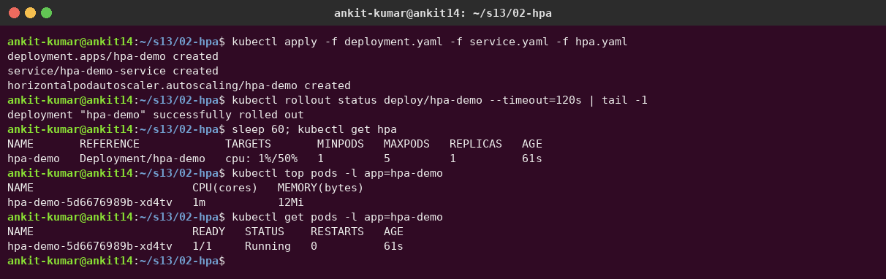

### 4–7. Deploy the load generator → increase load → observe CPU and pod scaling

```bash
kubectl apply -f 02-hpa/load-generator.yaml     # 3 busybox pods x 20 parallel wget loops
./02-hpa/watch-hpa.sh 4                          # prints TARGETS / REPLICAS every 15s
```

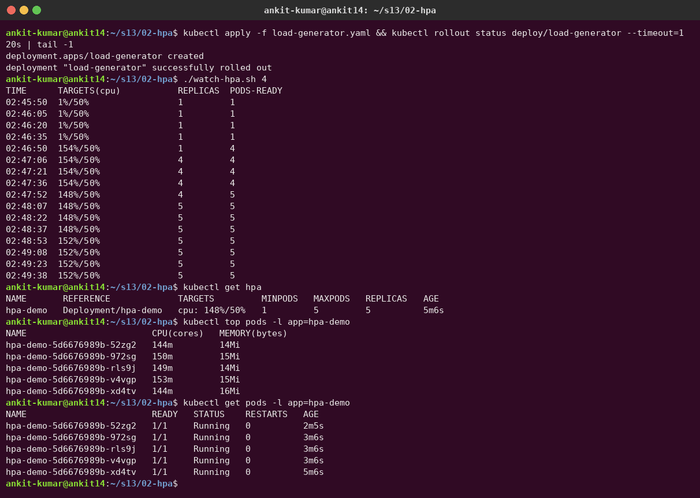

| Time | CPU | Replicas | What happened |
|---|---|---|---|
| 02:46:35 | 1% | 1 | Load generator starting |
| 02:46:50 | **154%** | 1 | Metrics refreshed (about every 15 s) |
| 02:47:06 | 154% | **4** | ceil(1 × 154/50) = 4 |
| 02:48:07 | 148% | **5** | Still above target, capped at `maxReplicas: 5` |

`kubectl top pods` shows each pod at about 150m: the pods are pinned at their **CPU limit (200m)**, and the load is still more than 5 pods can handle. In production you'd raise `maxReplicas` or add nodes (Cluster Autoscaler).

### `kubectl describe hpa`

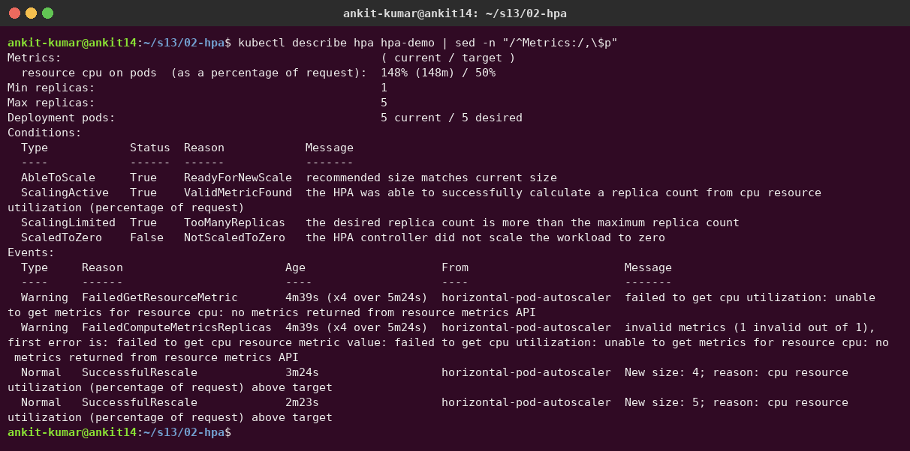

### Scale down after the load stops

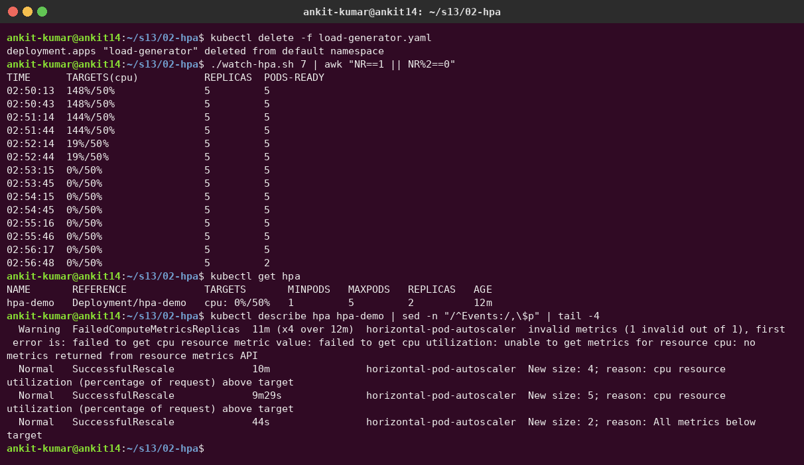

CPU dropped to 0% right away, but the HPA kept 5 replicas for **about 5 minutes**. That's the default **scale-down stabilization window** (300 s), which prevents flapping. Then it scaled down (`New size: 2; reason: All metrics below target`) and kept going toward `minReplicas`. The `FailedComputeMetricsReplicas` warning in the events is from the first minute after creation, before metrics-server had data.

### Commands used

```bash
kubectl get hpa            # TARGETS current/target, REPLICAS
kubectl get pods
kubectl top pods           # live CPU/memory from metrics-server
kubectl describe hpa hpa-demo
```

---

## Task 3 – Mini project: production-ready web app

[`03-mini-project/`](03-mini-project) (from the instructor's session 13 mini project): namespace `production-webapp`, a 500Mi **PVC** mounted at `/data`, 2 nginx replicas with **startup / readiness / liveness probes** and CPU/memory requests/limits, a ClusterIP **Service** and an **HPA** (2–5 replicas, 50% CPU).

```bash
kubectl apply -f namespace.yaml -f pvc.yaml -f deployment.yaml -f service.yaml -f hpa.yaml
```

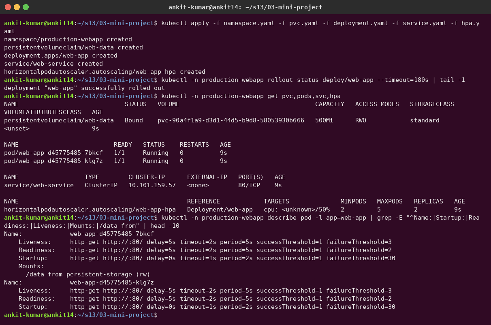

### Task 1 – Storage persistence

I wrote `Student: Ankit Kumar` to `/data/student.txt` in one pod and deleted that pod. The replacement pod (and the other replica) still read the same file from the PVC:

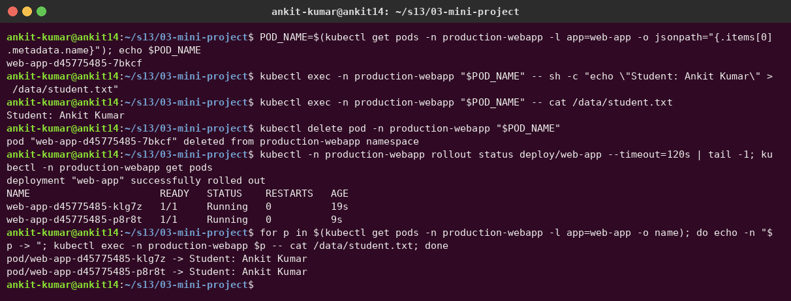

> Note: the PVC is `ReadWriteOnce`, so all replicas can share it only because minikube has a single node. On a multi-node cluster, pods on other nodes would get stuck in `ContainerCreating` (`Multi-Attach error`). You'd need RWX storage (NFS/EFS) or a StatefulSet with one volume per pod.

### Task 2 – Service verification

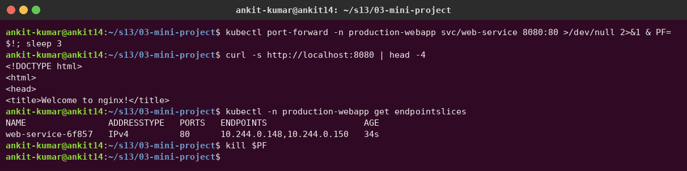

### Task 3 – HPA elastic scaling

**What I observed:** with the instructor's single `kubectl run load-generator … while true; do wget …; done`, CPU only reached **18–25%** and nothing scaled. `kubectl top` showed that the **load generator itself was the bottleneck** (935m CPU on one sequential loop):

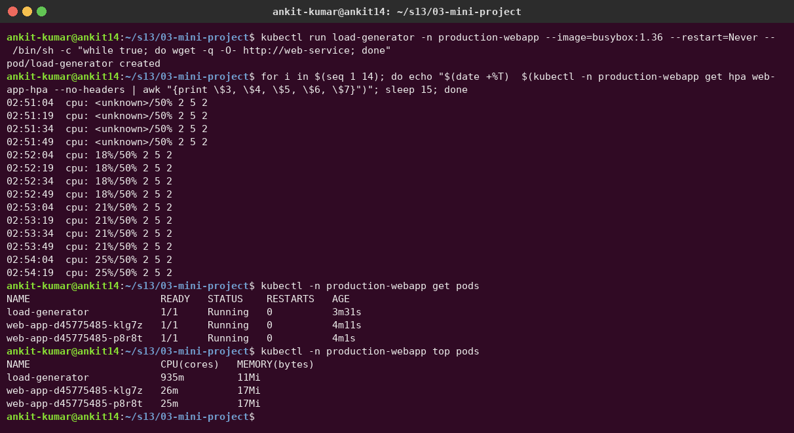

So I added [`parallel-load-generator.yaml`](03-mini-project/parallel-load-generator.yaml) (2 pods × 20 parallel loops). CPU jumped to **153%**, and the HPA scaled **2 → 4 → 5**:

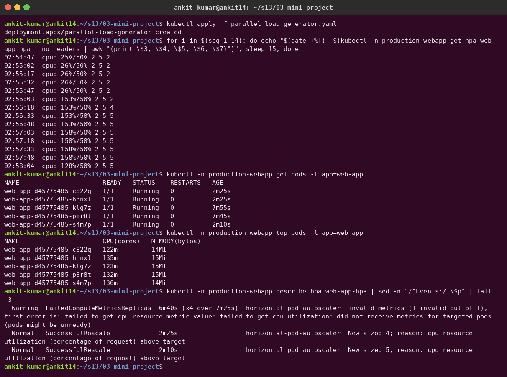

### Bonus challenge 2 – Readiness gating

`readinessProbe.path: /does-not-exist`: the pods are `Running` but `READY 0/1`, every endpoint is `ready=false`, and the probe gets **404**. The Service sends **no traffic** to them, but they are *not* restarted.

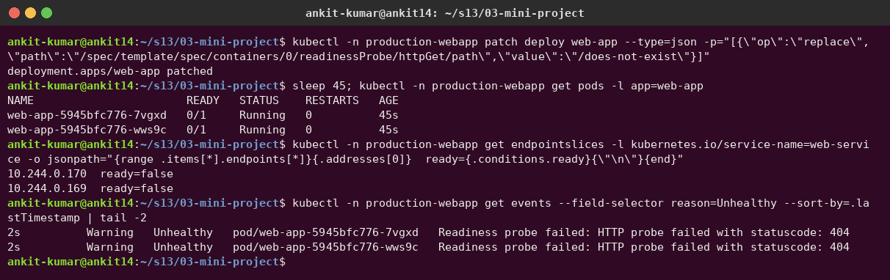

### Bonus challenge 3 – Liveness restart loop

`livenessProbe.path: /crash` → 404 three times (`failureThreshold: 3` × `periodSeconds: 5`), so the kubelet kills and restarts the container. **RESTARTS climbs** 1 → 2 → 3 and the pods end up in `CrashLoopBackOff`.

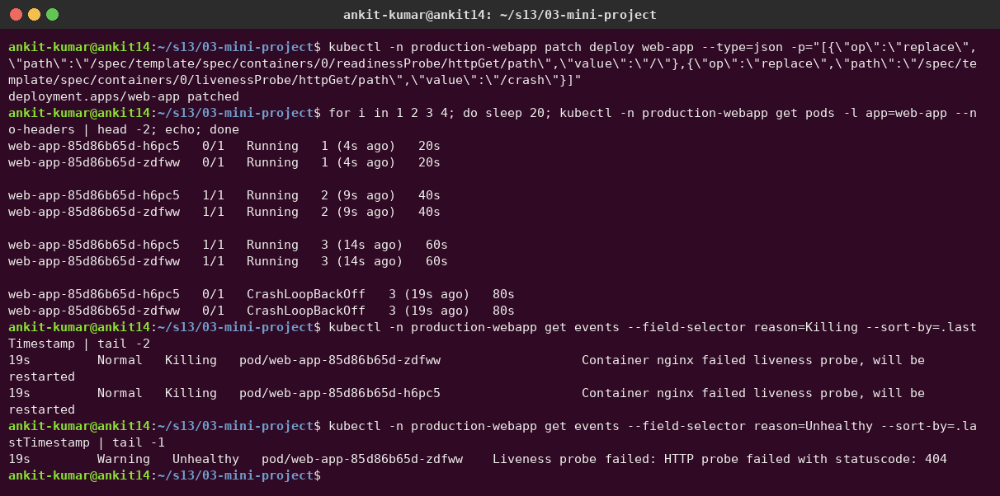

Restored the original deployment, and everything is healthy again:

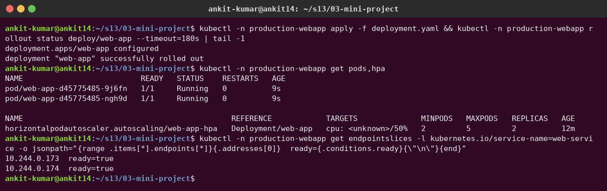

### Probe summary

| Probe | Question it answers | On failure |
|---|---|---|
| **startupProbe** | Has the app finished starting? (holds back the other probes) | Container killed after `failureThreshold × periodSeconds` (here 30 × 2 s = 60 s) |
| **readinessProbe** | Can it receive traffic right now? | Removed from Service endpoints, **not** restarted |
| **livenessProbe** | Is it still healthy or stuck? | Container **restarted** |

---

## Cleanup

```bash
kubectl delete -f 02-hpa
kubectl delete namespace production-webapp
```
