# Session 14 – Kubernetes Troubleshooting

**Author:** Ankit Kumar
**Cluster:** minikube (Kubernetes v1.37.0)

```text
homework/
├── 01-commands/      demo-app.yaml                      (Task 1)
├── 02-issues/        01..09 + 10-bonus: broken.yaml + fixed.yaml for every issue   (Task 2)
│   └── test-client.yaml                                 (curl pod used for in-cluster tests)
├── 03-mini-project/  deployment.yaml service.yaml broken-pod.yaml broken-service.yaml (Task 3)
└── screenshots/
```

My troubleshooting method, used for every issue:

```text
1. kubectl get        -> WHAT is wrong (STATUS, READY, RESTARTS)
2. kubectl describe   -> WHY (State/Reason, Events at the bottom)
3. kubectl logs       -> what the APP said (add --previous after a restart)
4. kubectl exec / test pod -> check from INSIDE the cluster (DNS, ports, env)
5. compare YAML (labels, selectors, ports, names) -> root cause -> fix -> verify again
```

---

## Task 1 – Troubleshooting commands

Practised on [`01-commands/demo-app.yaml`](01-commands/demo-app.yaml) (2 nginx replicas + a Service).

### `kubectl get` – current state at a glance

Also `--field-selector=status.phase!=Running` to list only unhealthy pods across all namespaces:

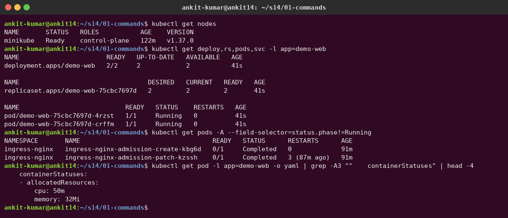

### `kubectl get -o wide` – adds pod IP, node, images and selectors

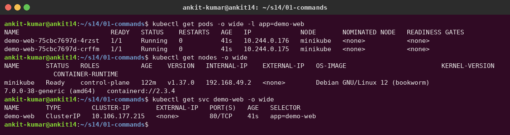

### `kubectl describe` – full detail: container state, conditions, **events**

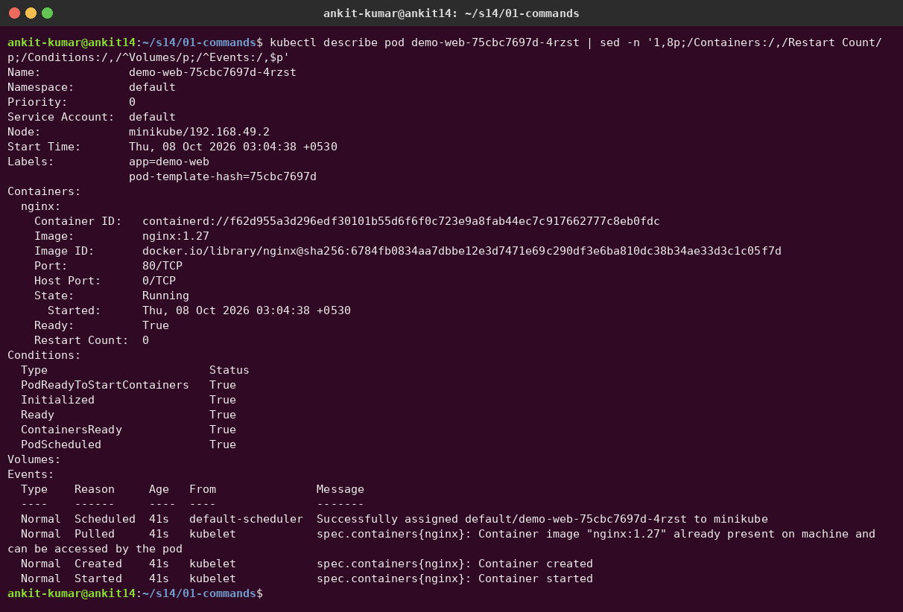

### `kubectl logs` – the application's stdout/stderr

`--tail`, `-l` selector + `--prefix`, `--since`/`--timestamps`, `-c container`, and `--previous` (fails here because this container has never restarted):

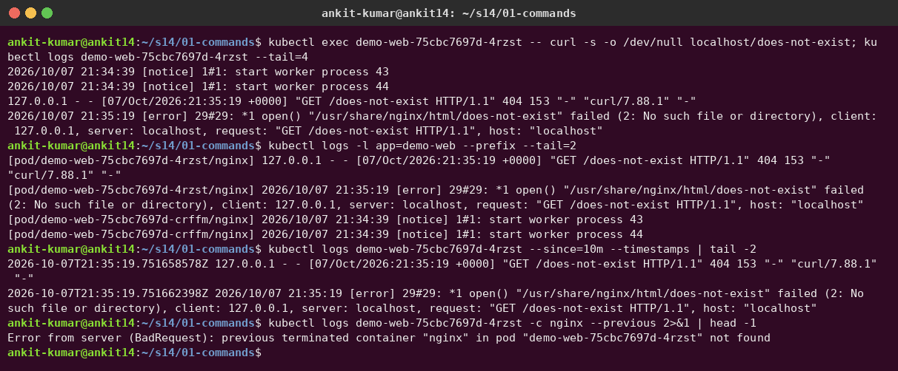

### `kubectl exec` – run commands inside a container

Check versions, `/etc/resolv.conf`, call the Service from inside, and read the injected service env vars:

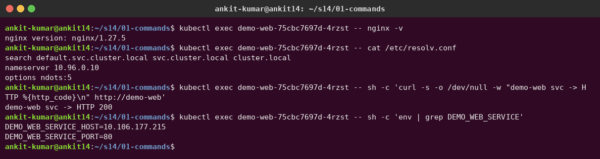

### `kubectl events` – cluster events, filterable by type or object

The Warning list shows real problems from earlier sessions (failed probes, unbound PVC, HPA without metrics):

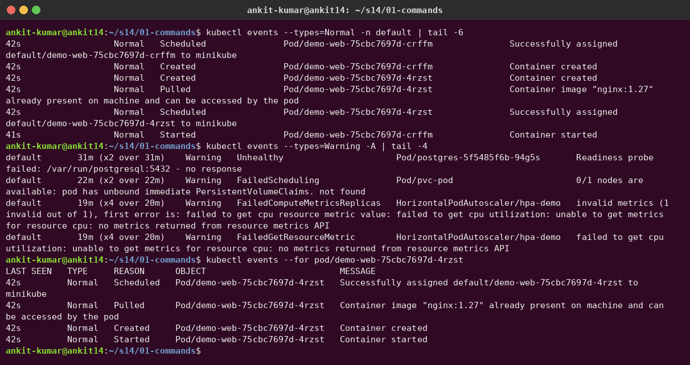

### `kubectl explain` – built-in API documentation for any field

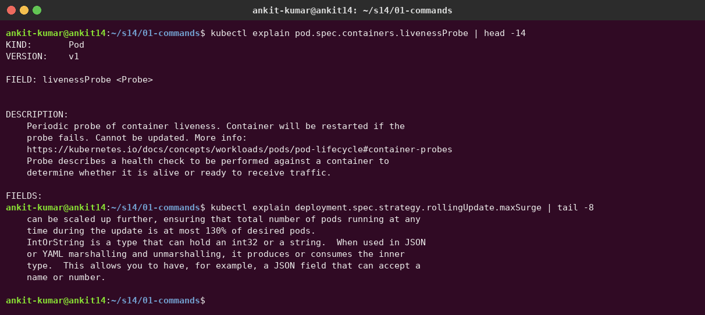

### `kubectl top` – live CPU/memory (needs metrics-server)

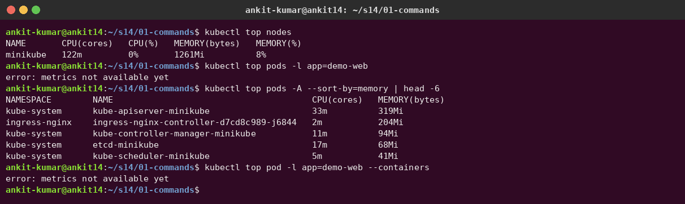

| Command | Use it when |
|---|---|
| `kubectl get pods [-A] [-o wide] [--show-labels]` | First look: status, restarts, IPs, nodes, labels |
| `kubectl describe pod/svc/node <name>` | Need the reason: events, probe results, mounts, scheduling |
| `kubectl logs <pod> [-c c] [--previous] [-f]` | App crashed or misbehaves |
| `kubectl exec -it <pod> -- sh` | Test DNS/network/config from inside |
| `kubectl events [--for pod/x] [--types=Warning]` | Timeline of what the cluster did |
| `kubectl explain <resource.field>` | Unsure what a YAML field means |
| `kubectl top nodes/pods` | Performance, OOM and HPA questions |

---

## Task 2 – Troubleshoot common issues

| # | Issue | Root cause | Fix |
|---|---|---|---|
| 1 | CrashLoopBackOff | App exits: `DATABASE_URL` env var missing | Add the env var |
| 2 | ImagePullBackOff | Image tag doesn't exist | Use an existing tag |
| 3 | ErrImagePull | Private/nonexistent repo → registry returns **403** | Correct image (+ `imagePullSecrets` for private) |
| 4 | Pending | Requests 500 CPUs / 1000Gi memory | Realistic resource requests |
| 5 | ContainerCreating | Volume refers to a ConfigMap that doesn't exist | Create the ConfigMap |
| 6 | Service connectivity | `targetPort: 8080` but the container listens on 80 | `targetPort: 80` |
| 7 | DNS | Wrong service name **and** wrong namespace in the hostname | `postgres-db.data.svc.cluster.local` |
| 8 | Pod networking | App binds to `127.0.0.1` inside the pod | Bind to `0.0.0.0` (+ readiness probe) |
| 9 | Configuration | Env var references a ConfigMap key that doesn't exist | Correct key name |
| 10 | Bonus: OOMKilled | 100 MiB allocation with a 20Mi memory limit | Right-size the limit (or fix the leak) |

### 1. CrashLoopBackOff – [`02-issues/01-crashloopbackoff`](02-issues/01-crashloopbackoff)

- **Identify:** `RESTARTS 3`, status `Error` / CrashLoopBackOff.
- **Investigate:** `describe` shows `Last State: Terminated, Exit Code 1` and `BackOff` events. `logs` shows the app's own message.
- **Root cause:** `[FATAL ERROR]: DATABASE_URL environment variable is MISSING!`

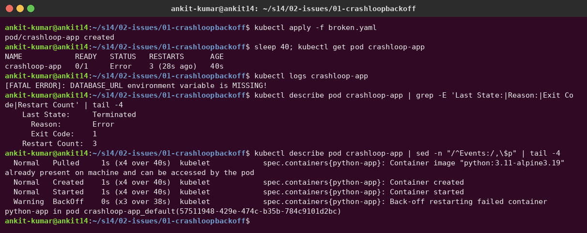

- **Fix and verify:** added the env var → `Running`, 0 restarts, `Application started successfully!`

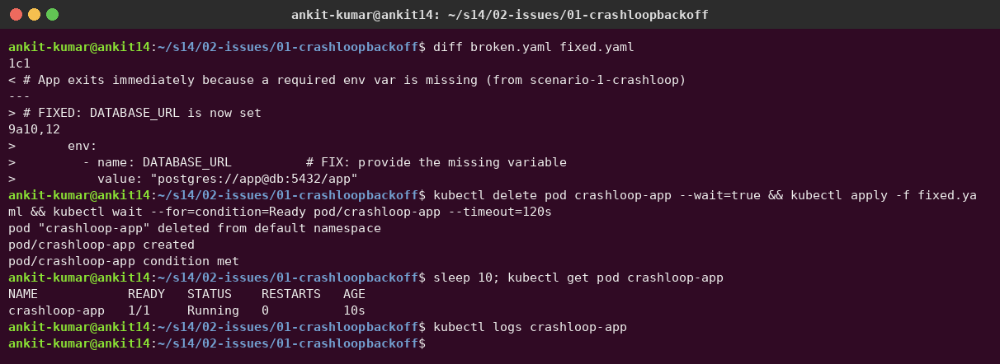

> I also noticed `kubectl logs --previous` can fail with *unable to retrieve container logs* when the restart counter has moved on and the older container was garbage-collected. Plain `kubectl logs` (the last terminated attempt) still showed the error.

### 2. ImagePullBackOff – [`02-issues/02-imagepullbackoff`](02-issues/02-imagepullbackoff)

- **Identify:** status alternates `ErrImagePull` → `ImagePullBackOff` (kubelet retries with increasing back-off).
- **Investigate / root cause:** `describe` → `Image: nginx:this-tag-does-not-exist`, event `not found`.

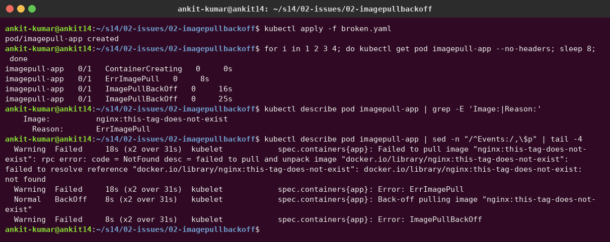

- **Fix and verify:** `nginx:1.27` → `Running`.

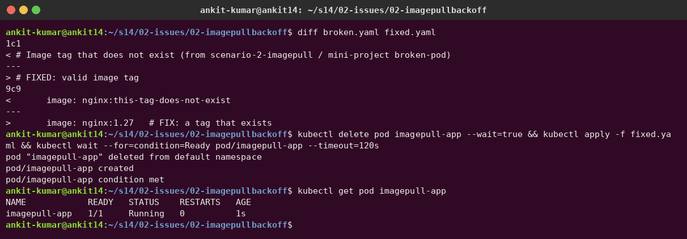

### 3. ErrImagePull – [`02-issues/03-errimagepull`](02-issues/03-errimagepull)

`ErrImagePull` is the **first** failed pull. `ImagePullBackOff` is Kubernetes waiting before retrying.

- **Root cause:** the event shows the registry answered **`403 Forbidden`** when fetching an anonymous token. The repository is private or doesn't exist, and there are no credentials.

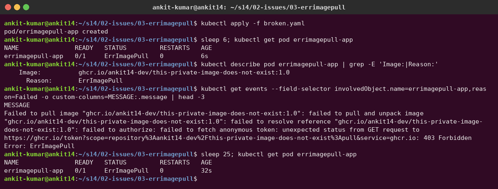

- **Fix and verify:** use a public image that exists (my Session 16 image on GHCR). For a real private image: `kubectl create secret docker-registry ghcr-creds …` plus `imagePullSecrets`.

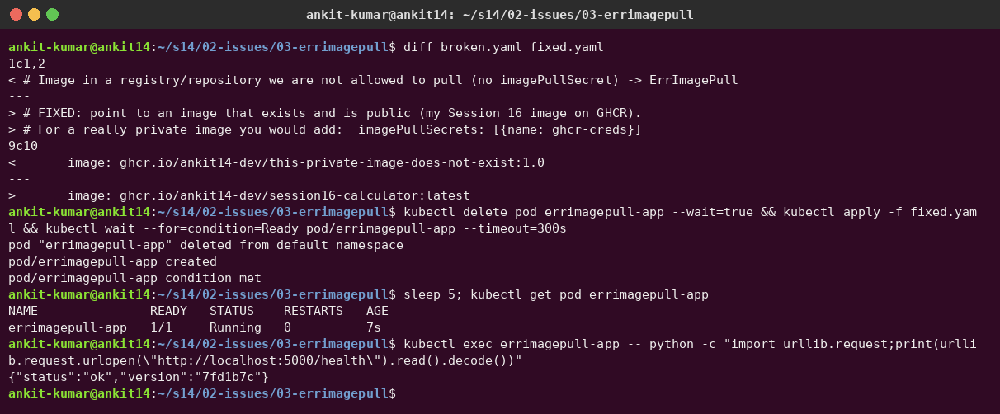

### 4. Pending – [`02-issues/04-pending`](02-issues/04-pending)

- **Identify:** `Pending`, no IP, no node.
- **Root cause:** the scheduler event says `0/1 nodes are available: 1 Insufficient cpu, 1 Insufficient memory`. The node has only 16 CPUs (`describe node` → allocated resources).

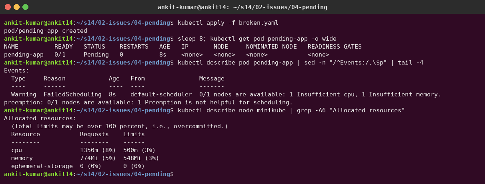

- **Fix and verify:** requests `100m` / `64Mi` → scheduled and `Running`. Other causes of Pending: an unbound PVC, nodeSelector/affinity mismatch, taints.

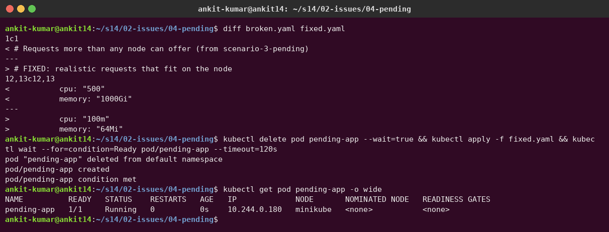

### 5. ContainerCreating (stuck) – [`02-issues/05-containercreating`](02-issues/05-containercreating)

- **Identify:** stuck in `ContainerCreating` for 30+ s.
- **Root cause:** the event `FailedMount … configmap "nginx-site-config" not found` (×6). The kubelet can't prepare the volume, so the container never starts.

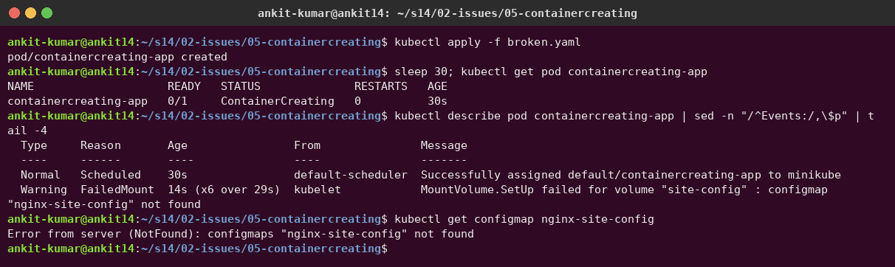

- **Fix and verify:** create the ConfigMap. The **same pod** starts by itself (no restart needed), and nginx serves the config from the ConfigMap.

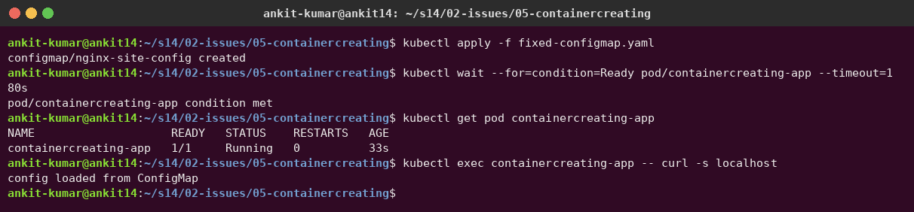

### 6. Service connectivity – [`02-issues/06-service-connectivity`](02-issues/06-service-connectivity)

- **Identify:** `curl http://shop-api` from a pod → **exit code 7 (connection refused)**, although the pods are Running.
- **Investigate:** the endpoints exist (so the selector is fine) but show port **8080**. The Service has `TargetPort: 8080`, while `containerPort` is 80. Inside the pod, `localhost:80` works and `localhost:8080` is refused.
- **Root cause:** wrong `targetPort`.

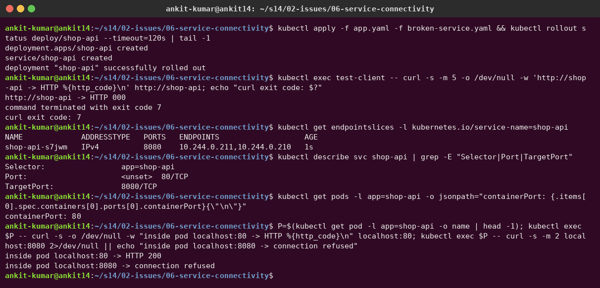

- **Fix and verify:** `targetPort: 80` → endpoints on port 80, HTTP 200.

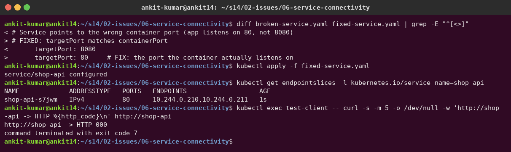

### 7. DNS issues – [`02-issues/07-dns`](02-issues/07-dns)

- **Identify:** the client logs `FAILED (curl exit 6: could not resolve host)`.
- **Investigate:** `nslookup` → `NXDOMAIN`. `kubectl get svc -A` shows the real service is **`postgres-db` in namespace `data`**, and namespace `production` doesn't exist.
- **Root cause:** wrong name and wrong namespace in the FQDN.

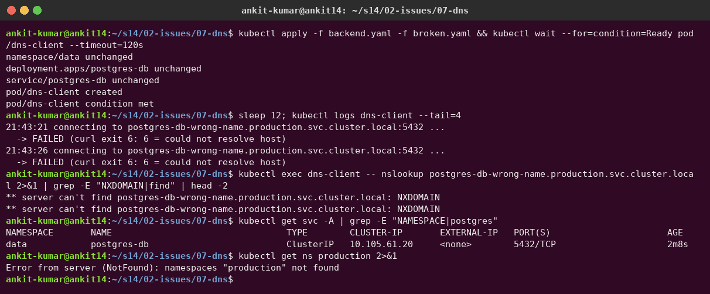

- **Fix and verify:** `postgres-db.data.svc.cluster.local` resolves to 10.105.61.20 and the client logs `connected (HTTP 200)`.

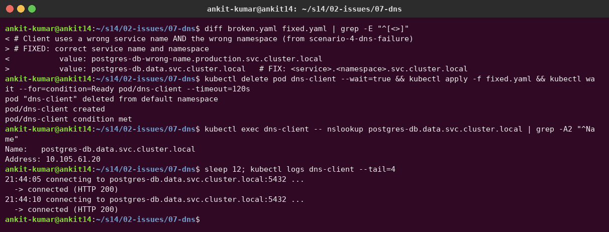

### 8. Pod networking – [`02-issues/08-pod-networking`](02-issues/08-pod-networking)

- **Identify:** the Service **and** the pod IP directly both return `exit code 7` from another pod, but inside the pod `127.0.0.1:8000` works (HTTP 200).
- **Investigate:** `/proc/net/tcp` in the pod shows the listening socket is `0100007F:1F40` = **127.0.0.1:8000**.
- **Root cause:** the app listens on the loopback interface only, so traffic arriving on the pod's eth0 IP is refused. (A very common bug with dev servers: Flask, `http.server`, Node.)

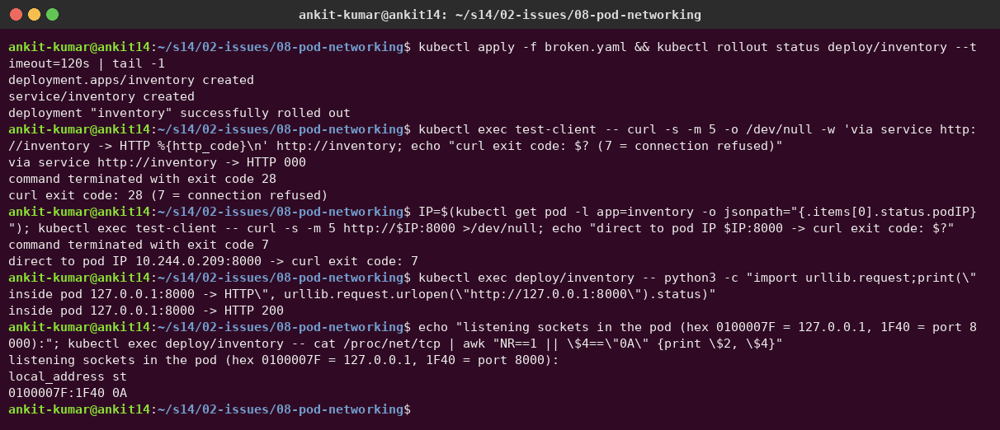

- **Fix and verify:** `--bind 0.0.0.0` → socket `00000000:1F40` (all interfaces) → HTTP 200 via the Service. My first "after" check failed because the Deployment had **no readiness probe**: the rollout finished before Python was listening. I added a `tcpSocket` readiness probe, and the rollout now waits.

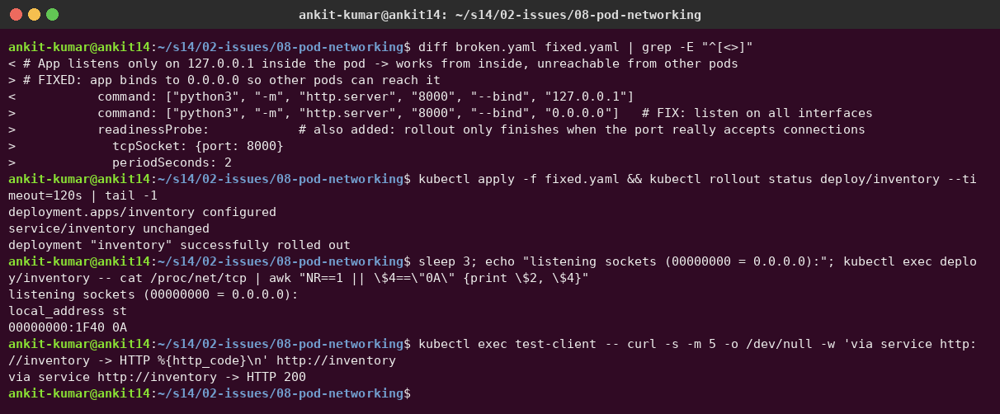

### 9. Configuration issues – [`02-issues/09-configuration`](02-issues/09-configuration)

- **Identify:** `CreateContainerConfigError` (the container is never created).
- **Root cause:** the event says `couldn't find key TIMEOUT in ConfigMap default/payments-config`. The ConfigMap has `TIMEOUT_SECONDS`.

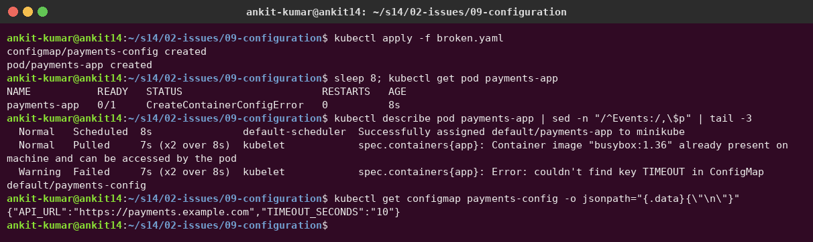

- **Fix and verify:** correct `key:` → `Running`, logs `API=https://payments.example.com TIMEOUT=10`.

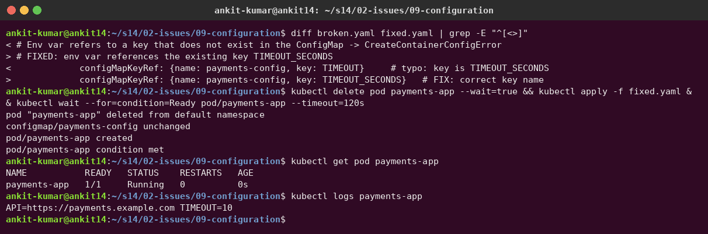

### 10. Bonus – OOMKilled – [`02-issues/10-bonus-oomkilled`](02-issues/10-bonus-oomkilled)

- **Root cause:** `reason=OOMKilled exitCode=137` (128 + SIGKILL 9) with `limit=20Mi`. The kernel killed the process as soon as it allocated more.

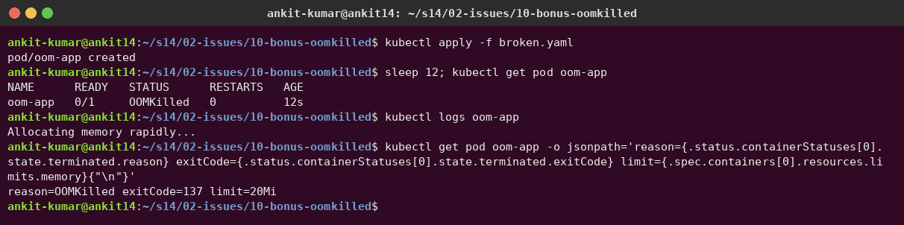

- **Fix and verify:** limit 256Mi → `Completed`, `allocated 100 MiB - done`.

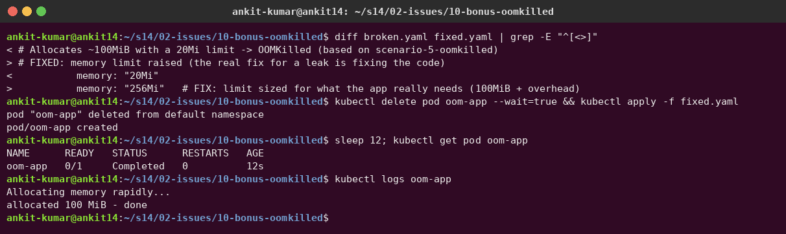

---

## Task 3 – Mini project: Kubernetes troubleshooting challenge

[`03-mini-project/`](03-mini-project) – the instructor's challenge (Deploy → Observe → Break → Investigate → Root cause → Fix → Verify).

### Deploy and observe

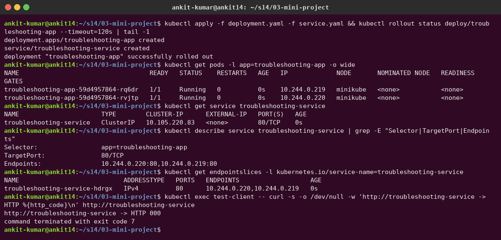

### Broken pod (section 5–6)

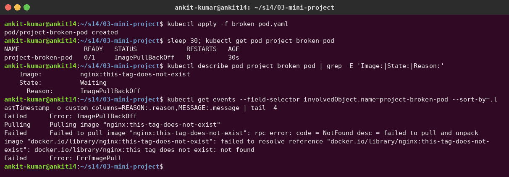

| Question | Answer |
|---|---|
| 1. What is the Pod status? | `ImagePullBackOff` (first `ErrImagePull`), `READY 0/1`, `State: Waiting` |
| 2. What is the actual error? | `failed to resolve reference "docker.io/library/nginx:this-tag-does-not-exist": not found` |
| 3. Which command helped find the reason? | `kubectl describe pod project-broken-pod` (Events) / `kubectl get events --field-selector involvedObject.name=…` |
| 4. What is wrong with the image? | The tag `this-tag-does-not-exist` doesn't exist in the nginx repository on Docker Hub |
| 5. How would you fix it? | Use a valid tag (`nginx:1.27`). A Pod's image can't be swapped in place for a bare pod, so delete and re-apply |

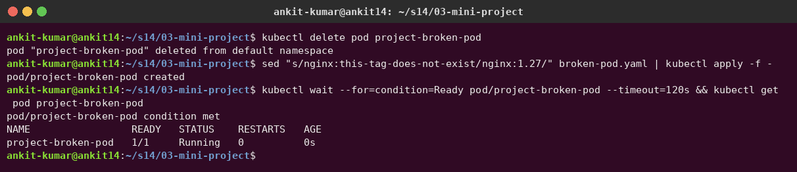

### Service troubleshooting challenge (section 8–9)

With the selector changed to `app: wrong-app` ([`broken-service.yaml`](03-mini-project/broken-service.yaml)), the Service still has a ClusterIP, but **`ENDPOINTS <none>`** and curl is refused. `kubectl get pods --show-labels` shows the pods are labelled `app=troubleshooting-app`, and `describe service` shows `Selector: app=wrong-app` with empty endpoints. That mismatch is the root cause.

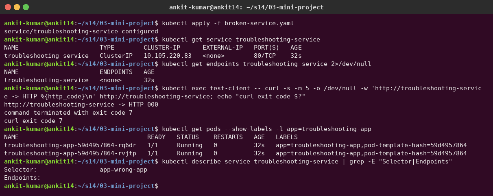

Restoring `app: troubleshooting-app` → 2 endpoints and HTTP 200:

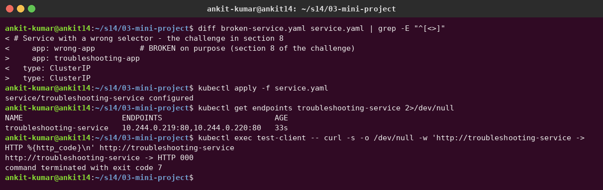

### Final troubleshooting table

| Symptom | First command | Typical root cause |
|---|---|---|
| `CrashLoopBackOff` | `kubectl logs <pod>` | App error, missing config/env, bad command |
| `ImagePullBackOff` / `ErrImagePull` | `kubectl describe pod` (Events) | Wrong image/tag, private registry without credentials |
| `Pending` | `kubectl describe pod` (FailedScheduling) | Not enough CPU/memory, PVC not bound, taints/affinity |
| `ContainerCreating` (stuck) | `kubectl describe pod` (FailedMount) | Missing ConfigMap/Secret/PVC, CNI problem |
| `CreateContainerConfigError` | `kubectl describe pod` | Missing ConfigMap/Secret or key |
| `OOMKilled` (exit 137) | `kubectl describe pod` (Last State) | Memory limit too low or a memory leak |
| Service unreachable | `kubectl get endpoints <svc>` | Selector ≠ labels, wrong targetPort, pods not Ready |
| `could not resolve host` | `nslookup` from a pod | Wrong name/namespace, CoreDNS down |
| Works inside the pod only | `/proc/net/tcp`, `ss -tln` in the pod | App bound to 127.0.0.1 |

### README questions

1. **What does `kubectl get` tell us?** A one-line-per-object summary of the current state: STATUS, READY, RESTARTS, AGE (and IPs/nodes with `-o wide`). It's the "what".
2. **`get` vs `describe`?** `get` is a summary (or raw YAML with `-o yaml`). `describe` is a human-readable deep dive that also pulls in related **events**, so it gives the "why".
3. **Why `kubectl logs`?** To see what the application itself printed (stack traces, config errors). Kubernetes can only tell you *that* a container exited, not *why*.
4. **When `kubectl exec`?** When you need to look from inside a running container: test DNS/connectivity, check env vars, files, listening ports, config.
5. **CrashLoopBackOff?** The container keeps exiting and the kubelet keeps restarting it, waiting longer each time (10 s → 20 s → … 5 min).
6. **ImagePullBackOff?** The kubelet couldn't pull the image (wrong name/tag, no access, registry down), and it is waiting before trying again.
7. **Why can a Pod stay Pending?** The scheduler can't place it (insufficient CPU/memory, unbound PVC, nodeSelector/affinity, taints), or it's still pulling images.
8. **Why can a Service have no endpoints?** Its selector matches no pods (typo or label mismatch), or the matching pods aren't Ready (failing readiness probe).
9. **Service selector vs Pod labels?** The Service selects pods whose labels match **all** its selector key/values. Matching pods become the endpoints. Change one and traffic stops.
10. **What is Kubernetes DNS?** CoreDNS gives every Service a name `<svc>.<namespace>.svc.cluster.local` (and pods a search path), so apps find each other by name instead of IP.

---

## Cleanup

```bash
kubectl delete -f 01-commands/demo-app.yaml -f 02-issues/test-client.yaml
for d in 02-issues/*/; do kubectl delete -f "$d" --ignore-not-found; done
kubectl delete -f 03-mini-project --ignore-not-found
```
