# Session 15 – Helm

**Author:** Ankit Kumar
**Tools:** Helm v3 (`helm version` in screenshot 1), minikube Kubernetes v1.37.0

| Deliverable | Where |
|---|---|
| Helm chart (Task 1 & 2) | [`webapp/`](webapp) – generated with `helm create`, customised `Chart.yaml` / `values.yaml` |
| values.yaml | [`webapp/values.yaml`](webapp/values.yaml), [`03-mini-project/notes-chart/values.yaml`](03-mini-project/notes-chart/values.yaml) + [`values-prod.yaml`](03-mini-project/notes-chart/values-prod.yaml) |
| Templates | [`webapp/templates/`](webapp/templates), [`03-mini-project/notes-chart/templates/`](03-mini-project/notes-chart/templates) |
| Install / Upgrade / Rollback | screenshots below |
| Mini project | [`03-mini-project/`](03-mini-project) |

**Helm in one line:** a package manager for Kubernetes. A **chart** (templates + default values) is rendered with **values** into manifests and installed as a **release**. Every install, upgrade or rollback creates a new **revision** that Helm stores in a Secret in the namespace, which is what makes `history` and `rollback` possible.

---

## Task 1 – Helm commands

### `helm create` – scaffold a chart

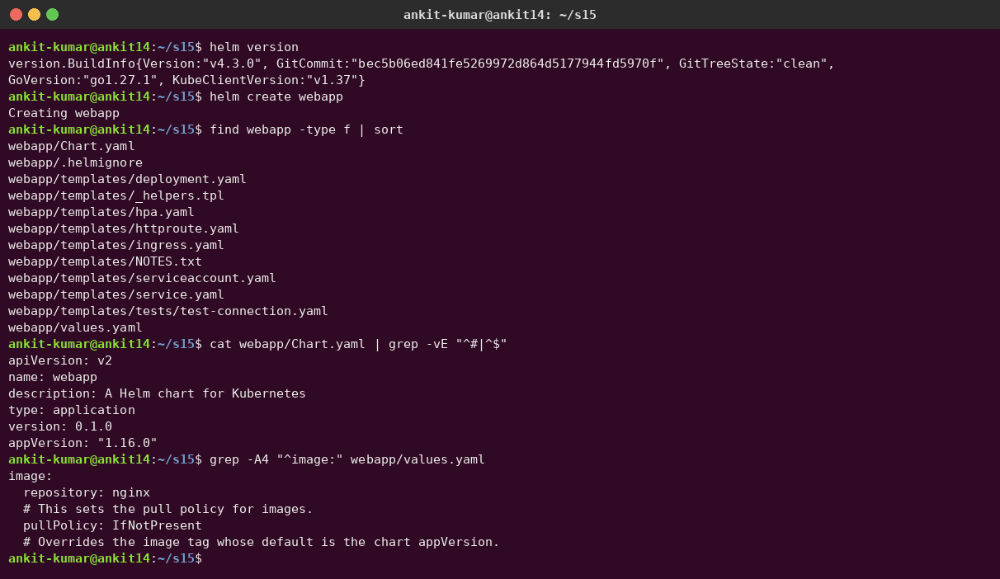

```text
webapp/
├── Chart.yaml          # chart metadata: name, version (chart), appVersion (app)
├── values.yaml         # default configuration values
├── .helmignore
└── templates/
    ├── _helpers.tpl     # reusable named templates (names, labels)
    ├── deployment.yaml  service.yaml  serviceaccount.yaml  ingress.yaml  hpa.yaml  httproute.yaml
    ├── NOTES.txt        # printed after install
    └── tests/test-connection.yaml   # used by `helm test`
```

I changed `Chart.yaml` (description, `appVersion: "1.24"`) and `values.yaml` (`image.tag: "1.24-alpine"`).

### `helm lint` / `helm template` – validate and render locally without installing

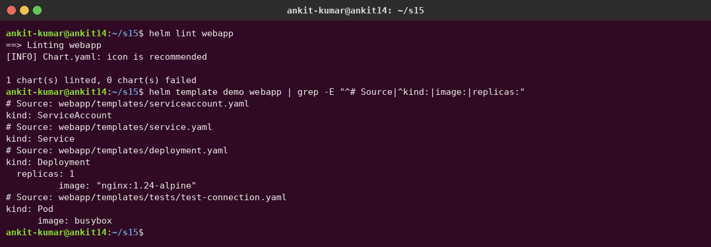

### `helm install` – create a release (revision 1)

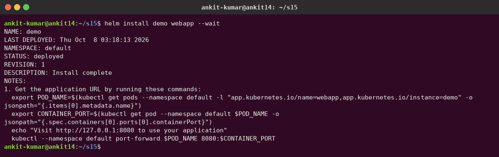

### `helm list` and `helm status` – which releases exist and their state

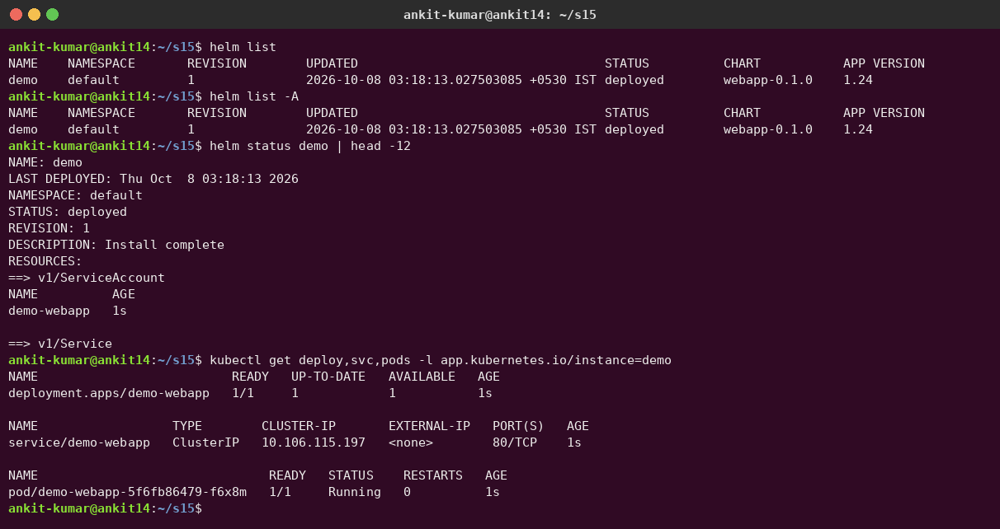

### `helm get` – inspect what was deployed

`get values` (user-supplied), `--all` (merged), `get manifest` (rendered YAML), `get notes`, `get metadata`:

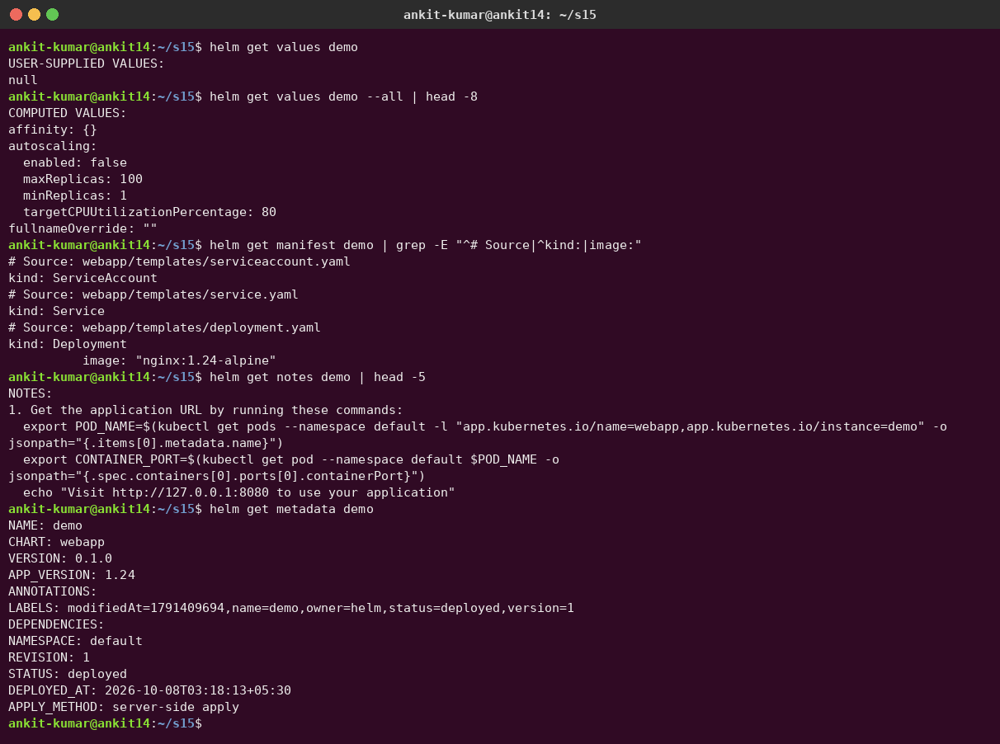

### `helm upgrade` and `helm history`

`--set replicaCount=3 --set image.tag=1.25-alpine` → revision 2. The new pods start while the old ones terminate:

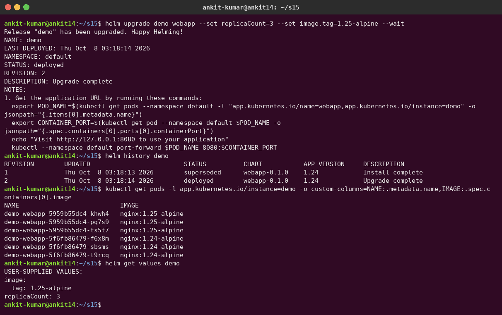

### `helm rollback` – back to revision 1 (creates revision 3)

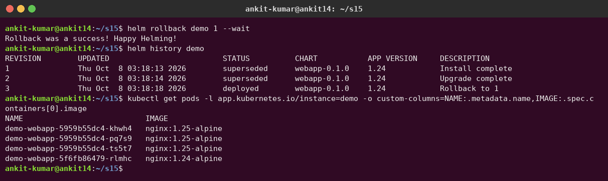

### `helm test` – run the chart's test pod

`templates/tests/test-connection.yaml` runs a `wget` against the Service:

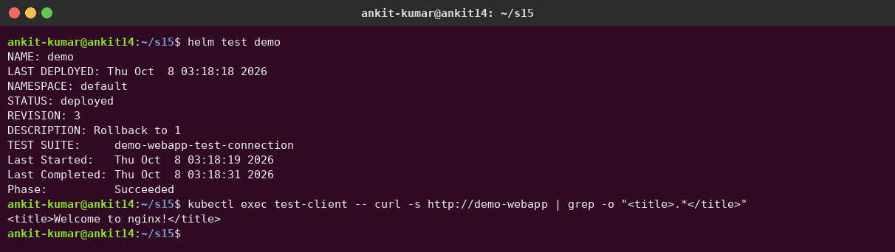

### `helm repo` and `helm search`

Added the repos I need later (Prometheus for Session 20, Argo CD for GitOps). Searched a repo, its versions, and Artifact Hub (`search hub`):

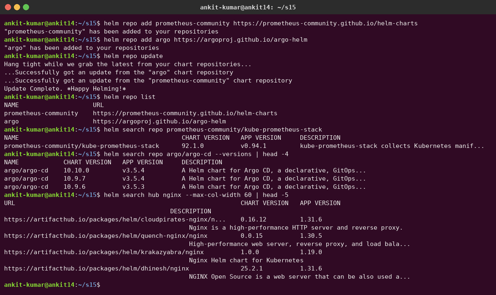

### `helm uninstall` – removes every resource of the release

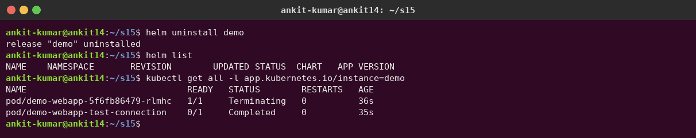

| Command | Purpose |
|---|---|
| `helm create <name>` | Scaffold a new chart |
| `helm lint <chart>` | Check a chart for errors and best practices |
| `helm template <rel> <chart>` | Render manifests locally (no cluster changes) |
| `helm install <rel> <chart> [-f values.yaml] [--set k=v] [--wait]` | Install a release |
| `helm list [-A]` | List releases |
| `helm status <rel>` | Release status and notes |
| `helm get values\|manifest\|notes\|all <rel>` | What exactly was deployed |
| `helm upgrade <rel> <chart> [...] [--install] [--atomic]` | Upgrade (or install) a release |
| `helm history <rel>` | All revisions |
| `helm rollback <rel> <rev>` | Go back to a revision (creates a new one) |
| `helm test <rel>` | Run the chart's test hooks |
| `helm uninstall <rel>` | Delete the release |
| `helm repo add/list/update/remove` | Manage chart repositories |
| `helm search repo\|hub <keyword>` | Find charts locally or on Artifact Hub |

---

## Task 2 – Complete rollback workflow

The release is `webapp`. I verify each step by asking nginx which version is serving (the `Server:` header) and checking the pod images.

### 1. Install (nginx 1.24) → verify

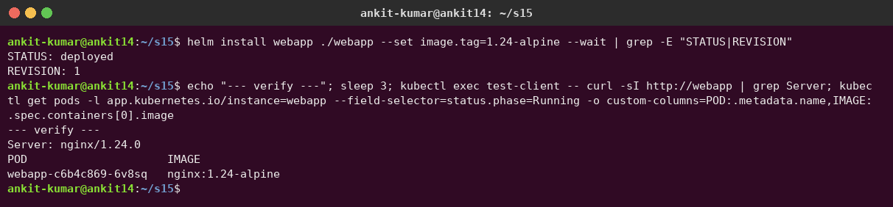

### 2. Upgrade (nginx 1.25) → verify

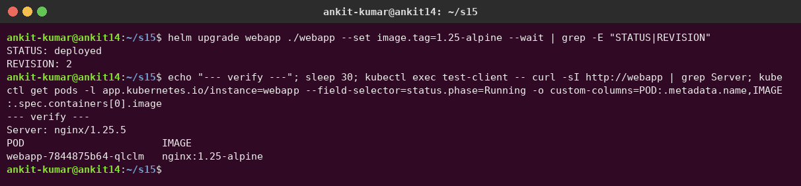

### 3. Upgrade again (nginx 1.27, 2 replicas) → verify

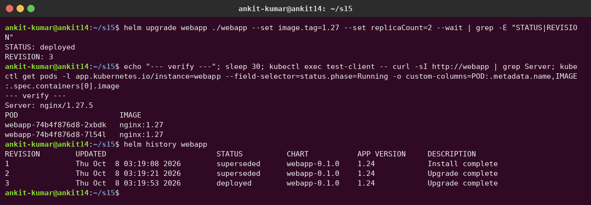

### 4. Rollback to revision 2 → verify

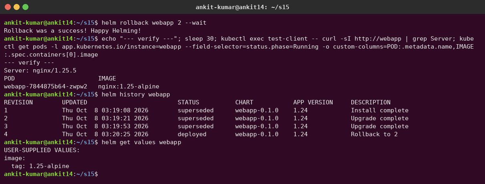

| Revision | Action | Verified |
|---|---|---|
| 1 | `helm install webapp ./webapp --set image.tag=1.24-alpine` | `Server: nginx/1.24.0` |
| 2 | `helm upgrade … --set image.tag=1.25-alpine` | `Server: nginx/1.25.5` |
| 3 | `helm upgrade … --set image.tag=1.27 --set replicaCount=2` | `Server: nginx/1.27.5`, 2 pods |
| 4 | `helm rollback webapp 2` | `Server: nginx/1.25.5`, back to **1** pod: a rollback restores the **whole** revision 2 config, not just the image |

---

## Task 3 – Mini project: Notes app chart

[`03-mini-project/notes-chart`](03-mini-project/notes-chart) – `Chart.yaml`, `values.yaml` (dev), `values-prod.yaml`, and templates for a Deployment, NodePort Service (30090) and ConfigMap.

### Lint and render (steps 8–9)

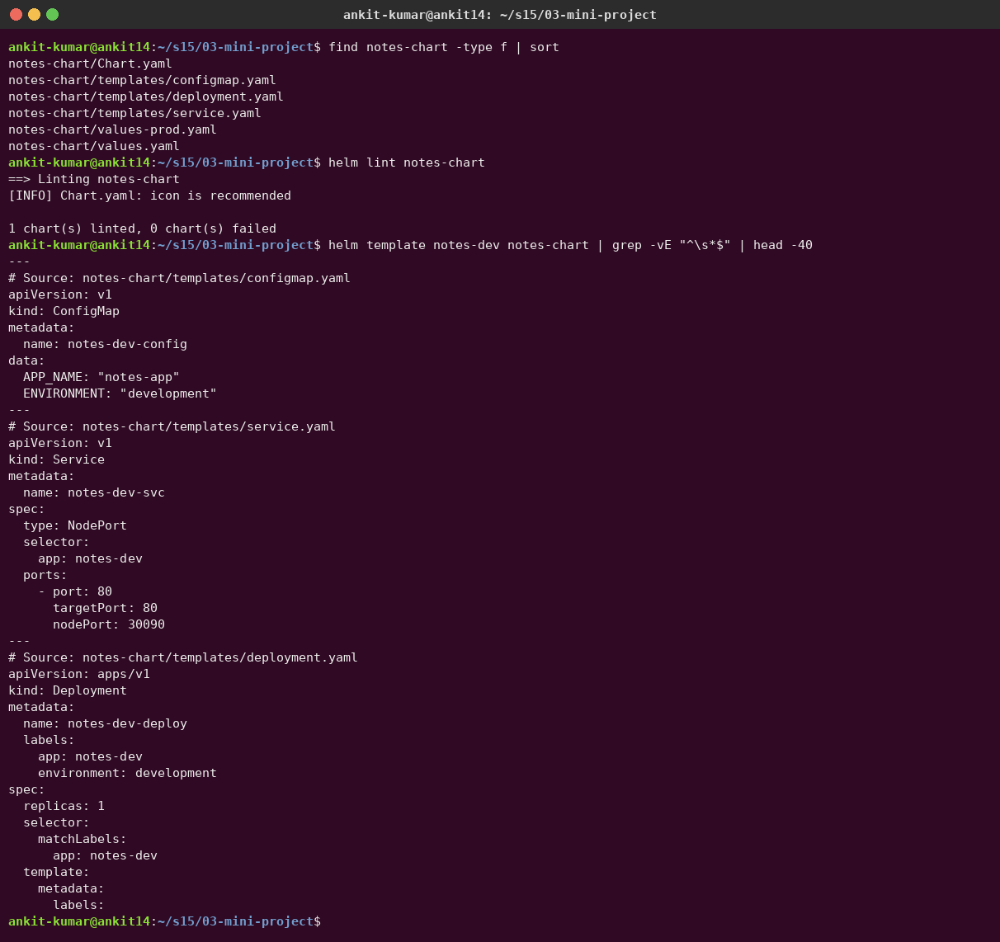

### Install for development (step 10)

1 replica, nginx 1.24, `ENVIRONMENT=development`:

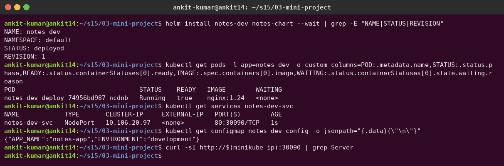

### Upgrade with production values (steps 11–12)

`-f values-prod.yaml` → 3 replicas, nginx 1.25, `ENVIRONMENT=production`:

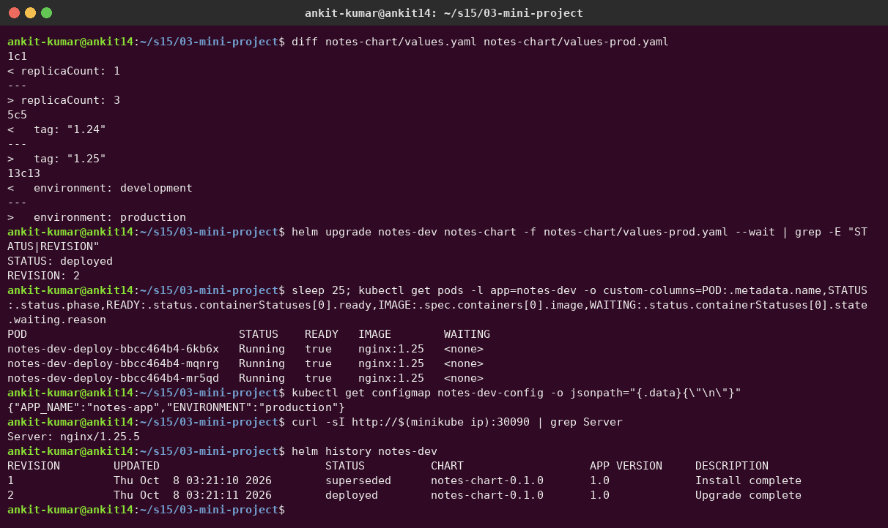

### Simulate a bad upgrade (step 13)

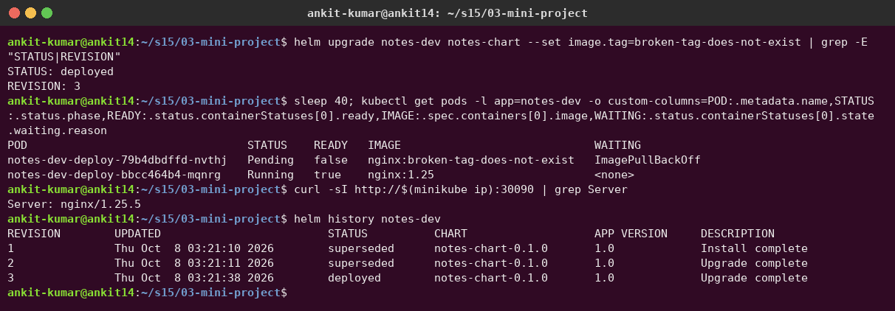

Two things I learned from this step:
1. **Helm reported `STATUS: deployed`** although the new pod is stuck in `ImagePullBackOff`. Without `--wait`, Helm only checks that the manifests were *accepted* by the API server. With `--wait --timeout 2m` the upgrade would be marked `failed`, and with **`--atomic`** Helm would roll back automatically. The app stayed up only because the rolling update keeps the old pod until the new one is Ready.
2. **Running pods dropped from 3 to 1.** `helm upgrade --set image.tag=…` **without** `-f values-prod.yaml` starts again from the chart's *default* values (replicaCount 1, development). `helm upgrade` does **not** reuse the previous release's values unless you pass `--reuse-values`, or the same `-f` file again.

### Rollback to revision 2 (step 14)

Back to 3 healthy nginx 1.25 pods with the production values:

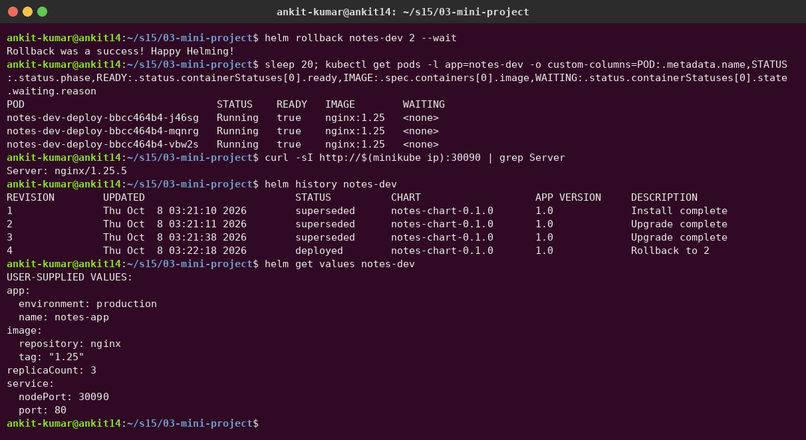

---

## Cleanup

```bash
helm uninstall webapp notes-dev
```
