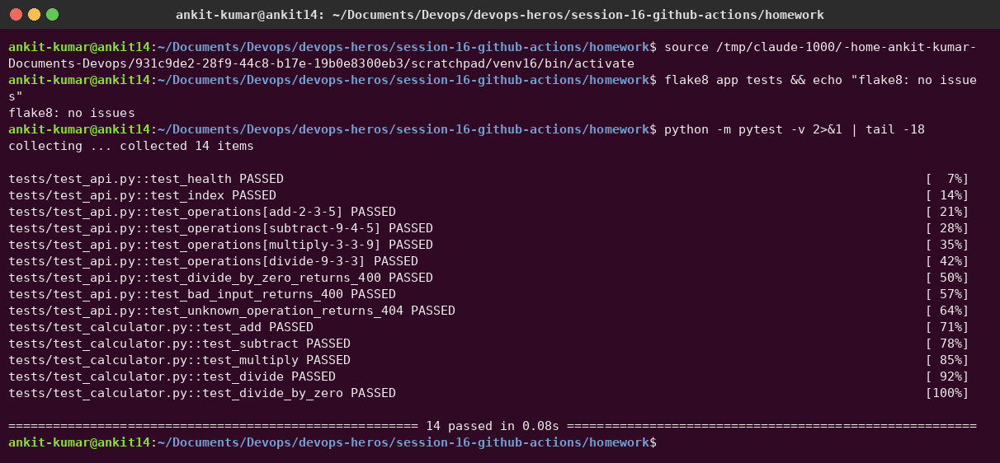
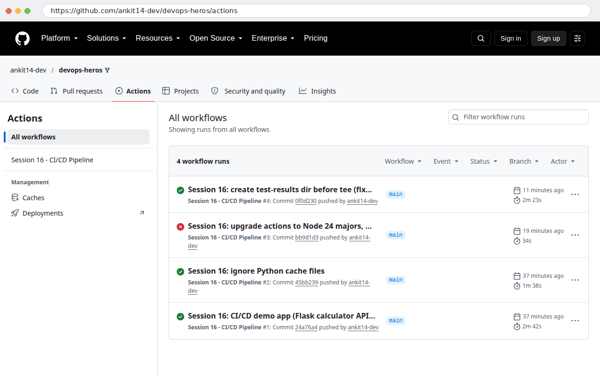
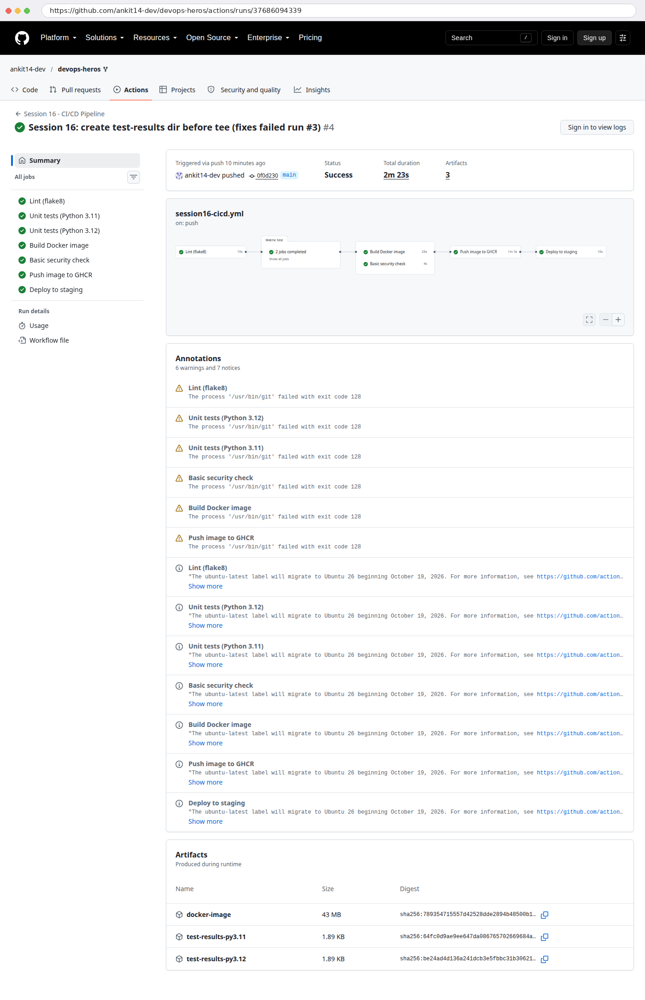
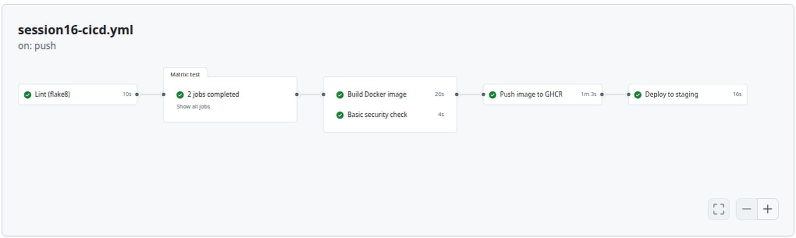
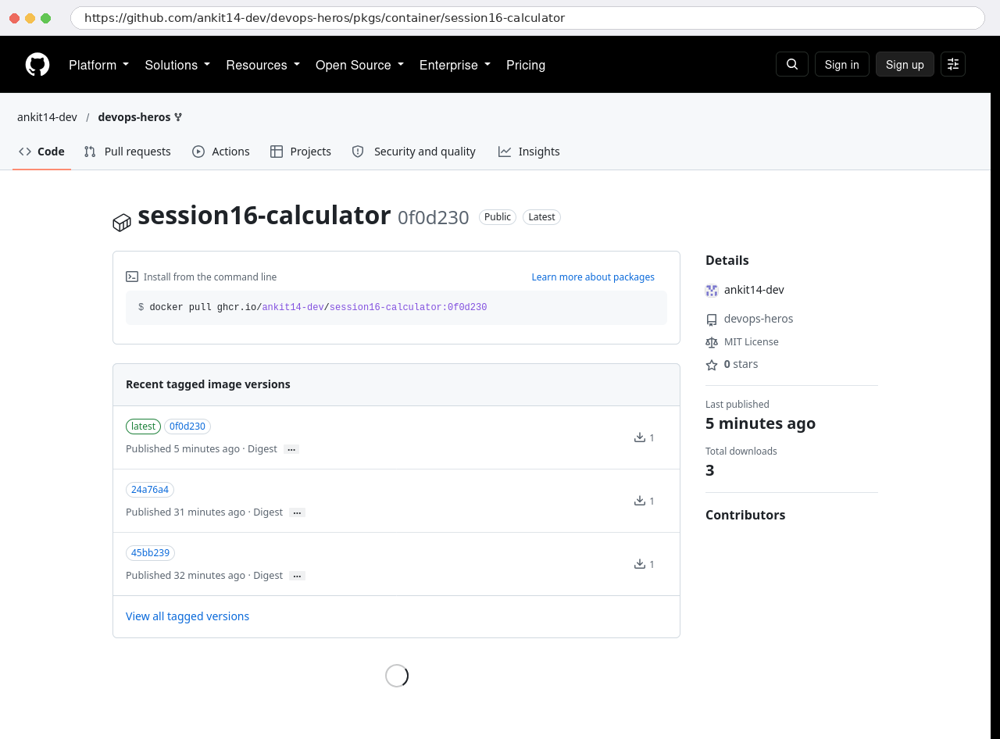
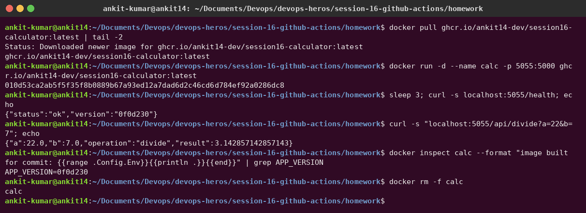
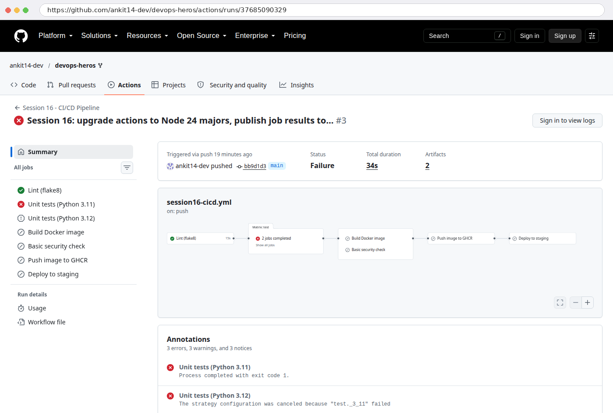

# Session 16 – CI/CD & GitHub Actions: Demo Project

**Author:** Ankit Kumar
**Workflow:** [`.github/workflows/session16-cicd.yml`](../../.github/workflows/session16-cicd.yml) · **Runs:** [Actions tab](https://github.com/ankit14-dev/devops-heros/actions/workflows/session16-cicd.yml) · **Image:** [`ghcr.io/ankit14-dev/session16-calculator`](https://github.com/ankit14-dev/devops-heros/pkgs/container/session16-calculator)

Based on the instructor's `10-final-cicd-pipeline` (test → build → security). I extended it into full **CI + CD**: lint, a matrix of tests, Docker build with a smoke test, a container registry push and a deployment with post-deploy checks.

## The application

A small **Flask calculator API** ([`app/main.py`](app/main.py) + pure logic in [`app/calculator.py`](app/calculator.py)):

| Endpoint | Example | Response |
|---|---|---|
| `GET /health` | `/health` | `{"status":"ok","version":"<commit>"}` |
| `GET /api/<op>?a=&b=` | `/api/divide?a=22&b=7` | `{"result":3.142857…}` |
| errors | `/api/divide?a=1&b=0` → **400**, `/api/power…` → **404** | |

14 unit tests in [`tests/`](tests) (logic + HTTP API), [`Dockerfile`](Dockerfile) (python:3.12-slim, gunicorn, **non-root user**, HEALTHCHECK), [`requirements.txt`](requirements.txt) / [`requirements-dev.txt`](requirements-dev.txt).

```text
session-16-github-actions/homework/
├── app/            __init__.py  calculator.py  main.py
├── tests/          test_calculator.py  test_api.py
├── Dockerfile  .dockerignore  .flake8  pytest.ini  requirements*.txt
└── screenshots/
.github/workflows/session16-cicd.yml      <- workflows must live at the repo root
```

Running it locally first: the same lint and tests the pipeline runs:



---

## Concepts, and where each one appears in my pipeline

### CI vs CD

| | **Continuous Integration** | **Continuous Delivery / Deployment** |
|---|---|---|
| Goal | Every push is automatically **built and tested**, so problems are found minutes after they are introduced | Every change that passes CI is automatically **released** to an environment |
| In my pipeline | `lint` → `test` (matrix) → `build-image` → `security-check` | `push-image` (registry) → `deploy-staging` (+ smoke tests) |
| Runs on | push **and** pull requests | only on push to `main` (`if: github.event_name != 'pull_request' && github.ref == 'refs/heads/main'`) |

### CI/CD pipeline

```text
 git push ─► lint ─► test (py3.11, py3.12) ─┬─► build-image ──┬─► push-image (GHCR) ─► deploy-staging
                                            └─► security-check ┘
            └──────────────────── CI ──────────────────────────┘   └──────────── CD ──────────────┘
```

A failure at any stage **stops everything after it** (`needs:`), so broken code can never reach the registry or staging.

### GitHub Actions, Workflow, Jobs, Steps

| Term | Meaning | In my file |
|---|---|---|
| **Workflow** | A YAML file in `.github/workflows/`, started by **events** | `on: push` (path-filtered to this folder), `pull_request`, `workflow_dispatch` (manual button) |
| **Job** | A group of steps that runs on **one runner**; jobs run in parallel unless they use `needs:` | 6 jobs; `build-image` and `security-check` run **in parallel** after `test` |
| **Step** | One command (`run:`) or a reusable **action** (`uses:`) | `actions/checkout@v7`, `actions/setup-python@v7`, `docker/login-action@v4`, shell steps |
| **Matrix** | Runs one job definition with several parameter sets | `python-version: ["3.11", "3.12"]` → 2 test jobs |
| **Outputs** | Pass data between jobs | `push-image` outputs the image tag that `deploy-staging` uses |
| **Environment** | A named deployment target (can have protection rules and its own secrets) | `environment: staging` |

### Runners

`runs-on: ubuntu-latest` means **GitHub-hosted runners**: a fresh Ubuntu VM for every job, with Docker, Python and git pre-installed, thrown away afterwards. (The run's annotations also note that `ubuntu-latest` moves to Ubuntu 26 on 19 Oct 2026, which is why some teams pin `ubuntu-24.04`.) **Self-hosted** runners are your own machines (`runs-on: [self-hosted, linux]`), used for private network access, GPUs or custom hardware.

### Secrets

- `secrets.GITHUB_TOKEN` is created **automatically for every run**. I use it to log in to GHCR, with `permissions: packages: write` granted only to the `push-image` job (least privilege).
- `secrets.DEMO_API_KEY` is a **repository secret** (Settings → Secrets and variables → Actions). It's passed to the step as an env var, and GitHub **masks** the value as `***` in the logs. The step handles the case where the secret isn't configured.
- Secrets are never written in the YAML and are not passed to workflows triggered from forks.

### Artifacts

Files that one job saves for later jobs (or for people to download):
- `test-results-py3.11` / `test-results-py3.12`: JUnit XML, coverage XML and the pytest output (`if: always()`, so they are uploaded even when tests fail).
- `docker-image`: the built image as `session16-calculator.tar.gz` (43 MB). The **push-image job downloads this artifact** instead of rebuilding, so exactly the image that was tested gets shipped.

### Build & Test

- **Test:** `flake8`, then `pytest -v --junitxml --cov` on two Python versions.
- **Build:** `docker build --build-arg APP_VERSION=<short sha>`, then a **smoke test**: run the container, wait for `/health`, call `/api/add?a=2&b=3`.

---

## Pipeline execution

**All runs.** #1, #2 and #4 succeeded. #3 failed (see below):



**A successful run (#4)**: 7 jobs, the dependency graph, 3 artifacts:





**CD result: the image published to GitHub Container Registry**, tagged with the commit SHA and `latest`:



I pulled the image the pipeline published and ran it on my laptop. The `/health` version `0f0d230` is the commit that run #4 built:



### A real failure, and how I fixed it (run #3)

After adding the `| tee test-results/pytest-output.txt` step summary, run #3 **failed in both test jobs**. The matrix also cancelled the 3.12 job as soon as 3.11 failed (`fail-fast`):



Root cause (reproduced locally): `tee` opens its output file immediately, but `test-results/` only gets created later by pytest's `--junitxml`. `tee` errored, and since GitHub runs bash with `-eo pipefail`, the step failed **even though all 14 tests passed**. Fix: `mkdir -p test-results` before pytest (commit `0f0d230`). Run #4 was green.

## How to trigger it

- Push a change under `session-16-github-actions/homework/` (the path filter ignores the rest of the repo), **or**
- Actions → *Session 16 - CI/CD Pipeline* → **Run workflow** (`workflow_dispatch`).
