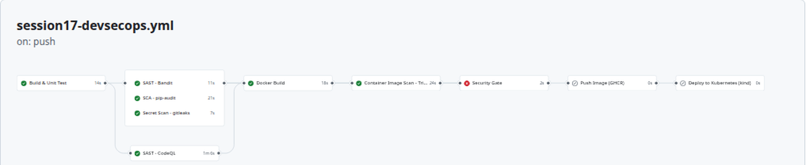
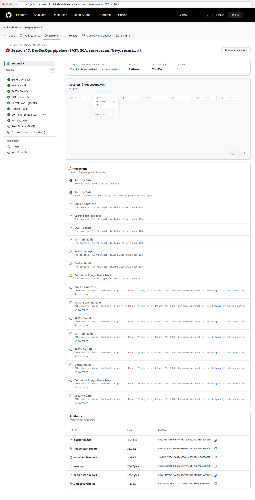
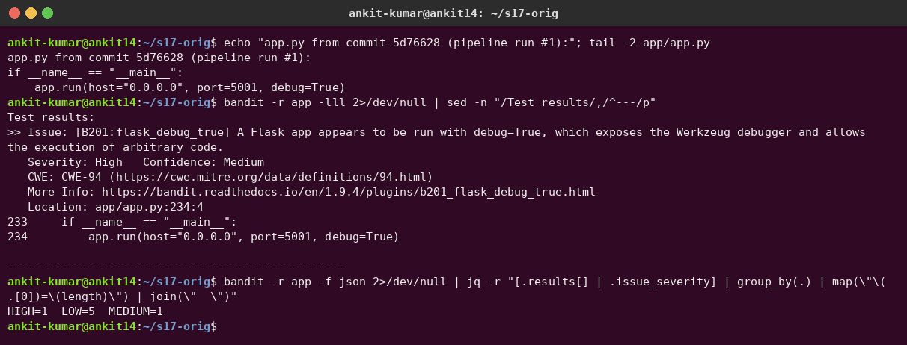
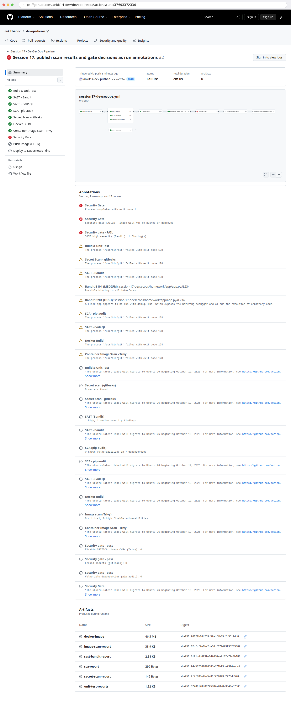
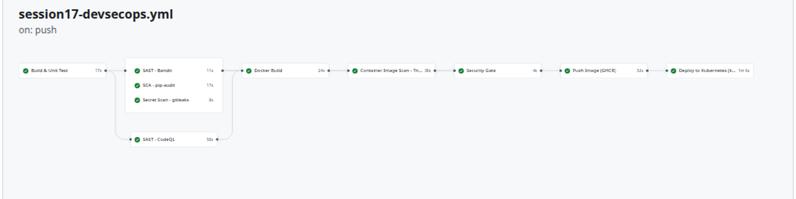
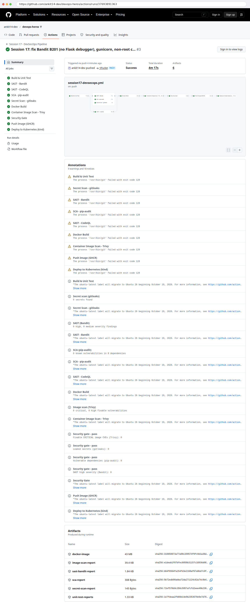
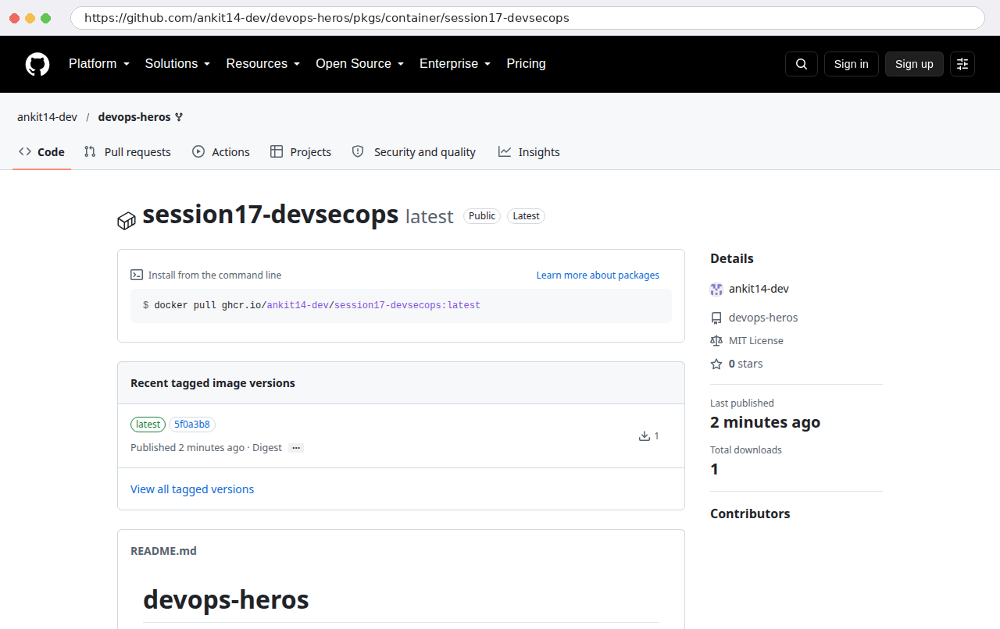
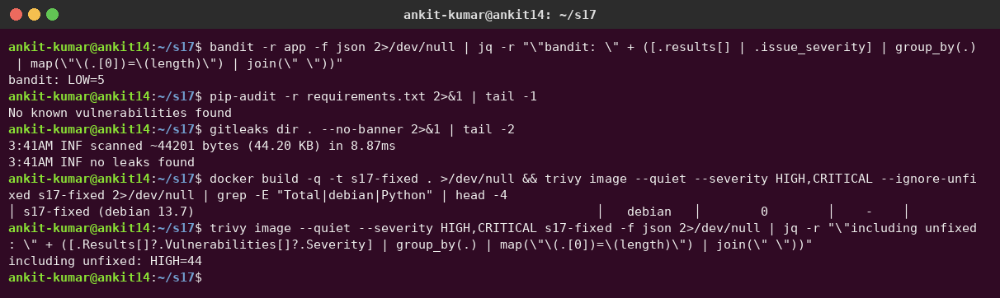
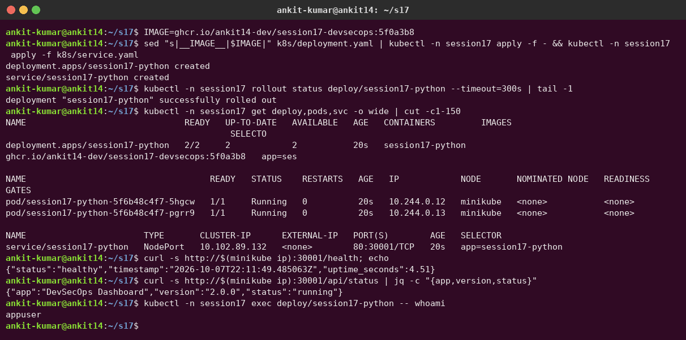
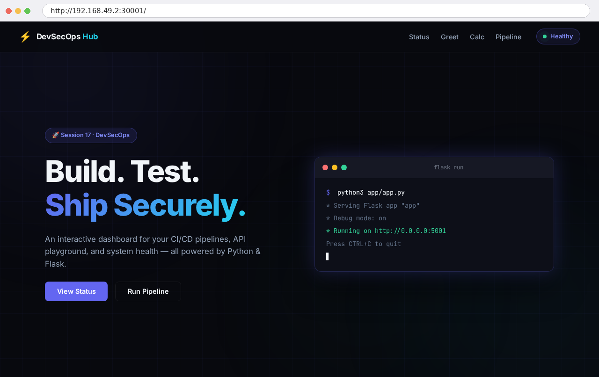

# Session 17 – Complete CI/CD & DevSecOps

**Author:** Ankit Kumar
**Pipeline:** [`.github/workflows/session17-devsecops.yml`](../../.github/workflows/session17-devsecops.yml) · **Runs:** [Actions](https://github.com/ankit14-dev/devops-heros/actions/workflows/session17-devsecops.yml) · **Image:** [`ghcr.io/ankit14-dev/session17-devsecops`](https://github.com/ankit14-dev/devops-heros/pkgs/container/session17-devsecops)

The application is the instructor's Flask **"DevSecOps Dashboard"** (`session-17-devsecops/demo`), copied here and then **fixed** after the pipeline found a real vulnerability in it.

```text
session-17-devsecops/homework/
├── app/                 app.py, templates/, static/      (Flask application)
├── tests/test_app.py    8 unit tests (pytest)
├── Dockerfile           python:3.12-slim, gunicorn, non-root user, HEALTHCHECK
├── requirements.txt     Flask, gunicorn (pinned)
├── requirements-dev.txt + pytest, pytest-cov
├── k8s/                 deployment.yaml (probes + resources, __IMAGE__ placeholder), service.yaml
└── screenshots/
```

## Pipeline – expected flow, implemented

```text
Code ─► Build & Unit Test ─┬─► SAST (Bandit) ──────┐
                           ├─► SAST (CodeQL) ──────┤
                           ├─► SCA (pip-audit) ────┼─► Docker Build ─► Container Image Scan (Trivy) ─► SECURITY GATE ─► Push Image (GHCR) ─► Deploy to Kubernetes (kind) + smoke test
                           └─► Secret Scan (gitleaks)┘
```

| Stage | Tool / how | Output |
|---|---|---|
| **Build** | `pip install`, `python -m compileall app` | – |
| **Unit test** | `pytest --cov --junitxml` | `unit-test-reports` artifact |
| **SAST** | **Bandit 1.9.4** (Python security linter) + **GitHub CodeQL** (semantic analysis → Security tab) | `sast-bandit-report` artifact, annotations |
| **SCA** | **pip-audit 2.10.1** checks `requirements.txt` against the PyPI/OSV advisory DBs | `sca-report` artifact |
| **Secret scanning** | **gitleaks 8.30.1** over the app source | `secret-scan-report` artifact |
| **Docker build** | `docker build`, then `docker save` to an artifact, so the *same* image is scanned, pushed and deployed | `docker-image` artifact |
| **Container image scan** | **Trivy 0.75.0**: OS + Python packages, `--severity HIGH,CRITICAL --ignore-unfixed` | `image-scan-report` artifact |
| **Security gate** | Shell policy over the scan outputs (job `outputs`) | ✅/❌ table + annotations; **blocks push/deploy** |
| **Container registry** | GHCR with the built-in `GITHUB_TOKEN` (`packages: write` only in this job) | `:<sha>` and `:latest` tags |
| **Kubernetes deployment** | `helm/kind-action` creates a cluster **on the runner**, then `kubectl apply` + `rollout status` + `curl /health` via port-forward | – |

**Security tools configuration:** all tool versions are **pinned** (`TRIVY_VERSION`, `GITLEAKS_VERSION`, `bandit==1.9.4`, `pip-audit==2.10.1`) and downloaded from the official release URLs, so a compromised `latest` tag can't silently change the pipeline. Scanners run in **report-only** mode (`|| true`) and export counts through job `outputs`. Only the gate decides pass/fail, so you always get *all* the reports, not just the first failure.

**Gate policy** (the `security-gate` job):

| Check | Blocks if |
|---|---|
| SAST (Bandit) | any **HIGH** severity finding |
| SCA (pip-audit) | any dependency with a known vulnerability |
| Secret scan (gitleaks) | any secret found |
| Image scan (Trivy) | any **fixable CRITICAL** CVE |

Unfixable OS CVEs (Trivy found **44 HIGH with no fix available** in Debian 13) are reported but don't block, since there is nothing to upgrade to yet. Blocking on them would just train people to ignore the gate.

---

## Run #1 – the security gate blocked the release

Pushed the instructor's app unchanged. Every scan job ran, and the **Security Gate failed**, so **Push Image** and **Deploy to Kubernetes** were **skipped**:





**Why?** Bandit (locally on the same commit, `5d76628`) reports **B201 – HIGH**: `app.run(host="0.0.0.0", port=5001, debug=True)`. The Werkzeug debugger allows **arbitrary code execution** from the browser, and binding to 0.0.0.0 (B104, medium) exposes it to the network:



## Run #2 – same code, with findings published as annotations

Job summaries need a GitHub sign-in to view, so I made every scan and gate check also emit public **annotations**. They show `Bandit B201 (HIGH): app.py#L234`, `Bandit B104 (MEDIUM)`, and `Security gate – FAIL: SAST high severity (Bandit): 1`, while pip-audit (0 vulns / 7 deps), gitleaks (0 secrets) and Trivy (0 fixable) pass:



## The fix (commit `5f0a3b8`)

| Problem | Fix |
|---|---|
| Flask debugger on (`debug=True`) – B201 HIGH | `debug=os.environ.get("FLASK_DEBUG") == "1"` (off unless explicitly enabled) |
| Dev server bound to 0.0.0.0 – B104 | `__main__` binds to `127.0.0.1` by default (local dev only) |
| Flask dev server in production | `CMD ["gunicorn", "--bind", "0.0.0.0:5001", ...]` in the Dockerfile |
| Container ran as **root** | `useradd appuser` + `USER appuser` |
| No health check / probes | Docker `HEALTHCHECK`, k8s readiness + liveness probes on `/health`, CPU/memory requests and limits |

## Run #3 – all 11 jobs green: pushed and deployed





Annotations: `Bandit: 0 high, 0 medium`, `pip-audit: 0 vulnerabilities in 8 dependencies`, `gitleaks: 0 secrets`, `Trivy: 0 critical, 0 high fixable`, and **all four gate checks pass**.

**Container registry:** the image `ghcr.io/ankit14-dev/session17-devsecops:5f0a3b8`. "Total downloads 1" is the pipeline's kind cluster pulling it during the deploy job:



## Verifying the results locally

The same scanners on the fixed code: Bandit only LOW, no vulnerable dependencies, no leaks, 0 fixable HIGH/CRITICAL in the image (44 unfixed HIGH in the Debian base):



I deployed the **exact image the pipeline pushed** to my minikube with the same `k8s/` manifests. 2/2 pods are Ready, `/health` is healthy, and the container runs as `appuser`:





## What I learned

- **Shift left:** the vulnerable code was caught *before* an image ever reached the registry or a cluster.
- Run scanners in report-only mode and centralise the decision in a **gate**, so one job owns the policy and you see every finding at once.
- **Pass the same artifact through the pipeline** (save/load the image) so that what you scanned is exactly what you ship.
- Pin scanner versions, give each job only the permissions it needs (`security-events: write` for CodeQL, `packages: write` only for push), and prefer the built-in `GITHUB_TOKEN` over long-lived secrets.
