# Session 10 – Kubernetes Pods, ReplicaSets & Deployments

**Author:** Ankit Kumar
**Cluster:** minikube (Kubernetes v1.37.0, Docker driver). Services are reached at `http://$(minikube ip):<nodePort>`.

All YAML files are in this folder:

```text
homework/
├── 01-rolling-update/   deployment-v1.yaml  deployment-v2.yaml  service.yaml          (NodePort 30010)
├── 02-blue-green/       deployment-blue.yaml deployment-green.yaml service-blue.yaml service-green.yaml (30020)
├── 03-canary/           deployment-stable.yaml deployment-canary.yaml service.yaml   (30030)
├── 04-recreate/         deployment-v1.yaml  deployment-v2.yaml  service.yaml  observe-recreate.sh (30040)
├── pod-lifecycle/       01-running.yaml … 12-termination.yaml
└── screenshots/
```

---

# Task 1 – Deployment strategies

| Strategy | How it works | Downtime | Two versions live at once? | Rollback |
|---|---|---|---|---|
| **Rolling Update** (default) | Replaces pods gradually (`maxSurge` / `maxUnavailable`) | None | Yes, briefly | `kubectl rollout undo` |
| **Blue-Green** | Two full environments; the Service selector flips 100% of traffic | None | Both run, only one gets traffic | Flip the selector back (instant) |
| **Canary** | A small canary deployment shares the Service with stable | None | Yes, by design | Scale canary to 0 |
| **Recreate** | Kill **all** old pods, then start new ones | **Yes** | Never | Re-apply the old version |

## 01. Rolling Update

```yaml
strategy:
  type: RollingUpdate
  rollingUpdate:
    maxSurge: 1          # at most 1 extra pod above replicas=4 during the update
    maxUnavailable: 0    # never go below 4 ready pods -> zero downtime
```

**Create the Deployment (v1, nginx:1.24) and the Service:**

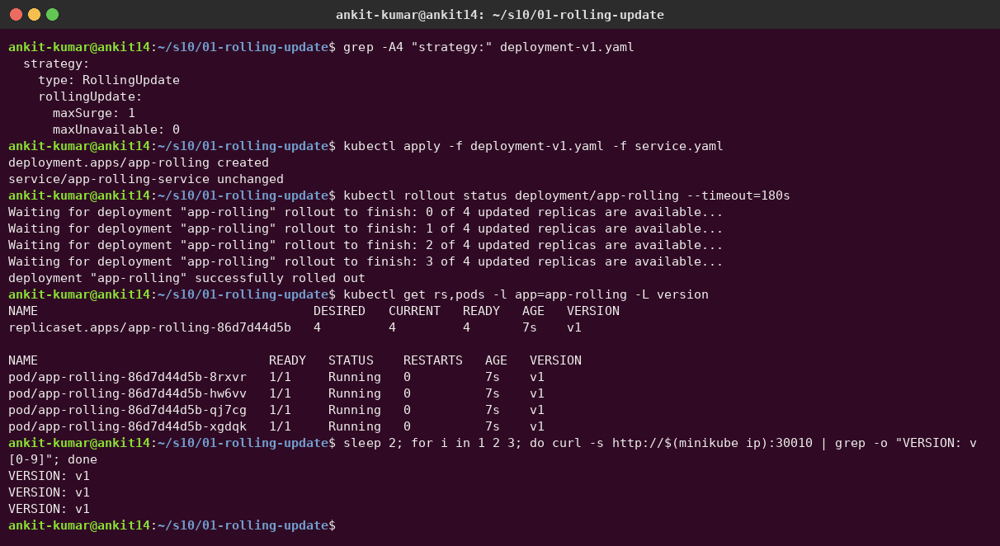

**Update to v2 (nginx:1.25)** with `kubectl apply -f deployment-v2.yaml`. I recorded `kubectl get pods --watch` during the update:

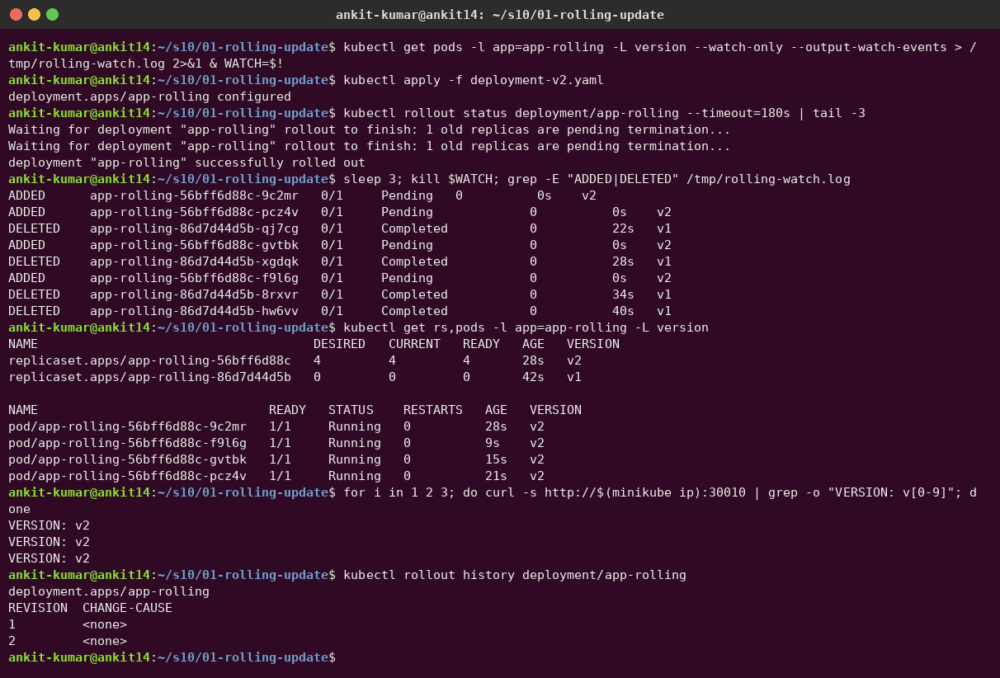

**Old and new pods, verified:**
- The watch log shows the pattern `ADDED v2 → DELETED v1 → ADDED v2 → DELETED v1 …`. Each new pod is created **before** an old one is removed (`maxSurge: 1`, `maxUnavailable: 0`).
- The old ReplicaSet `app-rolling-86d7d44d5b` (v1) is scaled to **0** but **kept**, so `kubectl rollout undo` can scale it back up. The new ReplicaSet `app-rolling-56bff6d88c` (v2) has 4/4.
- `curl` returns `VERSION: v2` and `rollout history` shows revisions 1 and 2.

## 02. Blue-Green Deployment

Both versions run all the time. The Service selector (`slot: blue` / `slot: green`) decides which one is live.

**Blue (v1) and Green (v2) are both running; the Service points to blue:**

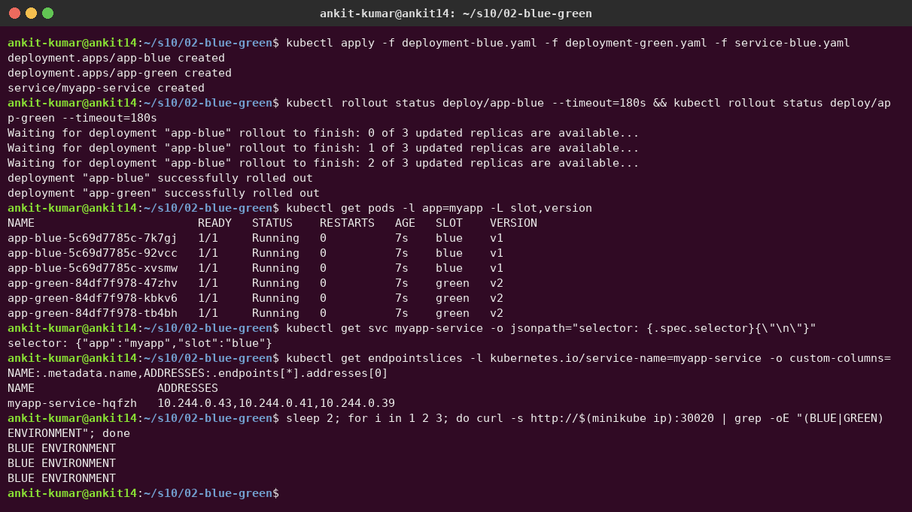

**Switch traffic to green** (`kubectl apply -f service-green.yaml`, which changes only `slot: blue → green`). The Service's EndpointSlice now contains exactly the green pod IPs (10.244.0.40/42/44) and every request returns **GREEN v2**. Rolling back is an instant selector patch back to blue:

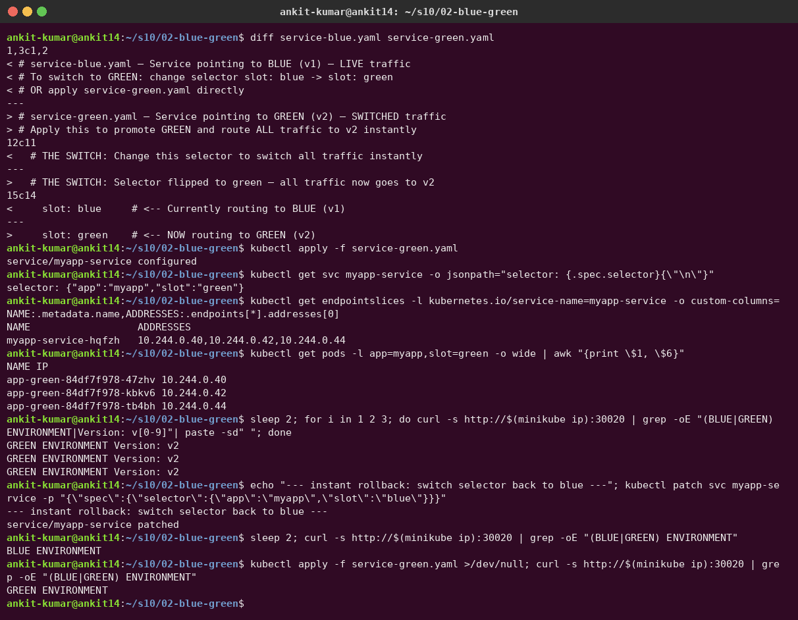

**Active version in the browser:**

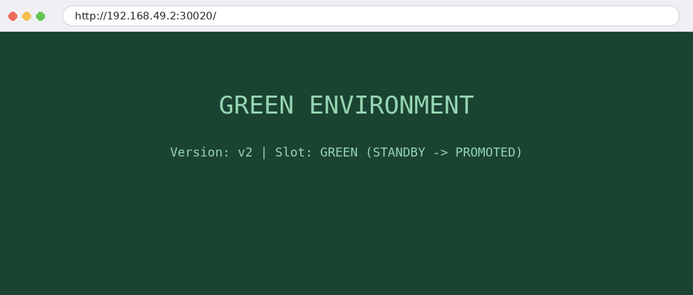

Trade-off: zero downtime and instant rollback, but it needs **2× the resources** while both environments run.

## 03. Canary Deployment

`app-stable` (v1, **9 replicas**) and `app-canary` (v2, **1 replica**) share the label `app: myapp-canary`, and the Service selects only that label. kube-proxy spreads connections roughly evenly across the 10 pods, so the canary gets **~10%** of the traffic.

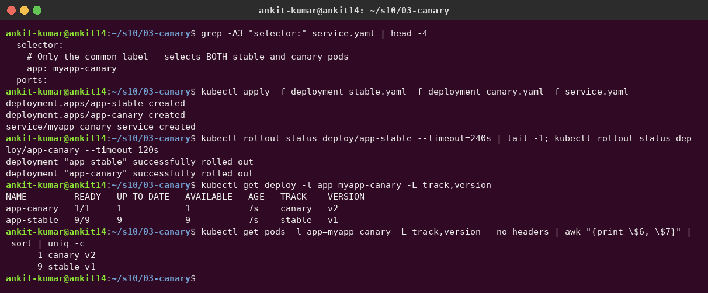

**Verifying both versions with 100 requests:**
- 9 / 100 requests hit **CANARY v2**, 91 hit **STABLE v1**: the expected ~10%.
- After "promoting" step-by-step to 5 + 5 replicas: 46 / 54, about 50%.

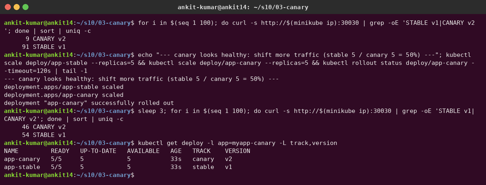

Note: with plain Services the percentage can only be controlled through **replica ratios**. For exact weights (e.g. 1%) you need an ingress or service mesh (NGINX canary annotations, Istio, Argo Rollouts).

## 04. Recreate Deployment

```yaml
strategy:
  type: Recreate
```

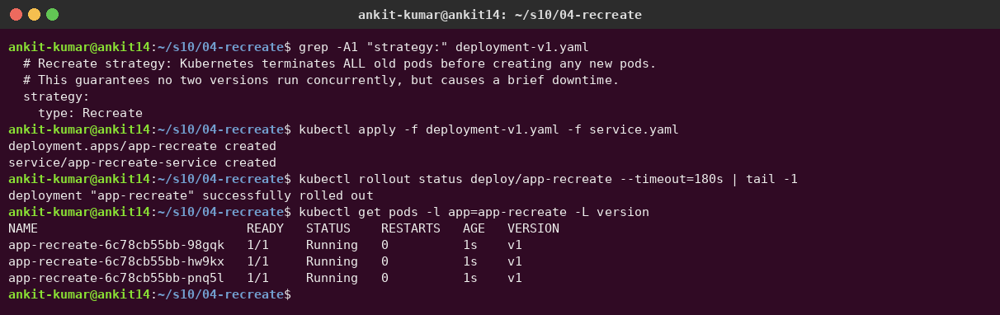

I wrote [`observe-recreate.sh`](04-recreate/observe-recreate.sh). While applying v2, it samples pod status every 0.4 s and sends an HTTP request every 0.3 s:

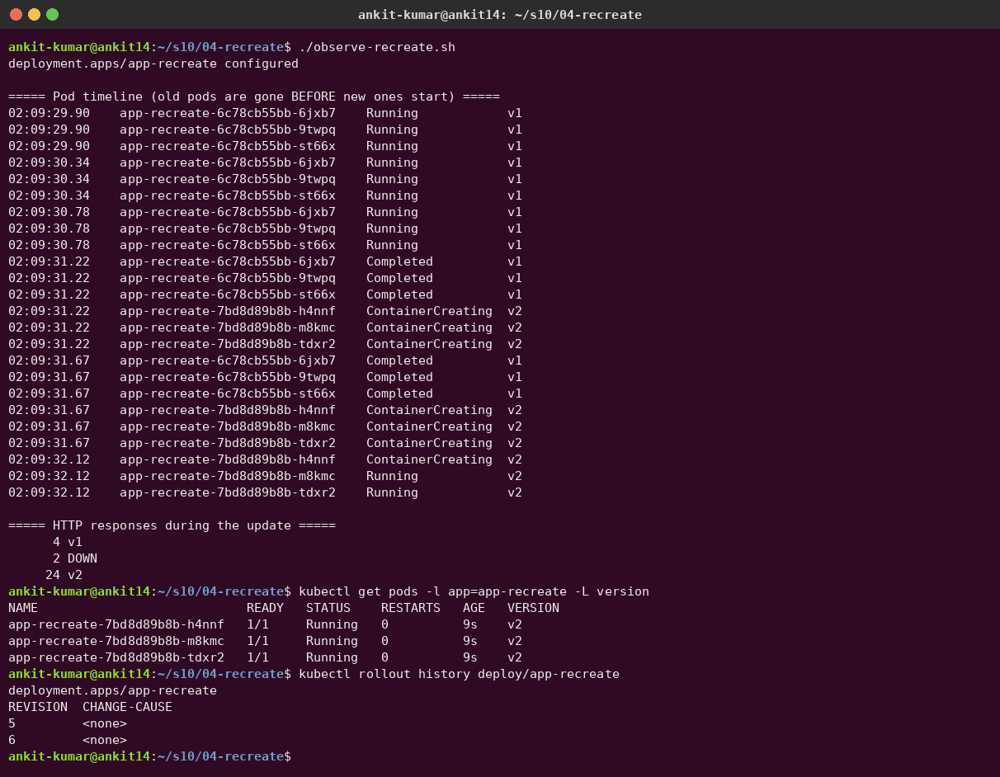

**Observation:** at `02:09:31.22` all three **v1 pods are already terminated (`Completed`)** when the v2 pods are only in `ContainerCreating`. Old and new pods never run together. The HTTP check confirms it: `v1 ×4 → DOWN ×2 → v2 ×24`, a short **outage**. Use Recreate only when two versions must not run together (e.g. incompatible DB schema, a single-writer app with a RWO volume).

---

# Task 2 – Pod lifecycle

**Pod phases:** `Pending → Running → Succeeded | Failed` (plus `Unknown`).
**Container states:** `Waiting` (reasons: `ContainerCreating`, `CrashLoopBackOff`, `ImagePullBackOff`, …), `Running`, `Terminated` (reasons: `Completed`, `Error`, `OOMKilled`).

For each YAML I ran `kubectl apply -f`, `kubectl get pod`, `kubectl describe pod` (status and events) and `kubectl logs`.

### 01 – Running (`01-running.yaml`)

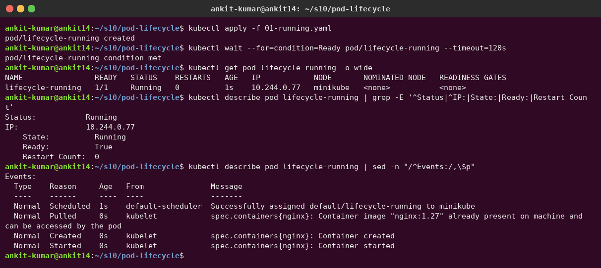

The pod is scheduled, the image pulled and the container started. Phase `Running`, `Ready: True`, events `Scheduled → Pulled → Created → Started`.

### 02 – Pending (`02-pending.yaml`)

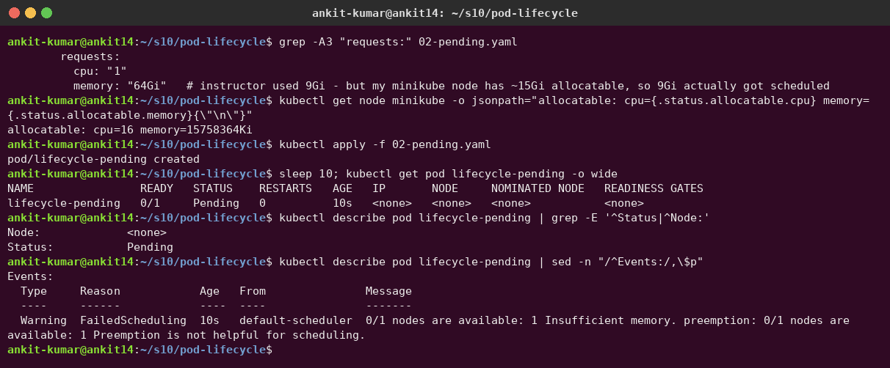

**What I observed:** with the instructor's original request of `memory: 9Gi` the pod actually went **Running**. With the Docker driver, my minikube node reports the laptop's full memory as allocatable (`15758364Ki` ≈ 15 Gi), so 9 Gi fits. I raised the request to **64Gi**. The pod then stayed **Pending** with no node and no IP, and the scheduler event says `FailedScheduling … 1 Insufficient memory`. Pending = accepted by the API server but **not scheduled** (or images not yet pulled).

### 03 – Succeeded (`03-succeeded.yaml`)

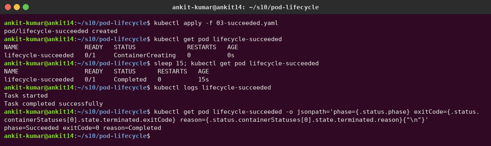

`restartPolicy: Never` and the command exits `0`. The status column shows `Completed`, phase **`Succeeded`**, `exitCode=0`. This is typical for Jobs and batch tasks.

### 04 – Failed (`04-failed.yaml`)

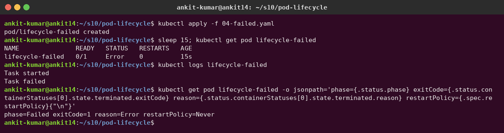

Same, but the command exits `1`, so the phase is **`Failed`** with reason `Error` and `exitCode=1`. Because `restartPolicy: Never`, Kubernetes does not retry.

### 05 – CrashLoopBackOff (`05-crashloopbackoff.yaml`)

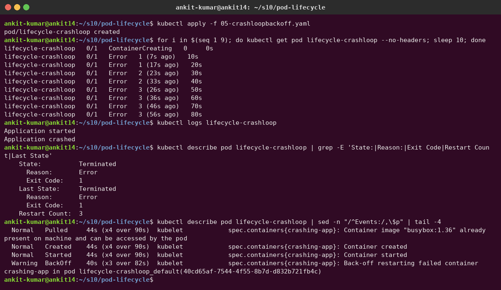
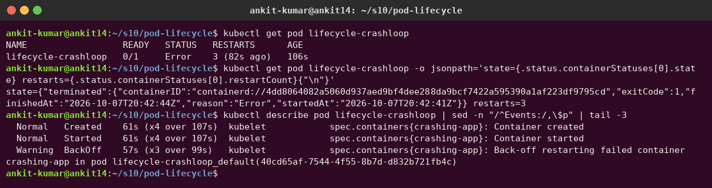

The default `restartPolicy: Always` restarts the crashing container again and again. The kubelet waits **longer each time** (10 s, 20 s, 40 s … capped at 5 min): this back-off is CrashLoopBackOff. The `BackOff` warning events (`Back-off restarting failed container`), the growing restart count and `Last State: Terminated, Exit Code 1` prove it. On Kubernetes v1.37 the STATUS column kept showing `Error` (the last termination reason) at the moments I sampled. Debug it with `kubectl logs <pod> --previous` and `describe`.

### 06 – ImagePullBackOff (`06-imagepullbackoff.yaml`)

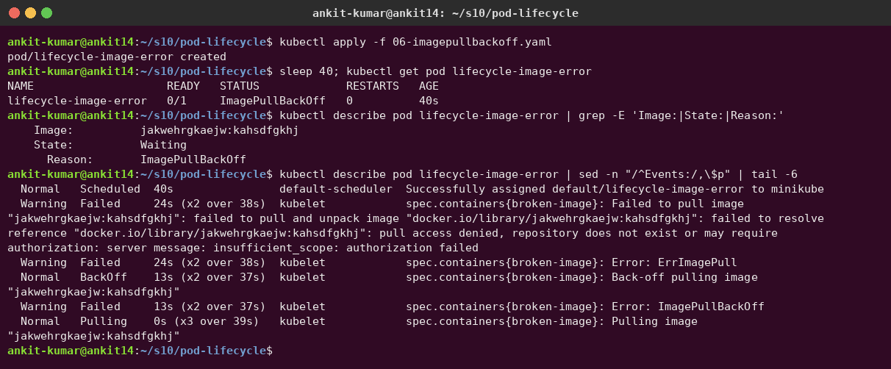

The image `jakwehrgkaejw:kahsdfgkhj` doesn't exist. The container stays **Waiting** with reason `ErrImagePull`, then `ImagePullBackOff` (pull retries with back-off). Phase stays `Pending`. Fix the image name, tag or registry credentials.

### 07 – Readiness probe (`07-readiness.yaml`)

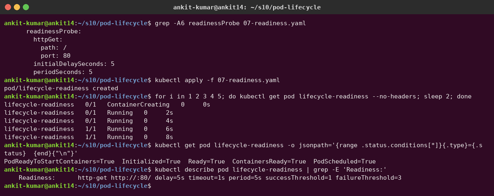

The container is `Running` but `READY 0/1` until the HTTP probe on `/` succeeds (after `initialDelaySeconds: 5`). Then it becomes `1/1` with `Ready=True`. **Only Ready pods receive Service traffic**, and a failing readiness probe removes the pod from endpoints without restarting it.

### 08 – Liveness probe (`08-liveness.yaml`)

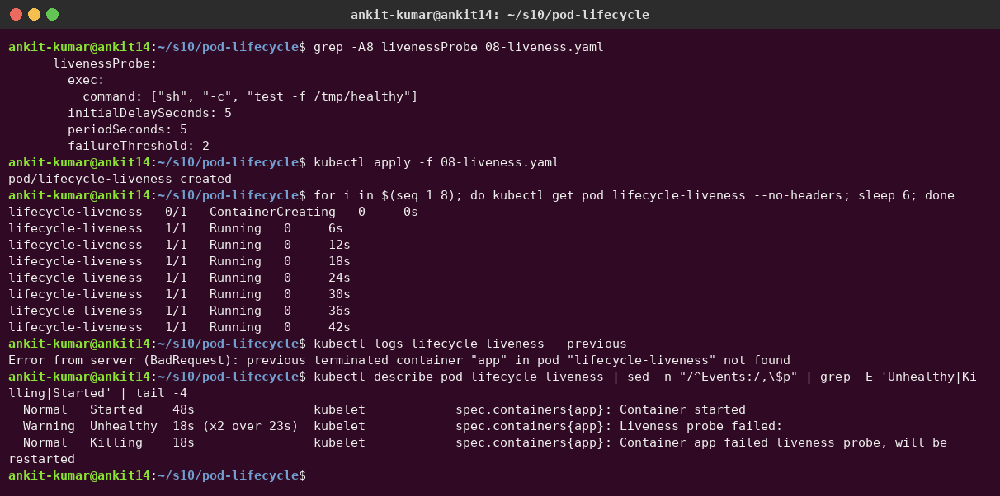
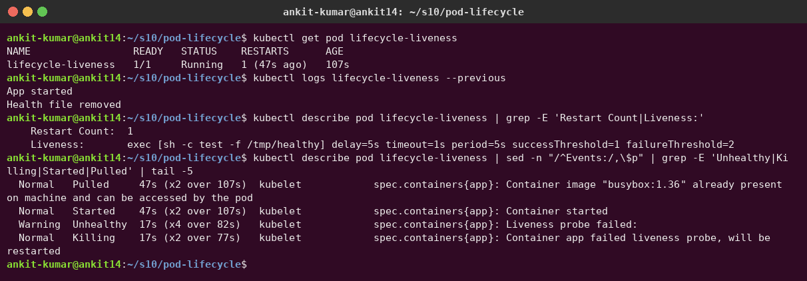

The app deletes `/tmp/healthy` after 20 s. The exec probe fails twice (`failureThreshold: 2`), so the kubelet logs `Liveness probe failed` → `Container app failed liveness probe, will be restarted`, and **RESTARTS becomes 1**. `logs --previous` shows the old container's `Health file removed`. Liveness = "is it stuck? restart it".

### 09 – Startup probe (`09-startup.yaml`)

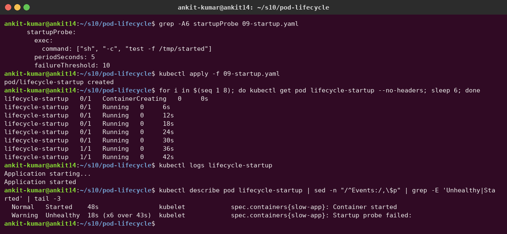

The app needs about 30 s to start. The startup probe allows `failureThreshold 10 × periodSeconds 5 = 50 s`. While it fails (`Startup probe failed` ×6), the pod stays `0/1` but is **not killed**. Liveness and readiness checks are held back until it passes, then the pod becomes `1/1` with **0 restarts**. Without it, a strict liveness probe would kill a slow-starting app in a loop.

### 10 – Init container (`10-init-container.yaml`)

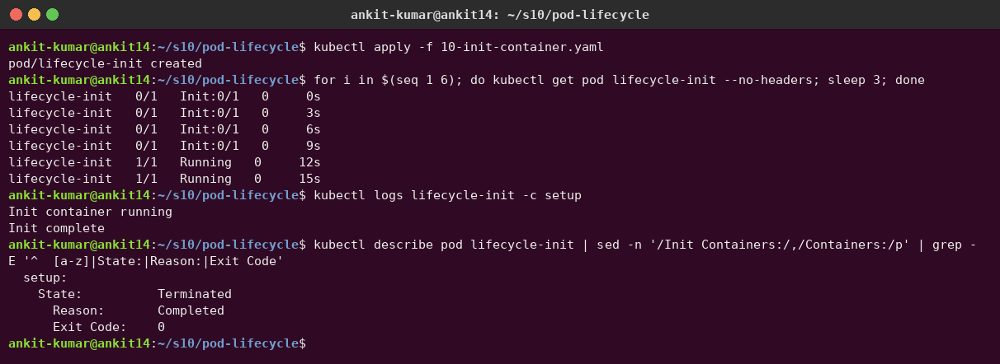

The status shows `Init:0/1` for about 10 s while the `setup` init container runs. It must finish (`Terminated / Completed / exit 0`) **before** the main `nginx` container starts, then the pod becomes `Running`. Typical uses: wait for a DB, run migrations, fetch config.

### 11 – Multi-container pod (`11-multi-container.yaml`)

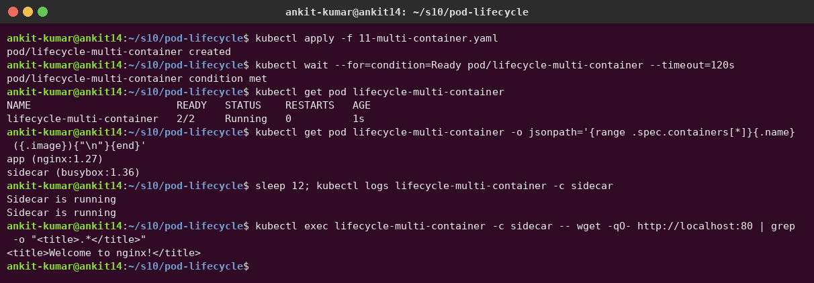

`READY 2/2`: the `app` (nginx) and `sidecar` (busybox) containers share the **same network namespace**, so the sidecar can reach nginx on `localhost:80`. Use `-c <name>` with `logs` and `exec` to pick a container.

### 12 – Graceful termination (`12-termination.yaml`)

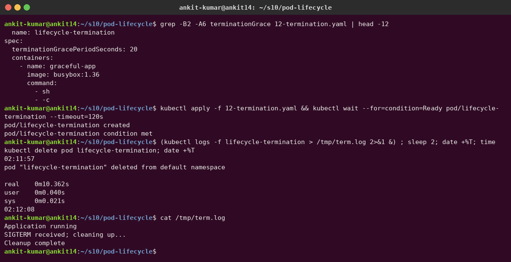

`kubectl delete pod` sends **SIGTERM**. The app's `trap` printed `SIGTERM received; cleaning up...`, spent 10 s cleaning up and exited (`Cleanup complete`). The delete took **10.36 s**, within `terminationGracePeriodSeconds: 20`. If the app hadn't exited in 20 s, the kubelet would have sent **SIGKILL**.

---

## Commands used

```bash
kubectl apply -f <file>.yaml
kubectl get deploy,rs,pods -L version -o wide
kubectl get pods --watch --output-watch-events
kubectl rollout status|history|undo deployment/<name>
kubectl scale deployment/<name> --replicas=N
kubectl patch svc <svc> -p '{"spec":{"selector":{"slot":"blue"}}}'
kubectl get endpointslices -l kubernetes.io/service-name=<svc>
kubectl describe pod <pod>      # status, probes, events
kubectl logs <pod> [-c container] [--previous]
kubectl exec <pod> -c <container> -- <cmd>
```
