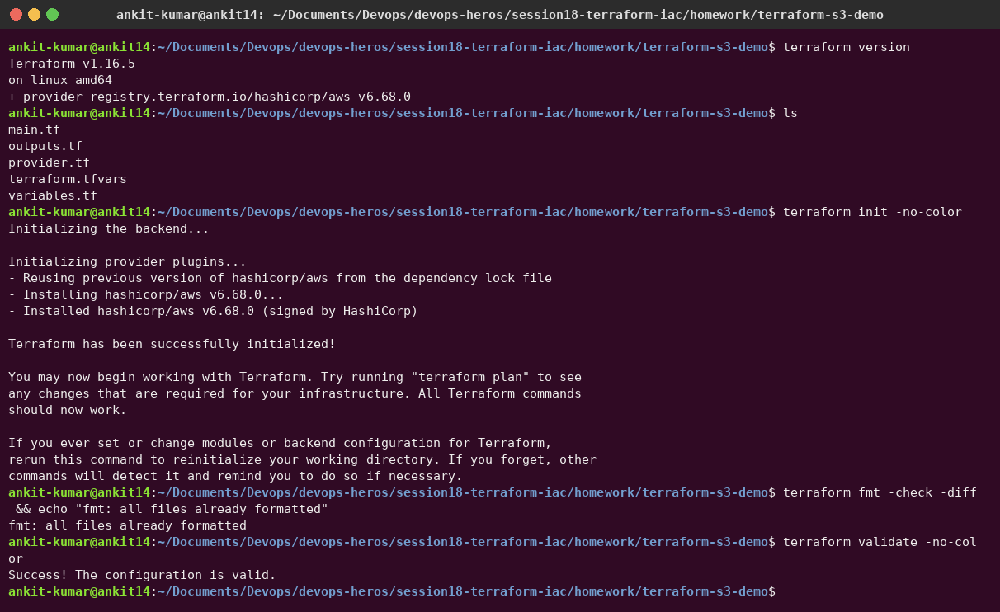

# Session 18 – Terraform & Infrastructure as Code

**Author:** Ankit Kumar
**Tools:** Terraform v1.16.5, AWS provider v6.68.0, AWS CLI v2

```text
homework/
├── terraform-s3-demo/          (Task 1)
│   ├── provider.tf             terraform + provider blocks (region, default tags)
│   ├── variables.tf            inputs with types, defaults and a validation rule
│   ├── main.tf                 S3 bucket + public-access block + versioning + encryption + an object
│   ├── outputs.tf              bucket name, ARN, region, versioning status, object URI
│   ├── terraform.tfvars        values (no secrets, so it is committed)
│   └── .terraform.lock.hcl     pinned provider versions
├── aws-services/               (Task 2)
│   ├── 01-iam/README.md   02-ec2/README.md   03-s3/README.md   04-vpc/README.md   05-dynamodb-rds/README.md
└── screenshots/
```

---

## Task 1 – Terraform S3 demo

### What the configuration creates

| Resource | Purpose |
|---|---|
| `aws_s3_bucket.demo` | Bucket `ankit14-devops-heros-s18-demo` (bucket names are global, so it needs a unique name) |
| `aws_s3_bucket_public_access_block.demo` | Blocks every kind of public access |
| `aws_s3_bucket_versioning.demo` | Keeps old object versions (`enable_versioning` variable) |
| `aws_s3_bucket_server_side_encryption_configuration.demo` | Default SSE-S3 (AES-256) encryption at rest |
| `aws_s3_object.readme` | Uploads `hello/README.txt`, with `depends_on` the encryption config (an explicit dependency) |

Other things to note: `default_tags` in the provider tags every resource. A `validation` block rejects invalid bucket names at `plan` time. Credentials come from `aws configure` and are **never** written in `.tf` files.

### Workflow

| Command | What it does |
|---|---|
| `terraform init` | Downloads the AWS provider into `.terraform/` and writes `.terraform.lock.hcl` |
| `terraform fmt` | Rewrites files in the canonical style (`-check` only reports) |
| `terraform validate` | Checks syntax and references without calling AWS |
| `terraform plan` | Compares config ↔ state ↔ real AWS and shows what would change |
| `terraform apply` | Makes the changes and records them in `terraform.tfstate` |
| `terraform show` | Prints the current state in a readable form |
| `terraform output` | Prints the output values (`-raw <name>` for scripts) |
| `terraform destroy` | Deletes everything this configuration manages |

#### init, fmt, validate



<!-- AWS-APPLY-S18 -->
#### plan, apply, show, output, destroy

> ⏳ These steps create a real bucket in my AWS account. They run as soon as the AWS CLI is configured on my machine (`aws configure`), and the screenshots will appear here.

---

## Task 2 – AWS services research

| # | Service | Category | Notes |
|---|---|---|---|
| 01 | [IAM](aws-services/01-iam/README.md) | Governance | users, groups, roles, policies (with JSON), policy evaluation, least privilege, best practices, Terraform example |
| 02 | [EC2](aws-services/02-ec2/README.md) | Compute | AMI, instance types, key pairs, security groups, EBS, public vs private IP, lifecycle |
| 03 | [S3](aws-services/03-s3/README.md) | Storage | buckets, objects, storage classes, versioning, lifecycle, encryption, bucket policies |
| 04 | [VPC](aws-services/04-vpc/README.md) | Networking | CIDR math, subnets, route tables, IGW, NAT, SG vs NACL, public vs private subnets |
| 05 | [DynamoDB & RDS](aws-services/05-dynamodb-rds/README.md) | Databases | NoSQL keys and capacity modes; RDS engines, backups, Multi-AZ vs read replicas |

How these appear in my own Terraform code:
- **IAM:** Session 19 and the final project give the EC2 instance a role that can only `GetObject`/`PutObject` on one bucket (least privilege, no access keys on the server).
- **EC2:** Ubuntu 24.04 AMI looked up with a `data "aws_ami"` filter, IMDSv2 required, encrypted gp3 root volume.
- **S3:** this task, plus a private asset bucket (Session 19) and a versioned backup bucket with a lifecycle rule (final project).
- **VPC:** a VPC, public subnet, Internet Gateway, route table and security group in Sessions 19 and 21.
