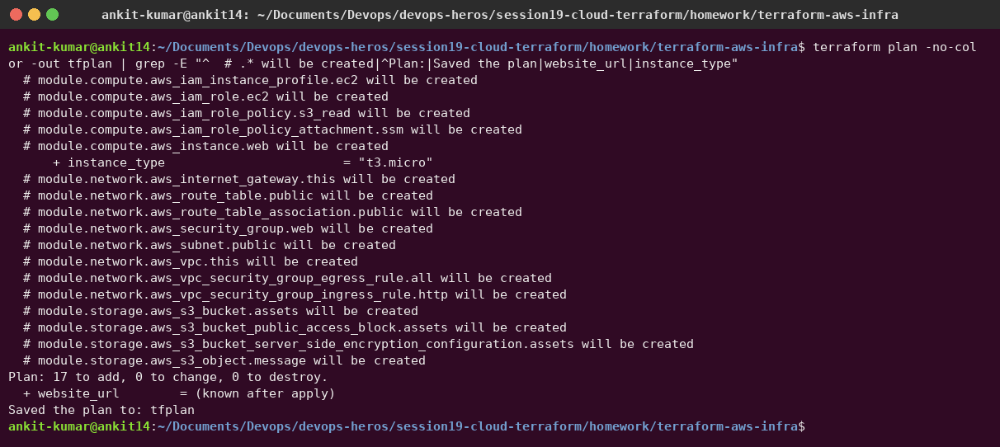
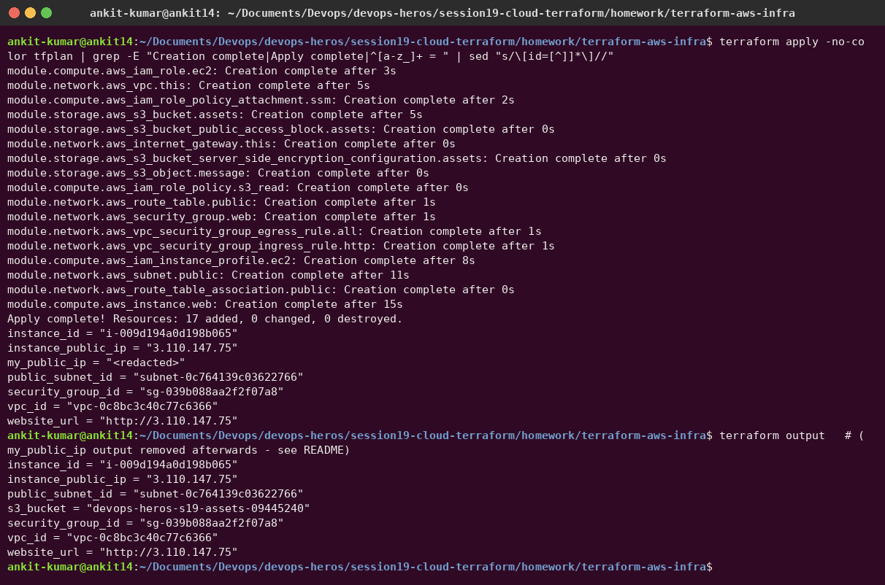
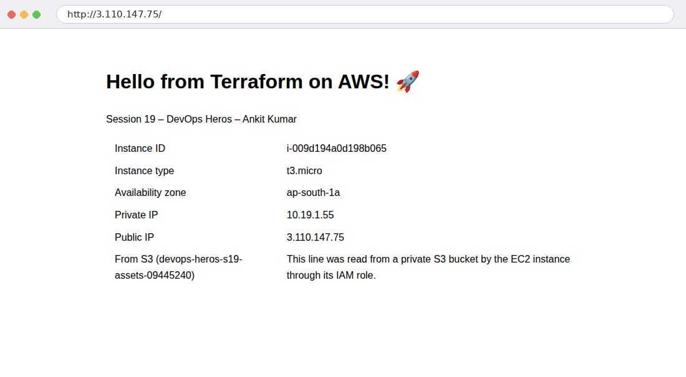
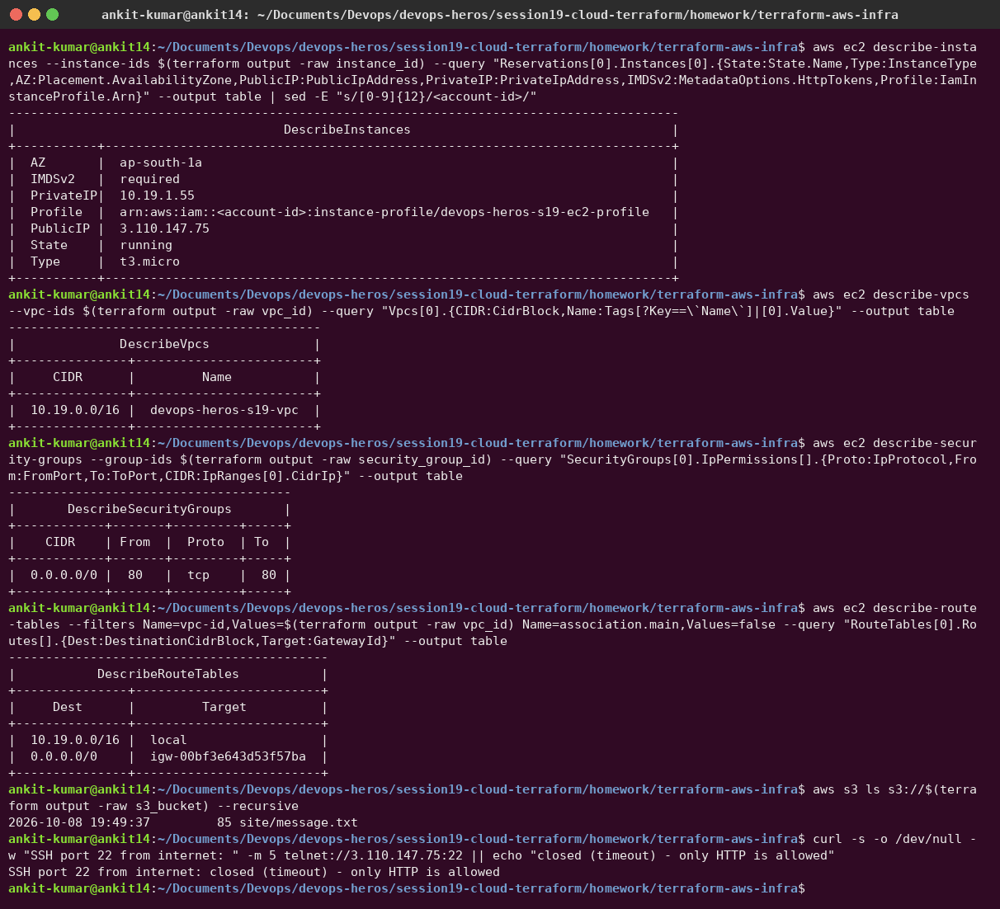
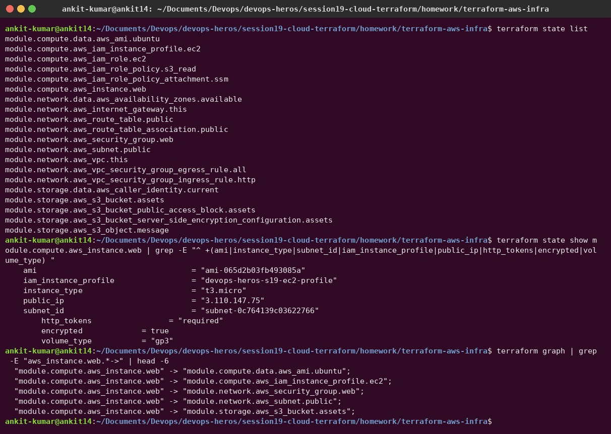
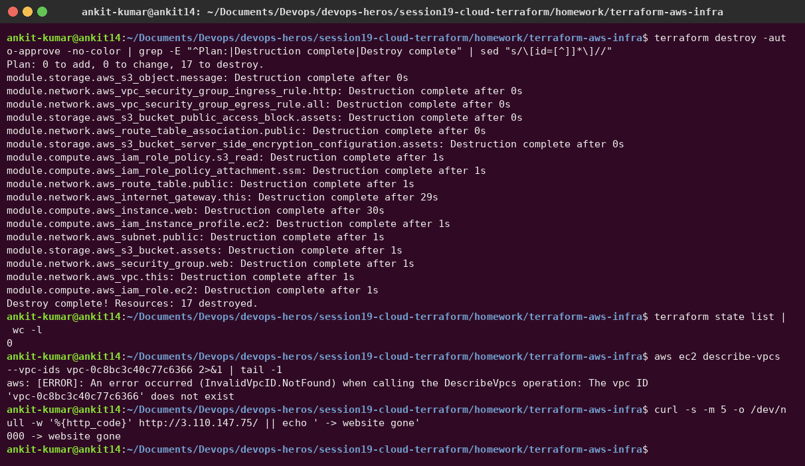

# Session 19 – Cloud & Terraform in Action

**Author:** Ankit Kumar
**Project:** [`terraform-aws-infra/`](terraform-aws-infra) is end-to-end AWS infrastructure built from **three reusable modules**.

## Architecture

```text
                         AWS ap-south-1
┌──────────────────────────────────────────────────────────────────────────┐
│  VPC 10.19.0.0/16  (module.network)                                      │
│                                                                          │
│   ┌──────────────── public subnet 10.19.1.0/24 (AZ a) ───────────────┐   │
│   │                                                                  │   │
│   │   EC2 t3.micro  Ubuntu 24.04  (module.compute)                   │   │
│   │   ├─ nginx web page built by user_data                           │   │
│   │   ├─ IAM role: s3:GetObject on ONE bucket + SSM                  │   │
│   │   └─ SG: 80 from 0.0.0.0/0, SSH closed                           │   │
│   └───────────────────────────────┬──────────────────────────────────┘   │
│       route table 0.0.0.0/0 ──► Internet Gateway ──► Internet            │
└───────────────────────────────────┼──────────────────────────────────────┘
                                    │ reads site/message.txt via IAM role
                    S3 bucket devops-heros-s19-assets-<account-id>  (module.storage)
                    private · encrypted · public access blocked
```

## Concepts demonstrated

| Concept | Where |
|---|---|
| **Providers** | `versions.tf`: `hashicorp/aws ~> 6.0` with `default_tags` on every resource |
| **Variables** | `variables.tf` + `terraform.tfvars` (region, CIDRs, instance type, optional SSH CIDR) |
| **Resources** | VPC, IGW, subnet, route table + association, SG + rules, IAM role/policy/profile, EC2, S3 bucket/settings/object |
| **Data sources** | `aws_availability_zones`, `aws_ami` (latest Ubuntu 24.04), `aws_caller_identity` (hashed into the bucket name) |
| **Outputs** | `outputs.tf`: VPC/subnet/SG/instance IDs, public IP, **website URL**, bucket name |
| **Dependencies** | *implicit*, through references (`module.network.public_subnet_id` → EC2, `module.storage.bucket_arn` → IAM policy); *explicit* `depends_on` (S3 object after the encryption config) |
| **Modules** | `modules/network`, `modules/compute`, `modules/storage` with their own variables and outputs |
| **Conditional resources** | `count = var.ssh_allowed_cidr == "" ? 0 : 1` (SSH rule only if a CIDR is given) |
| **Templates** | `templatefile()` renders `user_data.sh.tftpl` with the bucket name |
| **State** | `terraform.tfstate` (local, git-ignored); inspected with `terraform state list/show` |

## Terraform commands

```bash
cd terraform-aws-infra
terraform init                 # providers + modules
terraform fmt -recursive       # style
terraform validate             # static checks
terraform plan -out tfplan     # preview
terraform apply tfplan         # create
terraform state list           # what Terraform manages
terraform output               # URLs and IDs
terraform destroy              # clean up (avoid charges)
```

### Code structure, fmt and validate


### plan – 17 resources across the three modules



### apply



Terraform builds independent resources in parallel (VPC, IAM role and S3 bucket all start at once) and waits on references: the subnet waits for the VPC, the EC2 instance for the subnet, security group, instance profile and bucket.

> **Privacy fix:** my first version had a `my_public_ip` output (from the `http` provider), so the apply output contained my home IP. I removed that output and the `http` provider from the code. In this screenshot the value is shown as `<redacted>`; everything else is the real apply output.

### The website, served from the new EC2 instance

The page was built at boot by `user_data`. The last row was read from the **private** S3 bucket through the instance's IAM role, with no access keys on the server:



### Verified with the AWS CLI

Instance `running`, `t3.micro`, **IMDSv2 required**, instance profile attached; VPC `10.19.0.0/16`; the security group allows **only TCP 80**; the public route table has `0.0.0.0/0 → igw-…`; the S3 object is present; and **port 22 is closed** from the internet:



### Terraform state and dependency graph



### destroy – all 17 resources removed



The IGW and EC2 instance took ~30 s; Terraform deletes in reverse dependency order. Afterwards the VPC no longer exists, the website no longer responds, and the state is empty, so there are no ongoing charges.

## Security choices

- **No SSH by default:** the security group only opens port 80. Admin access goes through **SSM Session Manager** (the role has `AmazonSSMManagedInstanceCore`).
- **Least-privilege IAM:** the instance can read only `bucket/*` of its own bucket, and no access keys exist on the server.
- **IMDSv2 required** (`http_tokens = "required"`) protects instance credentials from SSRF attacks.
- **Encrypted** root volume and S3 bucket; S3 public access is fully blocked.
