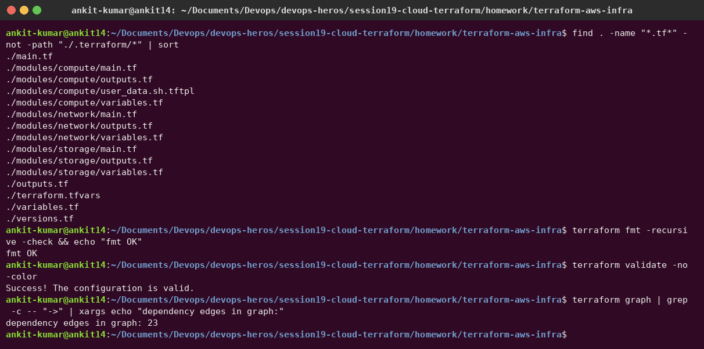

# Session 19 – Cloud & Terraform in Action

**Author:** Ankit Kumar
**Project:** [`terraform-aws-infra/`](terraform-aws-infra) is end-to-end AWS infrastructure built from **three reusable modules**.

## Architecture

```text
                         AWS ap-south-1
┌──────────────────────────────────────────────────────────────────────────┐
│  VPC 10.19.0.0/16  (module.network)                                      │
│                                                                          │
│   ┌──────────────── public subnet 10.19.1.0/24 (AZ a) ───────────────┐   │
│   │                                                                  │   │
│   │   EC2 t3.micro  Ubuntu 24.04  (module.compute)                   │   │
│   │   ├─ nginx web page built by user_data                           │   │
│   │   ├─ IAM role: s3:GetObject on ONE bucket + SSM                  │   │
│   │   └─ SG: 80 from 0.0.0.0/0, SSH closed                           │   │
│   └───────────────────────────────┬──────────────────────────────────┘   │
│       route table 0.0.0.0/0 ──► Internet Gateway ──► Internet            │
└───────────────────────────────────┼──────────────────────────────────────┘
                                    │ reads site/message.txt via IAM role
                    S3 bucket devops-heros-s19-assets-<account-id>  (module.storage)
                    private · encrypted · public access blocked
```

## Concepts demonstrated

| Concept | Where |
|---|---|
| **Providers** | `versions.tf`: `hashicorp/aws ~> 6.0` (with `default_tags`), `hashicorp/http` |
| **Variables** | `variables.tf` + `terraform.tfvars` (region, CIDRs, instance type, optional SSH CIDR) |
| **Resources** | VPC, IGW, subnet, route table + association, SG + rules, IAM role/policy/profile, EC2, S3 bucket/settings/object |
| **Data sources** | `aws_availability_zones`, `aws_ami` (latest Ubuntu), `aws_caller_identity`, `http` (my public IP) |
| **Outputs** | `outputs.tf`: VPC/subnet/SG/instance IDs, public IP, **website URL**, bucket name |
| **Dependencies** | *implicit*, through references (`module.network.public_subnet_id` → EC2, `module.storage.bucket_arn` → IAM policy); *explicit* `depends_on` (S3 object after the encryption config) |
| **Modules** | `modules/network`, `modules/compute`, `modules/storage` with their own variables and outputs |
| **Conditional resources** | `count = var.ssh_allowed_cidr == "" ? 0 : 1` (SSH rule only if a CIDR is given) |
| **Templates** | `templatefile()` renders `user_data.sh.tftpl` with the bucket name |
| **State** | `terraform.tfstate` (local, git-ignored); inspected with `terraform state list/show` |

## Terraform commands

```bash
cd terraform-aws-infra
terraform init                 # providers + modules
terraform fmt -recursive       # style
terraform validate             # static checks
terraform plan -out tfplan     # preview
terraform apply tfplan         # create
terraform state list           # what Terraform manages
terraform output               # URLs and IDs
terraform destroy              # clean up (avoid charges)
```

### Code structure, fmt and validate



<!-- AWS-APPLY-S19 -->
### plan → apply → website → state → destroy

> ⏳ This creates real (free-tier) AWS resources. It runs as soon as the AWS CLI is configured on my machine, and the screenshots of the plan, the running website, the AWS console and the destroy will be added here.

## Security choices

- **No SSH by default:** the security group only opens port 80. Admin access goes through **SSM Session Manager** (the role has `AmazonSSMManagedInstanceCore`).
- **Least-privilege IAM:** the instance can read only `bucket/*` of its own bucket, and no access keys exist on the server.
- **IMDSv2 required** (`http_tokens = "required"`) protects instance credentials from SSRF attacks.
- **Encrypted** root volume and S3 bucket; S3 public access is fully blocked.
