# Session 01 & 02 – Linux Fundamentals Homework

**Author:** Ankit Kumar
**Machine:** Ubuntu 26.04 LTS (`ankit14`)

Every screenshot below comes from commands actually run on my machine.

---

## Task 1 – Soft Link vs Hard Link

### Theory

Every file on a Linux filesystem is an **inode** (the real data and metadata) plus one or more **directory entries (names)** that point to that inode.

| | Hard link | Soft (symbolic) link |
|---|---|---|
| Command | `ln target linkname` | `ln -s target linkname` |
| What it points to | The **same inode** as the original | The **path/name** of the original |
| Inode number | Same as the original | Its own, new inode |
| If the original is deleted | Still works – the data stays until the link count reaches 0 | Becomes a **dangling/broken** link |
| Across filesystems/partitions | ❌ Not allowed (`Invalid cross-device link`) | ✅ Allowed |
| Link to a directory | ❌ Not allowed | ✅ Allowed |
| Size | Same as the file | Length of the path string (e.g. 12 bytes for `original.txt`) |
| `ls -l` shows | Normal file, link count > 1 | `l` file type and `name -> target` |
| Real-world use | Backups/snapshots (e.g. `rsync --link-dest`), saving disk space | `/usr/bin/python3 -> python3.x`, `/etc/nginx/sites-enabled/*`, version switching |

### Commands practised

```bash
echo "Hello from original file" > original.txt
ln -s original.txt soft_link.txt     # soft link
ln original.txt hard_link.txt        # hard link
ls -li                               # -i shows the inode numbers
stat -c "%n -> inode=%i links=%h" original.txt hard_link.txt soft_link.txt
readlink -f soft_link.txt            # where does the soft link point?
rm original.txt                      # delete the original
cat hard_link.txt                    # still works
cat soft_link.txt                    # broken: No such file or directory
unlink soft_link.txt                 # delete a link (rm also works)
```

**Creating the links.** `original.txt` and `hard_link.txt` share inode `279948` and the link count becomes `2`. The soft link has its own inode, and its size (12) is the length of the text `original.txt`.

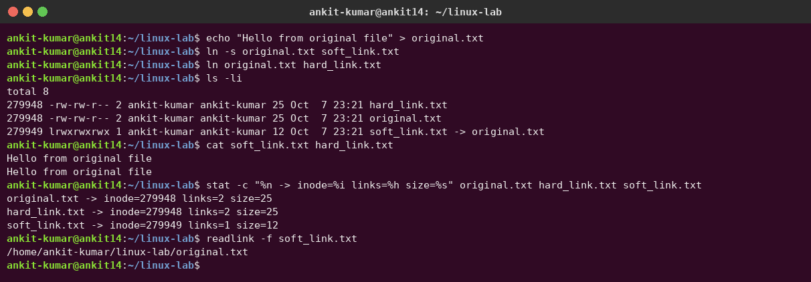

**Deleting the original.** The hard link still prints the content because the inode survives. The soft link breaks. When I recreated `original.txt`, the soft link worked again, because it only stores the *name*. The new file got a **new** inode (`279950`), so the hard link still holds the old content.

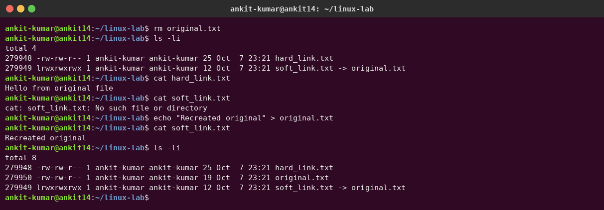

**Limits of hard links and deleting links.** A hard link to a directory is not allowed. A hard link to `/etc/hostname` is blocked by `fs.protected_hardlinks=1` because I don't own that file. A hard link across filesystems (`/` → `/tmp`, which is tmpfs) fails with `Invalid cross-device link`. Soft links work in every one of these cases. Links are deleted with `unlink` or `rm`.

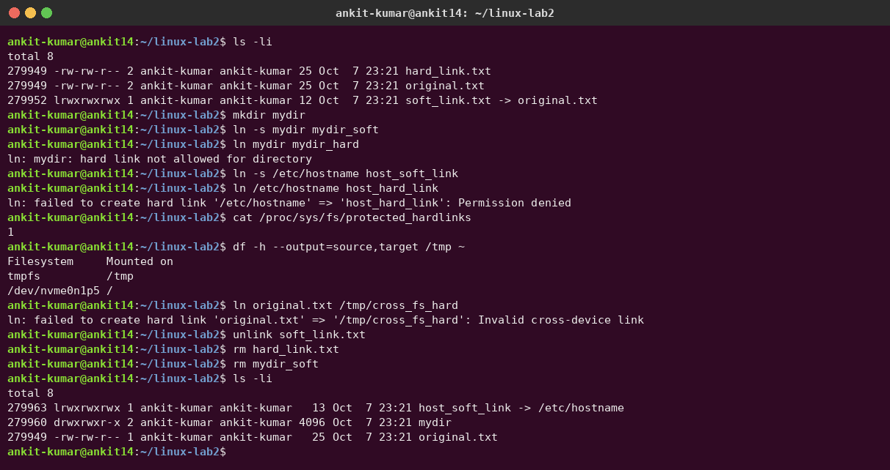

### Interview answer (short)

> A hard link is another name for the same inode. It has the same inode number, survives deletion of the original, can't cross filesystems and can't point to a directory. A soft link is a separate file that stores a path. It can cross filesystems and point to directories, but it breaks if the target is removed or moved. Use `ln` for hard links, `ln -s` for soft links and `ls -li` to tell them apart.

---

## Task 2 – `adduser` vs `useradd`

| | `useradd` | `adduser` |
|---|---|---|
| Type | Low-level **binary** (from the `passwd` package; on every Linux distro) | High-level **Perl script** (Debian/Ubuntu) that calls `useradd` internally |
| Home directory | **Not created** unless you pass `-m` | Created automatically and `/etc/skel` is copied in |
| Default shell | `/bin/sh` (from `/etc/default/useradd`) unless you pass `-s /bin/bash` | `/bin/bash` |
| Password | Not set – the account stays **locked** (`L`) until you run `passwd` | Prompts for a password (or `--disabled-password`) |
| Full name (GECOS) | Only with `-c` | Prompts for it, or `--comment` |
| Interactive | No – good for scripts | Yes – friendly for humans |
| Config file | `/etc/default/useradd`, `/etc/login.defs` | `/etc/adduser.conf` |

**Which one is preferred on Ubuntu?** `adduser`. Debian/Ubuntu recommend it (the `useradd` man page itself says so) because one command gives a complete, usable account: home dir, skeleton files, bash shell, its own group and a password. `useradd` is better for portable, non-interactive scripts (Dockerfiles, Ansible, RHEL/Alpine), where you pass all flags yourself (`useradd -m -s /bin/bash user`).

### Creating the test user with the recommended command (`adduser`)

The demo script is [`user-demo.sh`](user-demo.sh) (run with `sudo bash user-demo.sh`). `adduser` created the `devops-test` user and group, made `/home/devops-test` and copied the `.bashrc`, `.profile` and `.bash_logout` skeleton files:

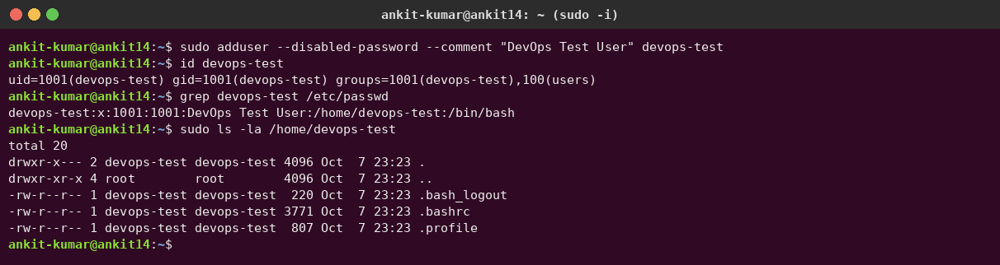

### Same thing with `useradd`

Plain `useradd` gave **no home directory**, the `/bin/sh` shell and a **locked** password (`L`). I had to pass `-m -s /bin/bash -c` to get what `adduser` does by default. Afterwards I removed both demo users with `userdel`:

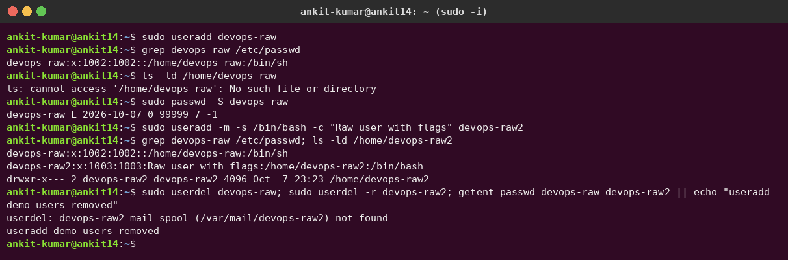

Proof that `adduser` is a Perl front-end while `useradd` is a compiled binary, plus where their defaults come from:

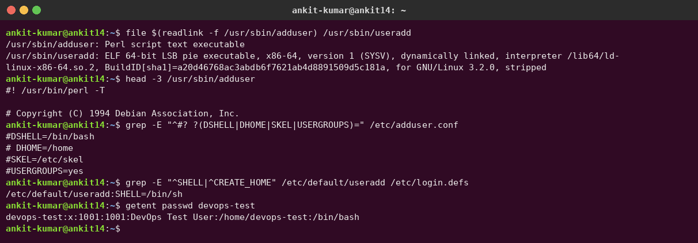

---

## Task 3 – `journalctl`

`journalctl` reads the **systemd journal** – the central binary log store kept by `systemd-journald`. It collects kernel messages, boot messages, service stdout/stderr and syslog entries. Normal users in the `adm` or `systemd-journal` group can read system logs without sudo.

| Command | Purpose |
|---|---|
| `journalctl` | All logs, oldest first (in a pager) |
| `journalctl -n 20` / `-f` | Last 20 lines / follow live (like `tail -f`) |
| `journalctl -b` / `-b -1` | Logs from the current / previous boot |
| `journalctl --list-boots` | List recorded boots |
| `journalctl -u nginx` | Logs of **one service (unit)** |
| `journalctl -u nginx --since "1 hour ago"` | Time filter (`--since`, `--until`) |
| `journalctl -p err` | Only priority `err` and worse (emerg, alert, crit, err) |
| `journalctl -k` | Kernel messages (like `dmesg`) |
| `journalctl _COMM=sudo` | Filter by any journal field (e.g. who used sudo) |
| `journalctl -o json-pretty` | Structured output, showing every field |
| `journalctl --disk-usage` / `--vacuum-size=200M` | Check or clean journal size |

**System logs:** disk usage, boots, the latest boot logs and only errors.

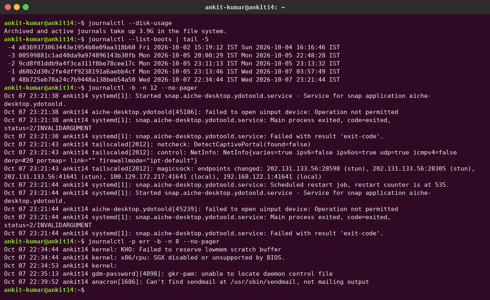

**Logs for a specific service:** `cron` and `NetworkManager`. I used `systemctl status` first, then `journalctl -u <service>`. The NetworkManager log shows my WiFi re-associating and getting a new DHCP lease. `ssh` isn't installed, so it has no entries.

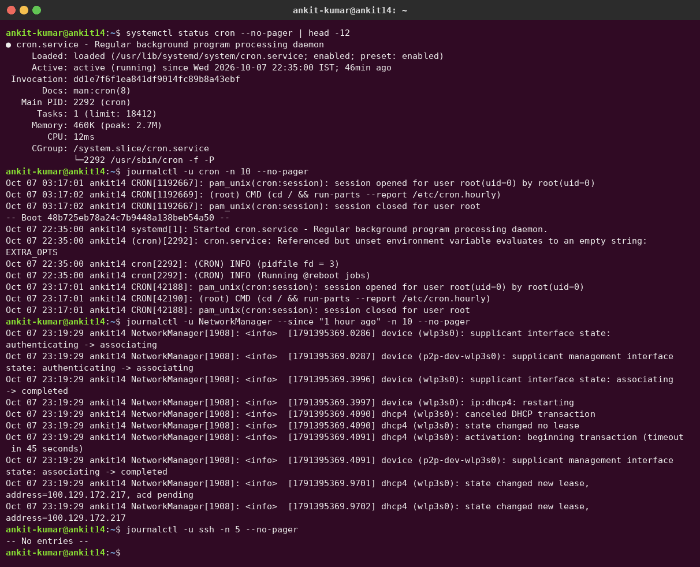

**Kernel logs, field filters and JSON output:**

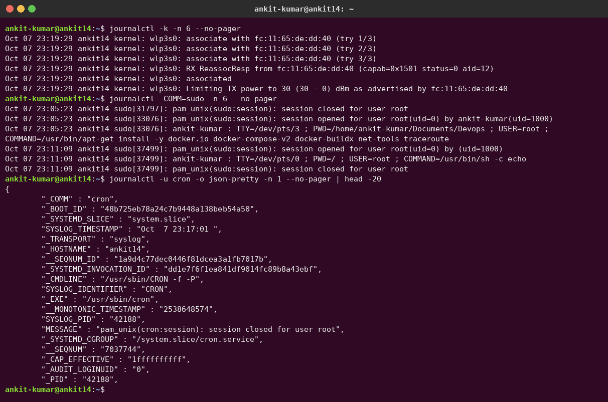

---

## Task 4 – Linux Command Cheat Sheet Practice

I practised the commands from the instructor's cheat sheet (`basic-linux.pdf`).

| Category | Commands | Purpose |
|---|---|---|
| Files & directories | `ls`, `cd`, `pwd`, `mkdir`, `rm`, `touch`, `cp`, `mv` | Navigate and manage files |
| Viewing & searching | `cat`, `less`, `head`, `tail`, `grep` | Read files, search text |
| Processes & services | `ps`, `top`, `kill`, `systemctl status/restart` | Inspect and control running programs |
| Networking | `ping`, `ip a`, `ss`/`netstat`, `curl`, `wget` | Connectivity, IPs, open ports, HTTP |
| Permissions | `chmod`, `chown` | Change access rights and owner |
| Packages | `apt update && apt install`, `yum install` | Install software |
| Disk | `df -h`, `du -sh` | Filesystem usage and folder size |
| Scheduling | `crontab -e`, `nohup cmd &`, `jobs`, `kill %1` | Cron jobs and background tasks |
| Users | `adduser`, `useradd`, `usermod -aG`, `passwd`, `id`, `groups`, `who`, `w`, `last` | User management |
| System info | `uname -a`, `hostname`, `uptime`, `free -h` | Kernel, host, load and memory |

**File, viewing and permission commands:**

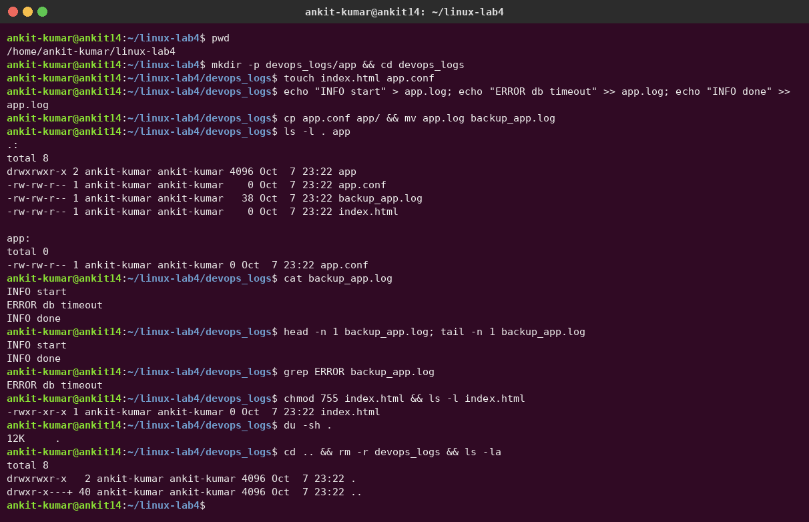

**System info, processes, users:**

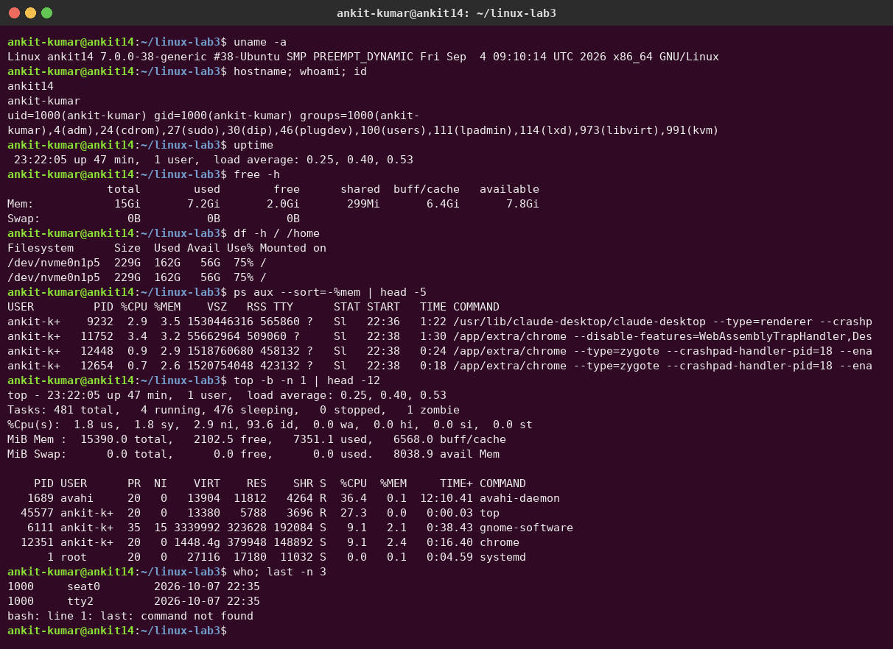

**Networking, cron, background jobs, services:**

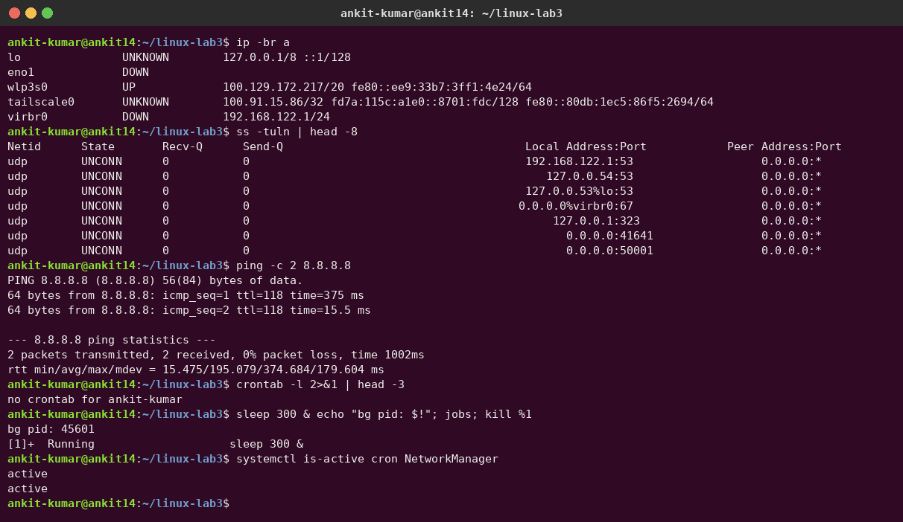
