# Session 20 – Monitoring, Observability & GitOps

**Author:** Ankit Kumar
**Cluster:** minikube (Kubernetes v1.37.0) · **kube-prometheus-stack** chart 92.1.0 (Prometheus Operator v0.94.1) · **Argo CD** v3.5.4

| Deliverable | Where |
|---|---|
| Monitoring demo (Task 1) | below + [`monitoring/`](monitoring) (Helm values, demo app + ServiceMonitor, alert rules, load generator) |
| Monitoring concepts | [`monitoring-concepts.md`](monitoring-concepts.md) |
| Observability documentation (Task 2) | [`observability/README.md`](observability/README.md) |
| GitOps documentation + demo (Task 3) | [`gitops/README.md`](gitops/README.md), [`gitops/argocd-application.yaml`](gitops/argocd-application.yaml), [`gitops/app/`](gitops/app) |

---

## Task 1 – Monitoring demo

### Setup

```bash
helm repo add prometheus-community https://prometheus-community.github.io/helm-charts
helm install monitoring prometheus-community/kube-prometheus-stack \
  -n monitoring --create-namespace -f monitoring/kube-prometheus-stack-values.yaml
kubectl apply -f monitoring/podinfo-app.yaml       # demo app + Service + ServiceMonitor
kubectl apply -f monitoring/alert-rules.yaml       # my PrometheusRule
kubectl apply -f monitoring/load-generator.yaml    # 2 pods x 20 parallel request loops
```

The demo app is **podinfo**: it exposes Prometheus `/metrics`, `/healthz` and `/readyz` endpoints and writes JSON logs. A **ServiceMonitor** tells the Prometheus Operator to scrape it every 15 s. The values file exposes Prometheus (:30900), Grafana (:30300) and Alertmanager (:30903) as NodePorts, and makes Prometheus pick up ServiceMonitors and rules from every namespace.

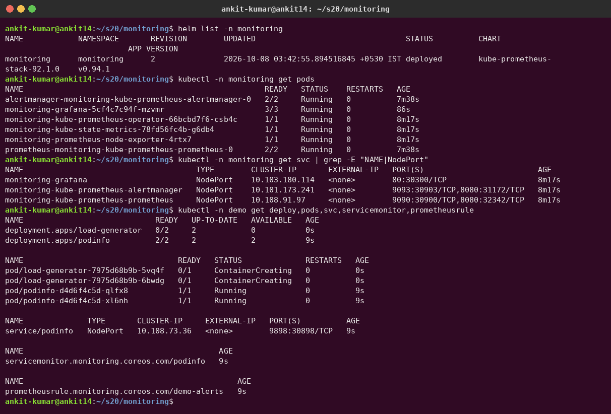

Prometheus discovered both podinfo pods (**2/2 up**):

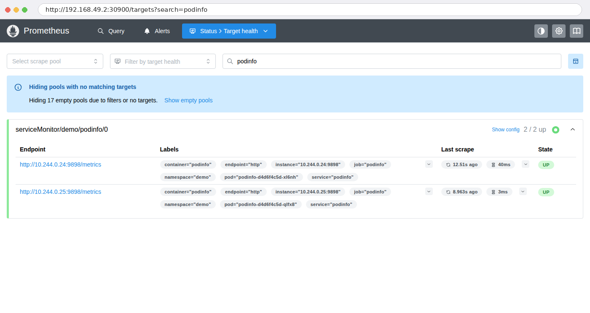

### Metrics – CPU utilization

`sum by (pod) (rate(container_cpu_usage_seconds_total{namespace="demo",container="podinfo"}[2m]))`

Each pod jumps from ~0 to **~0.28 cores** when the load generator starts at 22:15. The limit is 0.3 cores, so the pods are being throttled:

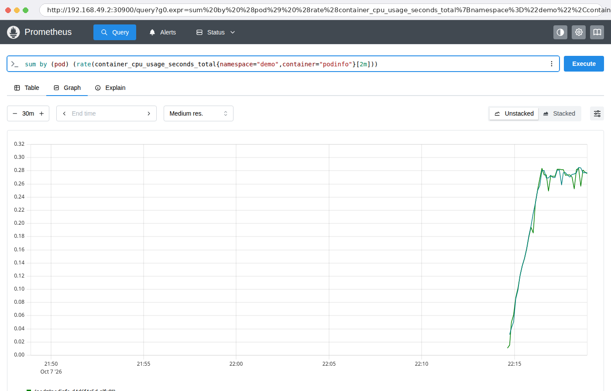

### Metrics – Memory utilization

`sum by (pod) (container_memory_working_set_bytes{namespace="demo",container="podinfo"})`

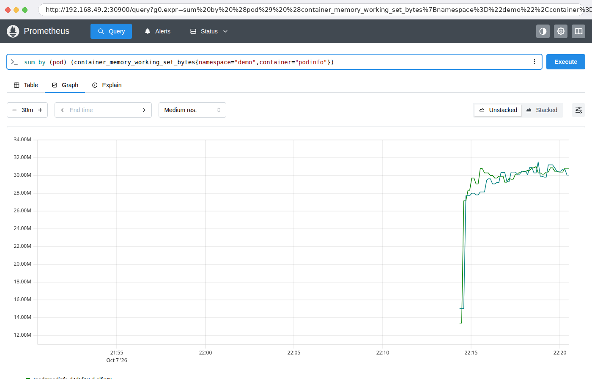

### Metrics – Application traffic (from the app's own `/metrics`)

`sum by (pod) (rate(http_requests_total{namespace="demo"}[1m]))`: about **1,500–1,700 requests per second per pod** under load.

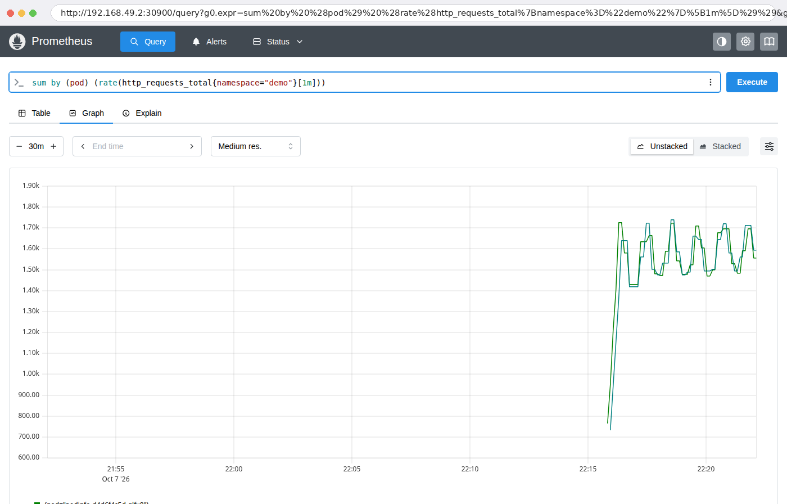

### Application health

`kube_pod_status_ready{namespace="demo",condition="true"}` (from kube-state-metrics) is 1 for every Ready pod:

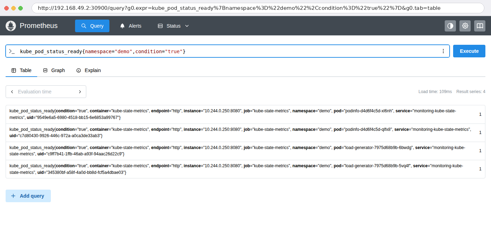

### Alerts

[`monitoring/alert-rules.yaml`](monitoring/alert-rules.yaml) defines three rules: `PodinfoHighCPU` (> 100m for 1 min), `PodinfoTargetDown` (`up == 0`) and `DemoPodCrashLooping`. Under load, **PodinfoHighCPU went Pending → Firing for both pods**:

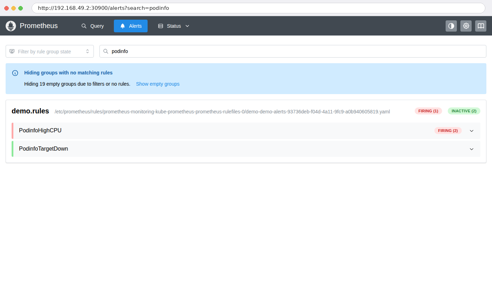

Prometheus sent them to **Alertmanager**, which handles grouping, silencing and routing to Slack/e-mail/PagerDuty receivers:

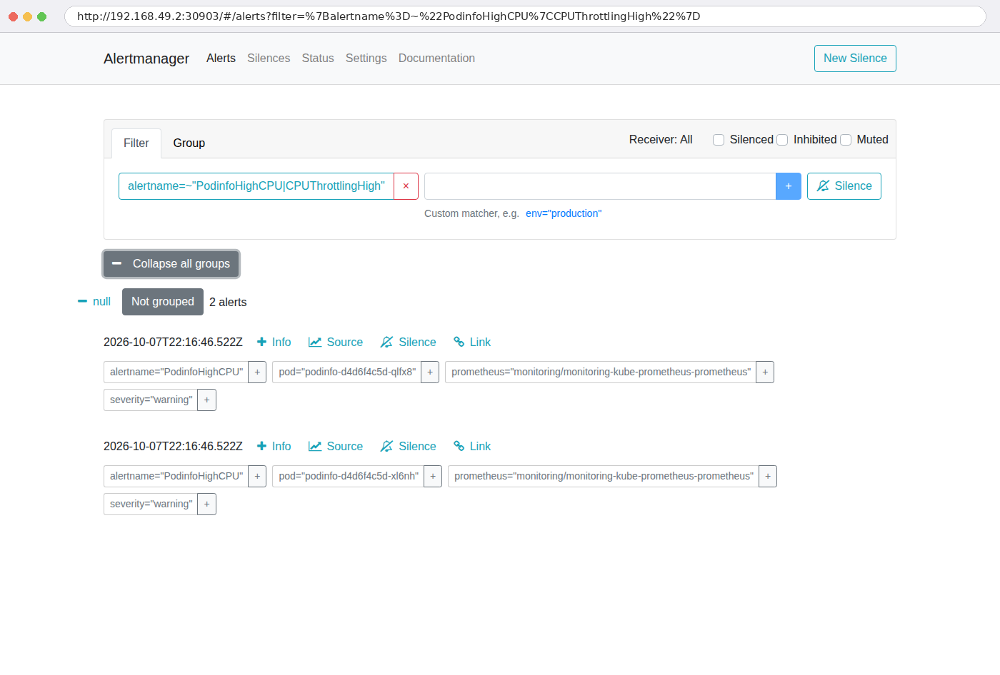

### Dashboards – Grafana

The built-in *Kubernetes / Compute Resources / Namespace (Pods)* dashboard for `demo`. CPU **requests** utilisation is 3768% because the load-generator pods request only 50m but use ~3.5 cores. That's a real finding: their requests are far too low for what they do.

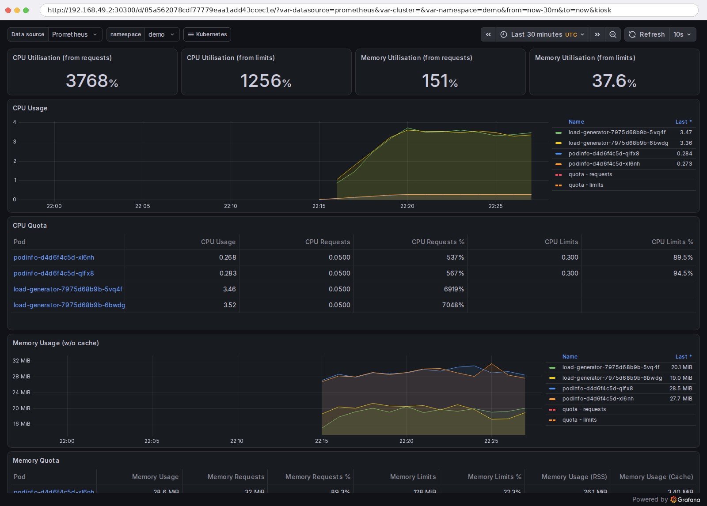

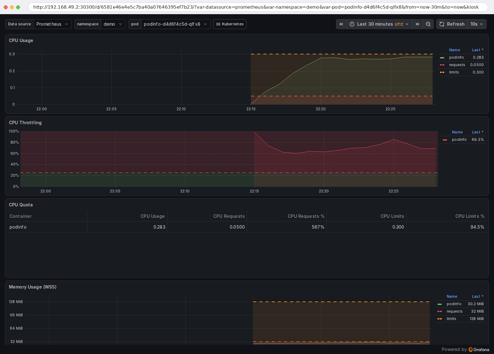

### Logs and health endpoints

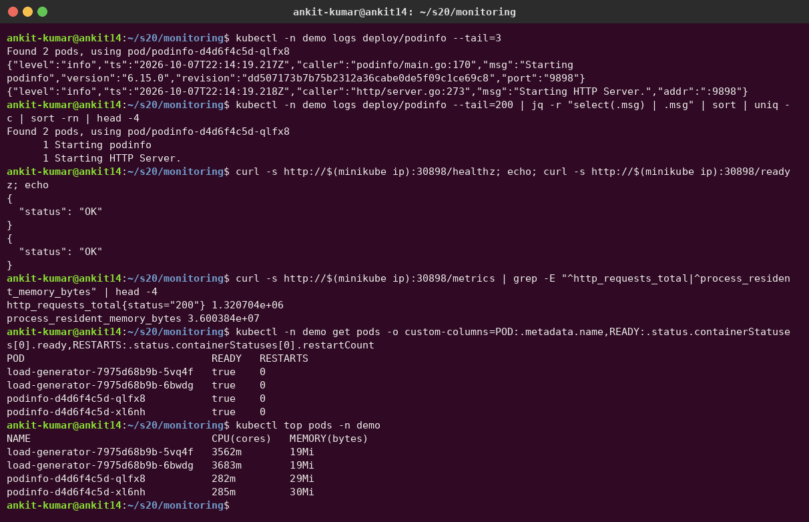

- **Logs:** podinfo writes structured JSON (`level`, `ts`, `caller`, `msg`), so it's easy to filter with `jq` (or with Loki/Elasticsearch in production).
- **Health:** `/healthz` (liveness) and `/readyz` (readiness) both return `OK`. All pods are Ready with **0 restarts**.
- **Metrics:** the raw `/metrics` endpoint showed `http_requests_total{status="200"} 1.32e6` requests served during the load test.

| Signal | Where I saw it |
|---|---|
| Metrics | Prometheus (PromQL), Grafana dashboards, `kubectl top` |
| Logs | `kubectl logs` (JSON) |
| Alerts | PrometheusRule → Prometheus Alerts → Alertmanager |
| CPU / Memory utilization | cAdvisor metrics (`container_cpu_usage_seconds_total`, `container_memory_working_set_bytes`) |
| Application health | Probes (`/healthz`, `/readyz`), `kube_pod_status_ready`, `up` |

Theory: [`monitoring-concepts.md`](monitoring-concepts.md).

---

## Task 2 – Observability

See **[observability/README.md](observability/README.md)**: the three pillars (**metrics, logs, traces**), why observability is needed beyond monitoring, common tools, and how Kubernetes observability works (metrics-server, kube-state-metrics, node-exporter, Prometheus Operator, Fluent Bit, OpenTelemetry, RED/USE/golden signals).

---

## Task 3 – GitOps demo (Argo CD)

Theory (Git as the source of truth, declarative config, continuous reconciliation, workflow, Argo CD vs Flux): **[gitops/README.md](gitops/README.md)**

### 1. Install Argo CD and register the app

```bash
helm repo add argo https://argoproj.github.io/argo-helm
helm install argocd argo/argo-cd -n argocd --create-namespace --set server.service.type=NodePort
kubectl apply -f gitops/argocd-application.yaml
```

[`argocd-application.yaml`](gitops/argocd-application.yaml) points Argo CD at **this GitHub repo**, path `session20-…/homework/gitops/app`, branch `main`, with `automated: {prune: true, selfHeal: true}`. Argo CD cloned the repo and created everything in `app/`: **Synced / Healthy** at commit `30fb31c`.

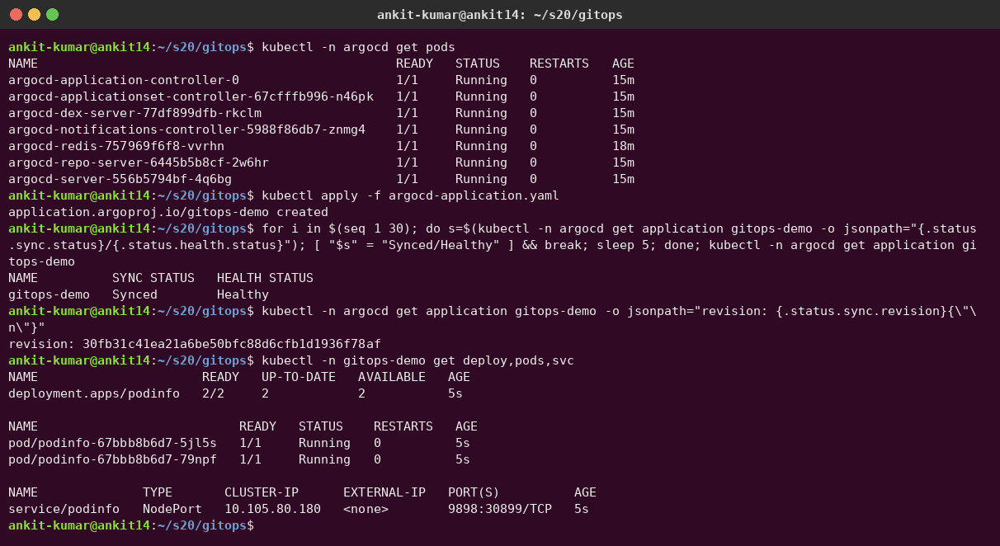

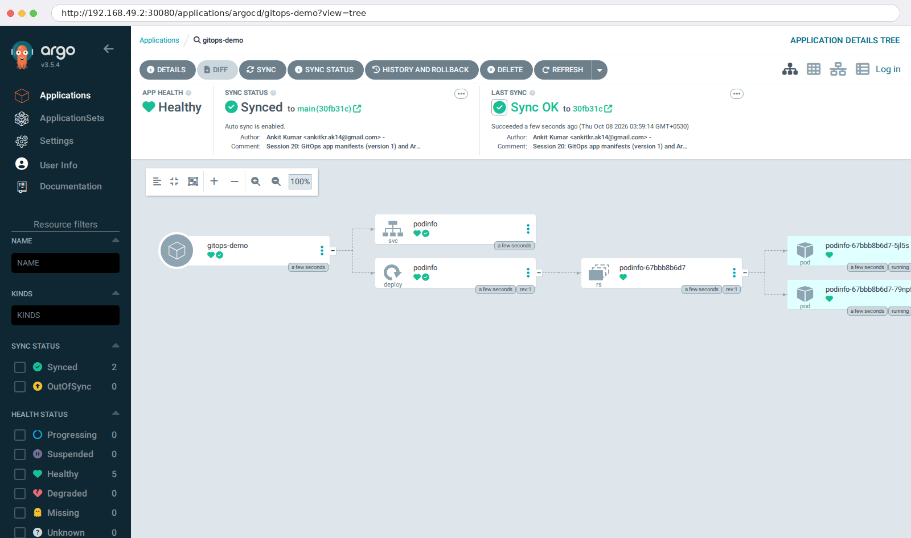

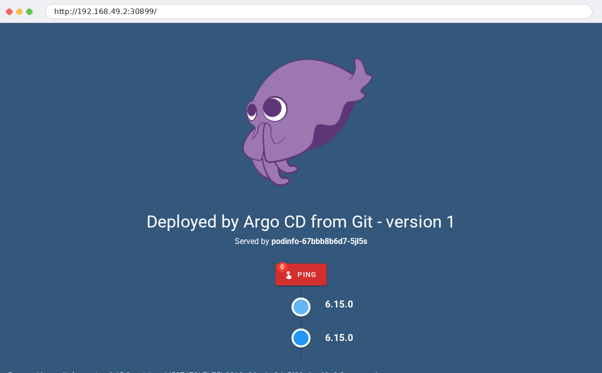

### 2. Change the app by changing Git only

I edited `app/deployment.yaml` (replicas 2 → 3, new message and colour), committed and pushed. **I never ran `kubectl apply`.** Argo CD noticed commit `699bc66` on its next poll (**101 s**; the default reconciliation interval is ~3 min, and a webhook makes it instant) and rolled out the new ReplicaSet:

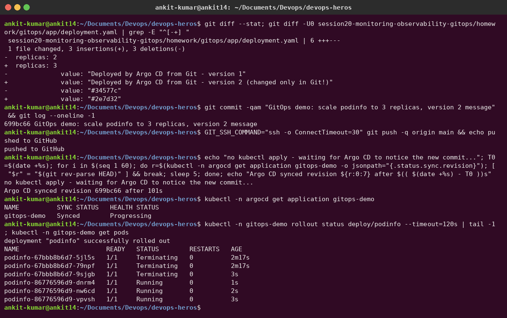

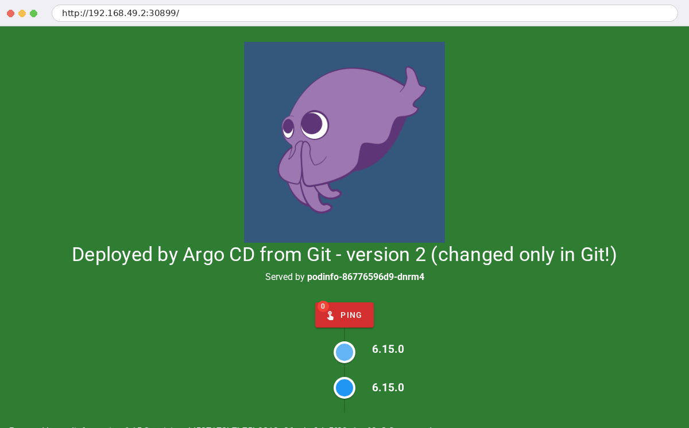

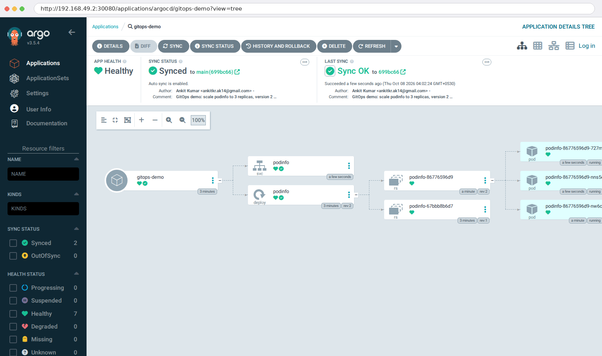

### 3. Continuous reconciliation – self-healing drift

- `kubectl scale --replicas=1` (manual drift) → Argo CD put it back to **3 within 2 seconds**.
- `kubectl delete svc podinfo` → Argo CD **recreated** the Service.
- The Application history lists both Git revisions. Rolling back = `git revert`.

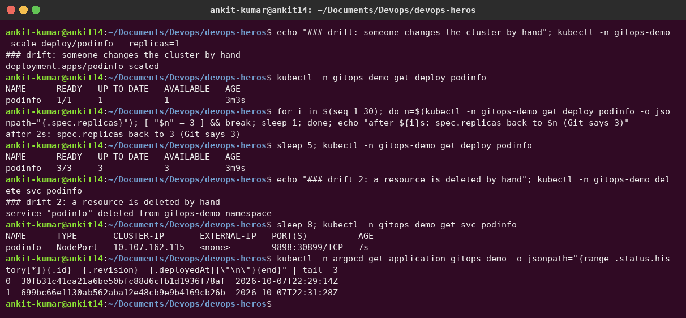

**Lesson:** with GitOps the cluster can't silently drift from Git. Every change is a reviewed, auditable commit, and the cluster *pulls* its desired state, so CI never needs cluster credentials.

---

## Cleanup

```bash
kubectl delete -f gitops/argocd-application.yaml   # prune deletes the app too
kubectl delete -f monitoring/load-generator.yaml -f monitoring/alert-rules.yaml -f monitoring/podinfo-app.yaml
helm uninstall monitoring -n monitoring; helm uninstall argocd -n argocd
```
