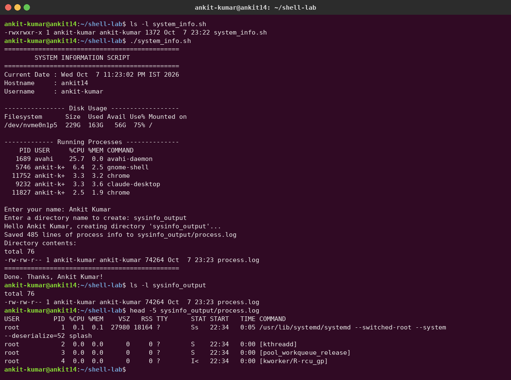
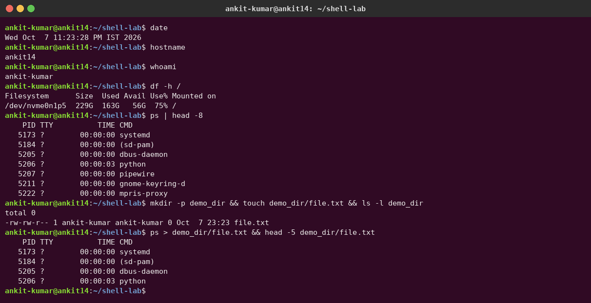

# Session 03 – Shell Scripting Homework

**Author:** Ankit Kumar
**Script:** [`system_info.sh`](system_info.sh)

## Task

Create a shell script that prints the date, hostname, username, disk usage and running processes. It should use variables, take user input with `read -p`, create a directory (`mkdir`) and a file (`touch`), and save the running processes into the file with `>` output redirection.

## How to run

```bash
chmod +x system_info.sh
./system_info.sh
```

## Concepts used in the script

| Concept | Where in the script |
|---|---|
| Variables | `current_date=$(date)`, `host_name=$(hostname)`, `user_name=$(whoami)`, `report_file=...` |
| `echo` | prints every heading and value |
| `df` | `df -h /` prints disk usage in human-readable form |
| `ps` | `ps -eo pid,user,%cpu,%mem,comm --sort=-%cpu` prints the top processes |
| `read -p` | asks for your name and the directory name |
| `mkdir` | `mkdir -p "$dir_name"` |
| `touch` | `touch "$report_file"` creates an empty `process.log` |
| `>` redirection | `ps aux > "$report_file"` overwrites the file with the process list |

## Screenshot – running the script



## Screenshot – each command on its own



## Full script output (text)

```text
$ ./system_info.sh
==============================================
        SYSTEM INFORMATION SCRIPT
==============================================
Current Date : Wed Oct  7 11:23:02 PM IST 2026
Hostname     : ankit14
Username     : ankit-kumar

---------------- Disk Usage ------------------
Filesystem      Size  Used Avail Use% Mounted on
/dev/nvme0n1p5  229G  163G   56G  75% /

------------- Running Processes --------------
    PID USER     %CPU %MEM COMMAND
   1689 avahi    25.7  0.0 avahi-daemon
   5746 ankit-k+  6.4  2.5 gnome-shell
  11752 ankit-k+  3.3  3.2 chrome
   9232 ankit-k+  3.3  3.6 claude-desktop
  11827 ankit-k+  2.5  1.9 chrome

Enter your name: Ankit Kumar
Enter a directory name to create: sysinfo_output
Hello Ankit Kumar, creating directory 'sysinfo_output'...
Saved 485 lines of process info to sysinfo_output/process.log
Directory contents:
total 76
-rw-rw-r-- 1 ankit-kumar ankit-kumar 74264 Oct  7 23:23 process.log
==============================================
Done. Thanks, Ankit Kumar!
```

## Output of each command

```text
$ date
Wed Oct  7 11:23:28 PM IST 2026
$ hostname
ankit14
$ whoami
ankit-kumar
$ df -h /
Filesystem      Size  Used Avail Use% Mounted on
/dev/nvme0n1p5  229G  163G   56G  75% /
$ ps | head -8
    PID TTY          TIME CMD
   5173 ?        00:00:00 systemd
   5184 ?        00:00:00 (sd-pam)
   5205 ?        00:00:00 dbus-daemon
   5206 ?        00:00:03 python
   5207 ?        00:00:00 pipewire
   5211 ?        00:00:00 gnome-keyring-d
   5222 ?        00:00:00 mpris-proxy
$ mkdir -p demo_dir && touch demo_dir/file.txt && ls -l demo_dir
total 0
-rw-rw-r-- 1 ankit-kumar ankit-kumar 0 Oct  7 23:23 file.txt
$ ps > demo_dir/file.txt && head -5 demo_dir/file.txt
    PID TTY          TIME CMD
   5173 ?        00:00:00 systemd
   5184 ?        00:00:00 (sd-pam)
   5205 ?        00:00:00 dbus-daemon
   5206 ?        00:00:03 python
```

## What I learned

- `$(command)` (command substitution) stores a command's output in a variable.
- `read -p "prompt" var` shows a prompt and saves what the user types into `var`.
- `>` **overwrites** a file and `>>` **appends** to it.
- `mkdir -p` doesn't fail if the directory already exists, so the script can be run again safely.
- Quoting variables (`"$dir_name"`) stops names that contain spaces from breaking the command.
