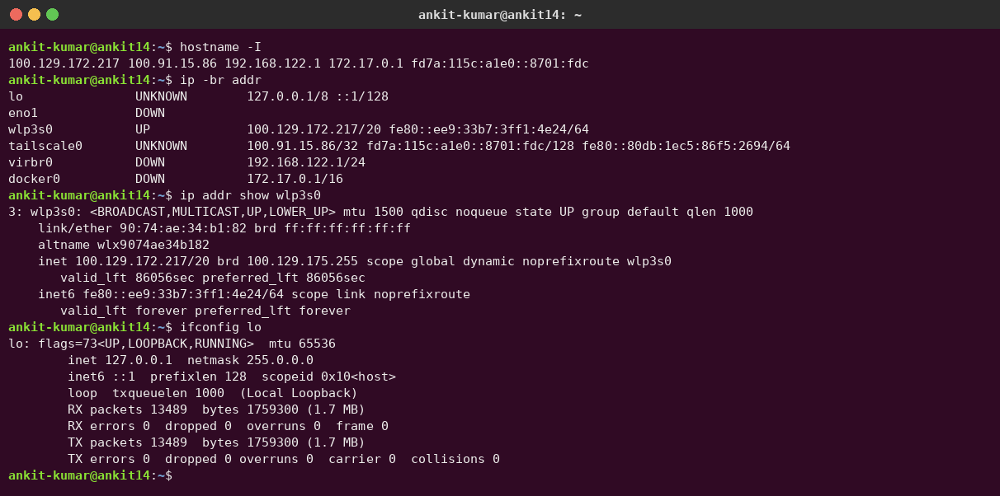
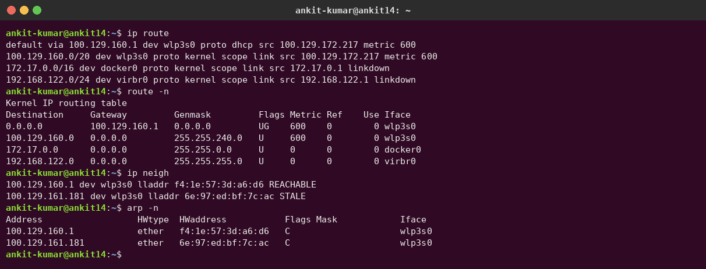
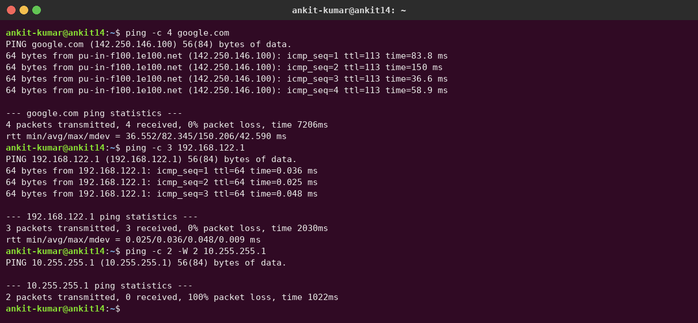
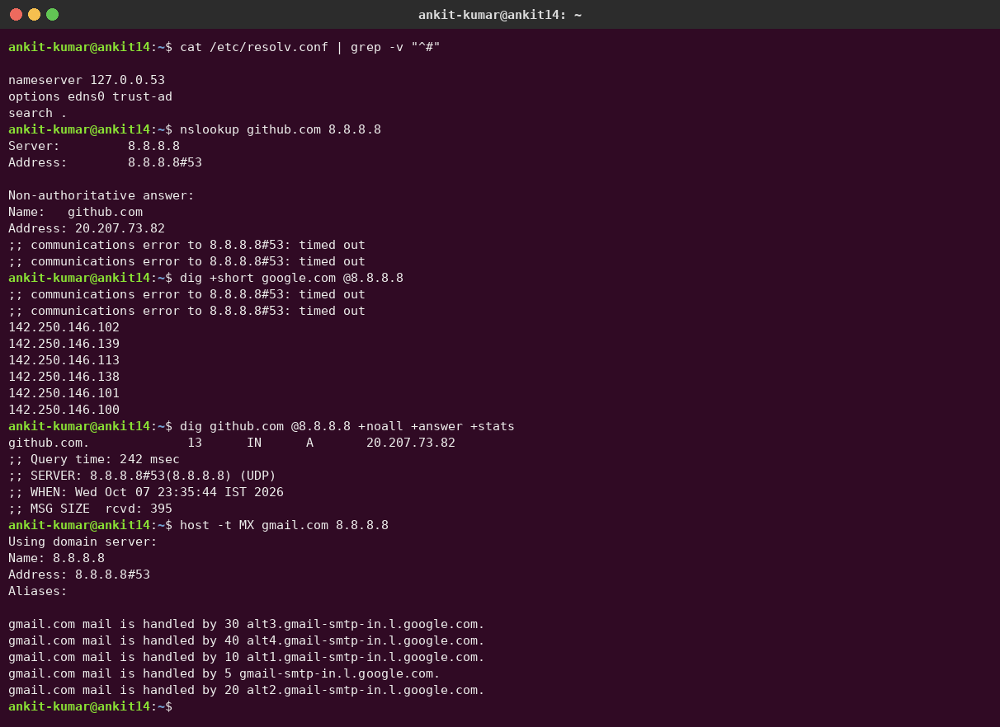
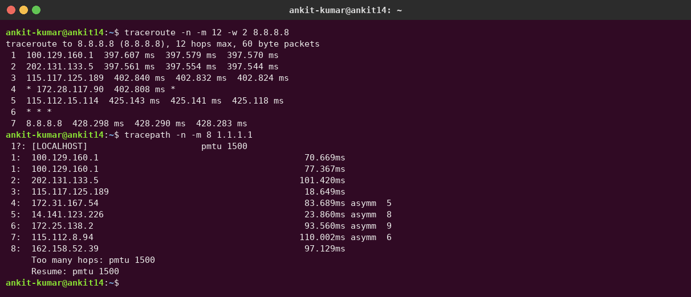
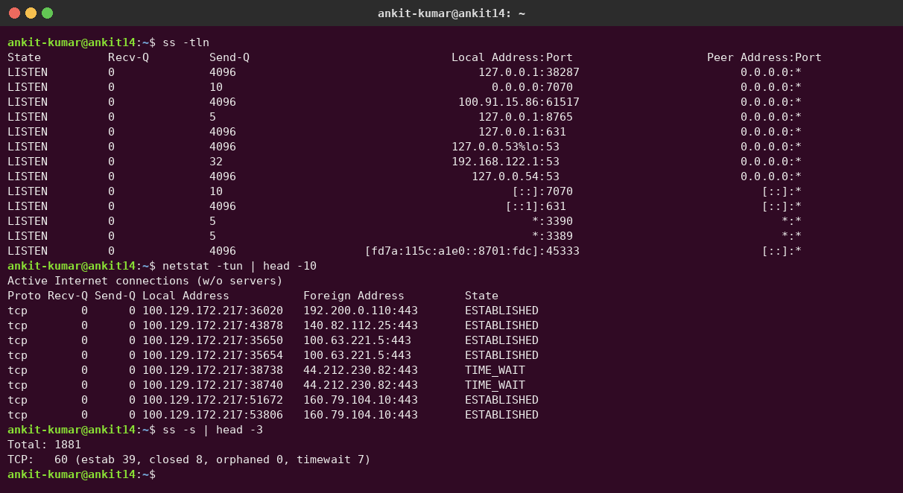
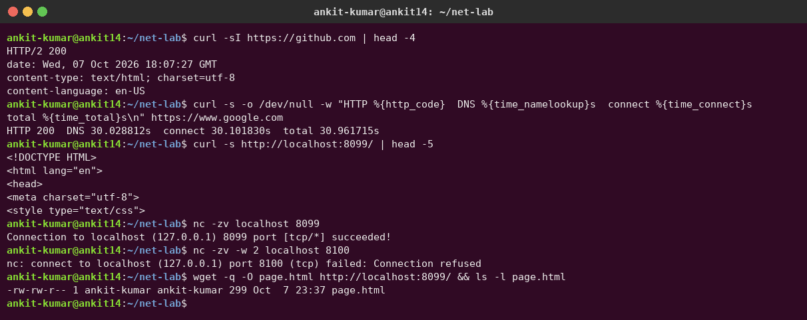

# Session 04 – Networking Fundamentals Homework

**Author:** Ankit Kumar
**Machine:** Ubuntu 26.04 LTS laptop on WiFi (`wlp3s0`), with Tailscale, Docker and libvirt installed

## Task 1 – Practice from the devops-heros networking repos

I went through the networking repos listed in [`../resources.md`](../resources.md) (Networking, OSI-Network-devices, IP-quest, Subnetting, How-DHCP-Works, Network-Troubleshooting) and practised the commands below.

Quick subnetting recap from [`../ip.md`](../ip.md):

| Class | First octet | Default mask | Network/host bits | Usable hosts |
|---|---|---|---|---|
| A | 1 – 127 | 255.0.0.0 (/8) | 8 / 24 | 2^24 − 2 = 16,777,214 |
| B | 128 – 191 | 255.255.0.0 (/16) | 16 / 16 | 2^16 − 2 = 65,534 |
| C | 192 – 223 | 255.255.255.0 (/24) | 24 / 8 | 2^8 − 2 = 254 |
| D | 224 – 239 | multicast | – | – |

Example from my own machine: `wlp3s0` has `100.129.172.217/20`. A /20 leaves 12 host bits, so 2^12 − 2 = 4094 usable hosts. The network is `100.129.160.0/20` (the same range shows up in `ip route`). `100.64.0.0/10` is the **CGNAT** shared range, so my ISP/WiFi puts me behind carrier-grade NAT.

---

## Task 2 – Commands, output and what I understood

### 1. `hostname -I`, `ip addr`, `ifconfig` – interfaces and IP addresses

- `ip -br addr` gives a brief one-line-per-interface view. I have `lo` (loopback 127.0.0.1), `eno1` (ethernet, DOWN), `wlp3s0` (WiFi, UP), `tailscale0` (VPN, 100.x /32) and `virbr0` (libvirt bridge 192.168.122.1/24).
- `ip addr show wlp3s0` shows the MAC (`link/ether`), the IPv4 with prefix, the broadcast address and the IPv6 link-local `fe80::` address.
- `ifconfig` is the **old** net-tools command. `ip` (iproute2) is its modern replacement.

### 2. `ip route`, `route -n`, `ip neigh`, `arp -n` – routing table and ARP

- `default via 100.129.160.1 dev wlp3s0` is my **default gateway**. Any packet that isn't for a local subnet goes to the router.
- Each other line is a directly connected network (`proto kernel scope link`). `172.17.0.0/16` on `docker0` is Docker's default bridge network.
- `route -n` shows the same thing in the old format: flag `UG` = route is Up and uses a Gateway, and `Genmask 255.255.240.0` = /20.
- `ip neigh` / `arp -n` show the **ARP cache**: IP → MAC mappings for devices on my LAN (here, the gateway). ARP turns a layer-3 IP into the layer-2 MAC needed to send a frame.

### 3. `ping` – reachability and latency (ICMP)

- `ping -c 4 google.com` resolves the name and then sends ICMP echo requests. It reports `ttl`, round-trip time and packet loss.
- Pinging my own libvirt bridge `192.168.122.1` takes ~0.03 ms because it never leaves the machine. Google is ~36–150 ms over WiFi.
- Pinging `10.255.255.1` (a host that doesn't exist) shows **100% packet loss**. ping proves whether a host is reachable, not whether a service on it is up.

### 4. DNS – `/etc/resolv.conf`, `nslookup`, `dig`, `host`

- `/etc/resolv.conf` points to `127.0.0.53`, the local **systemd-resolved** stub. It forwards queries to the real DNS servers (`resolvectl status` shows which).
- `nslookup` / `dig` / `host` all query DNS. `dig +short` prints just the answer. `+noall +answer +stats` shows the record (`github.com. 13 IN A 20.207.73.82`, where 13 is the TTL in seconds), the query time and which server answered.
- `host -t MX gmail.com` looks up **mail exchanger** records. Lower priority numbers are preferred.
- **Real troubleshooting I hit:** the `;; communications error ... timed out` lines are real. While doing this homework my WiFi DNS (`100.129.160.1`) and Tailscale DNS (`100.100.100.100`) kept timing out, so Docker could not pull images. I diagnosed it like this:
  1. `ping 8.8.8.8` worked, so IP connectivity was fine.
  2. `dig @8.8.8.8 github.com` worked, but `dig github.com` (via 127.0.0.53) timed out. That pointed at the configured DNS servers.
  3. `resolvectl status` showed the slow servers, so I ran `sudo tailscale set --accept-dns=false` and `sudo resolvectl dns wlp3s0 1.1.1.1 8.8.8.8`.

  UDP DNS packets are still occasionally dropped on this network, which is why some timeouts still appear before the answer comes back on a retry.

### 5. `traceroute` / `tracepath` – the path packets take

- Each line is a **hop** (router). traceroute sends packets with TTL = 1, 2, 3 … and every router that drops a packet (TTL expired) replies, revealing itself.
- Hop 1 `100.129.160.1` is my gateway. Then come ISP routers (`202.131.x`, `115.x`), and Google `8.8.8.8` is reached at hop 7.
- `* * *` means that router doesn't reply to these probes (it's filtered). That's not necessarily an error.
- `tracepath` needs no root. It also discovers the path **MTU** (`pmtu 1500`).

### 6. `ss` / `netstat` – sockets and listening ports

- `ss -tln` lists **t**cp, **l**istening sockets with **n**umeric ports, e.g. `127.0.0.53:53` (DNS stub) and `0.0.0.0:7070`. `0.0.0.0` means "all interfaces" and `127.0.0.1` means local-only.
- `netstat -tun` (old net-tools) shows established connections: my machine's ephemeral ports talking to remote `:443` (HTTPS).
- `ss -s` gives a summary of socket counts.

### 7. `curl`, `wget`, `nc` – test applications and ports

- `curl -sI` fetches only **HTTP headers** (`HTTP/2 200`).
- `curl -w` prints timing. In my output **DNS took ~30 s and everything after it was fast**, which matches the DNS problem described above. `-w` is a great way to tell whether DNS, connect or the server is slow.
- I started a local web server (`python3 -m http.server 8099`) and tested it with `curl` and `wget`.
- `nc -zv host port` tests whether a TCP port is open: `succeeded` on 8099, `Connection refused` on 8100 (nothing listening).

## Commands summary

| Command | Layer | What it tells you |
|---|---|---|
| `ip a`, `ifconfig`, `hostname -I` | L2/L3 | Interfaces, MAC, IP addresses |
| `ip route`, `route -n` | L3 | Routing table, default gateway |
| `ip neigh`, `arp -n` | L2/L3 | IP-to-MAC cache |
| `ping` | L3 (ICMP) | Is the host reachable? Latency, loss |
| `traceroute`, `tracepath`, `mtr` | L3 | Path/hops to a destination |
| `nslookup`, `dig`, `host`, `resolvectl` | L7 (DNS) | Name resolution |
| `ss`, `netstat` | L4 | Listening ports, connections |
| `nc -zv` | L4 | Is a TCP port open? |
| `curl`, `wget` | L7 (HTTP) | Does the application respond? |
