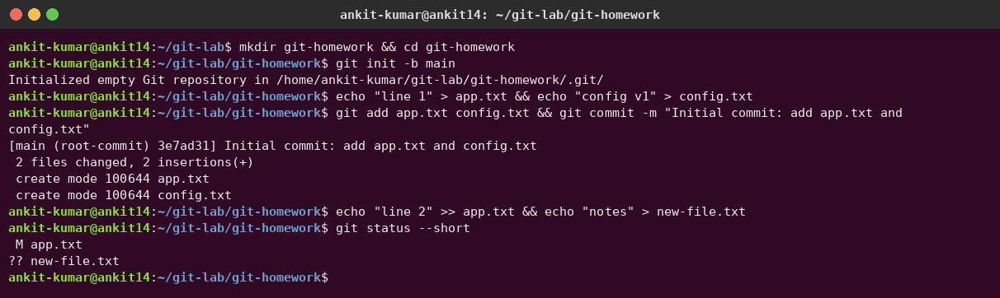
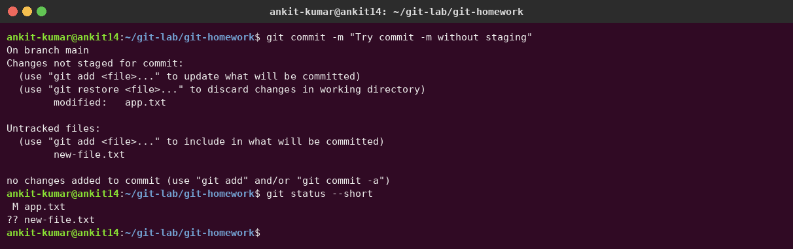
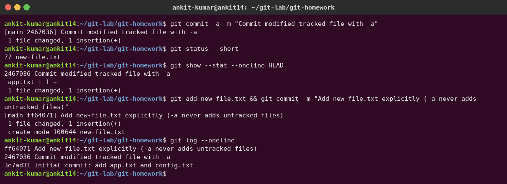
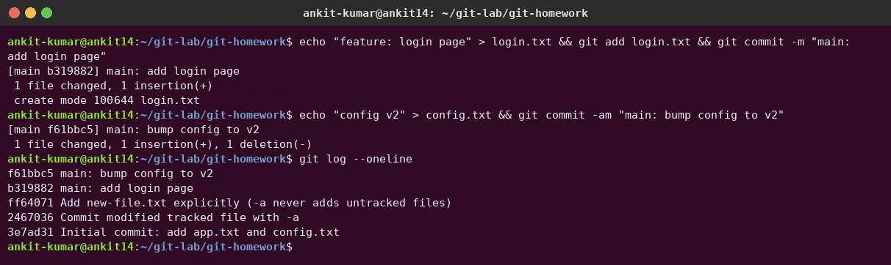
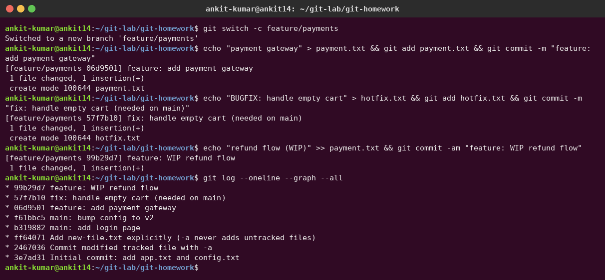
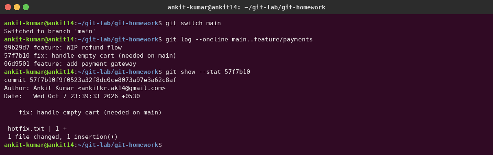
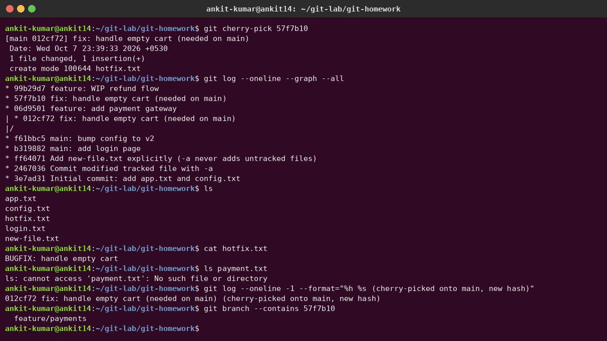
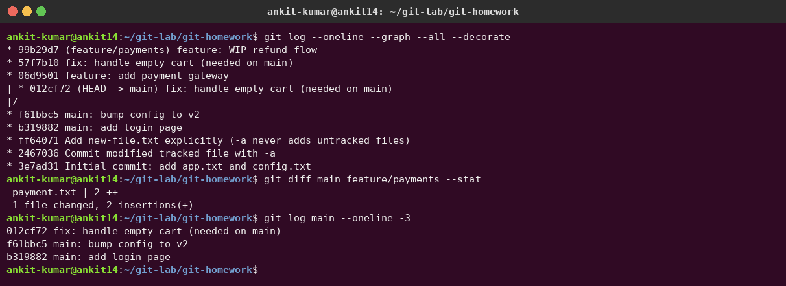

# Session 05 – Git / GitHub Homework

**Author:** Ankit Kumar

I did everything in a fresh practice repository (`~/git-lab/git-homework`). The screenshots below show the real commands and output.

---

## Task 1 – `git commit -a -m` vs `git commit -m`

| | `git commit -m "msg"` | `git commit -a -m "msg"` (`-am`) |
|---|---|---|
| What it commits | Only what is already **staged** (`git add`) | **Auto-stages every modified or deleted tracked file**, then commits |
| Untracked (new) files | Not included unless you `git add` them | **Never** included – `-a` ignores untracked files |
| Typical use | Choosing exactly what goes in a commit | Quick commit of edits to files git already knows |

### Setup: one tracked file modified, one new untracked file

`app.txt` is tracked and modified (` M`). `new-file.txt` is new and untracked (`??`).



### `git commit -m` with nothing staged → nothing is committed

Git refuses: *"no changes added to commit (use "git add" and/or "git commit -a")"*.



### `git commit -a -m` → commits the modified tracked file, but not the new file

`app.txt` was committed without running `git add`. `new-file.txt` is still `??` and needed an explicit `git add`.



**Observation:** `-a` is "`git add -u` + commit". It saves typing, but it can't add new files, and it can accidentally commit edits you didn't mean to include. Check `git status` first.

---

## Task 2 – Git Cherry-Pick

**Scenario:** a bug fix was made on a feature branch that is not ready to merge, but `main` needs the fix now. `git cherry-pick <hash>` copies **just that one commit** onto the current branch.

### Step 1 – Commits on `main` (5 commits in total)



### Step 2 – New branch `feature/payments` with 3 commits

```bash
git switch -c feature/payments
# 1) feature: add payment gateway
# 2) fix: handle empty cart (needed on main)   <-- the one we want
# 3) feature: WIP refund flow
```



### Step 3 – Identify the commit with `git log`

`git log main..feature/payments` lists the commits that are on the branch but not on main. `git show --stat 57f7b10` confirms that this commit only adds `hotfix.txt`.



### Step 4 – Cherry-pick into `main` and verify

```bash
git switch main
git cherry-pick 57f7b10
```



Verification:
- `hotfix.txt` now exists on `main` with the fix content ✅
- `payment.txt` (from the other feature commits) is **not** on main ✅ – only the selected commit came over
- The commit on main has a **new hash** (`012cf72`) because its parent is different. The original `57f7b10` is still only on `feature/payments`.



### Useful cherry-pick options

| Command | Use |
|---|---|
| `git cherry-pick A B C` | Pick several commits |
| `git cherry-pick A^..C` | Pick a range (A to C inclusive) |
| `git cherry-pick -x <hash>` | Add "(cherry picked from commit …)" to the message for traceability |
| `git cherry-pick -n <hash>` | Apply changes without committing |
| `git cherry-pick --continue / --abort` | After resolving a conflict / cancel the cherry-pick |

## Commands used

```bash
git init -b main
git add <file> ; git commit -m "msg" ; git commit -a -m "msg"
git status --short ; git show --stat <hash>
git log --oneline --graph --all --decorate
git switch -c feature/payments ; git switch main
git log main..feature/payments
git cherry-pick <hash>
git branch --contains <hash>
```
