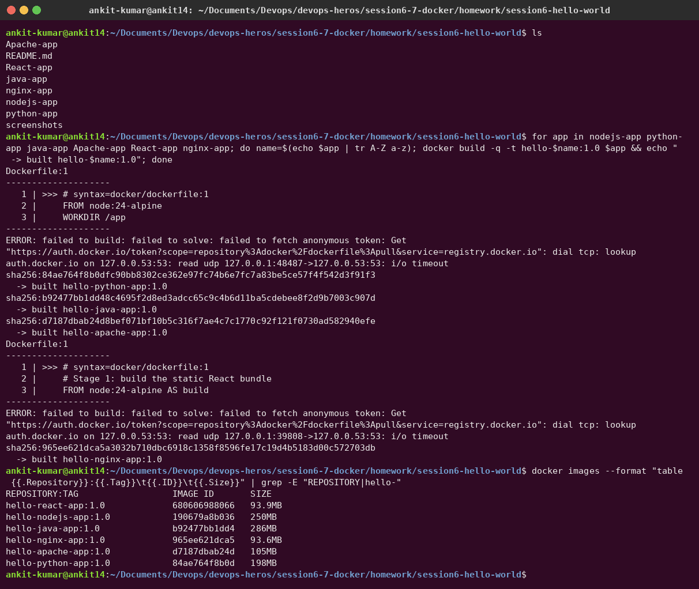
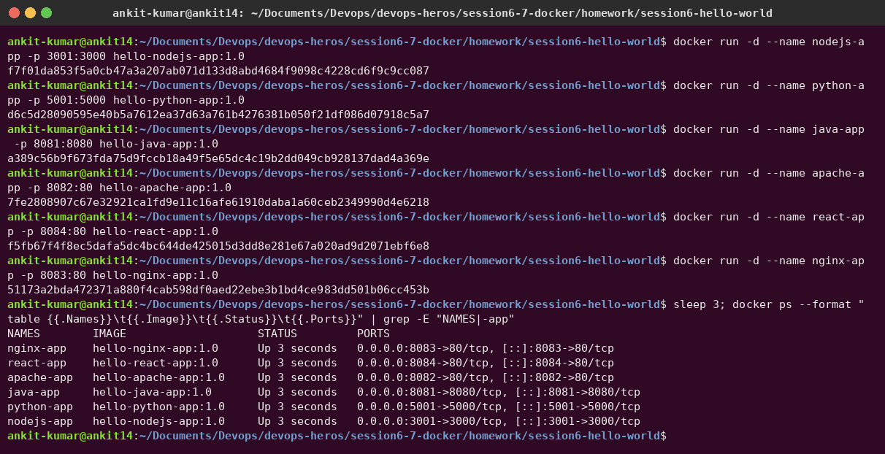
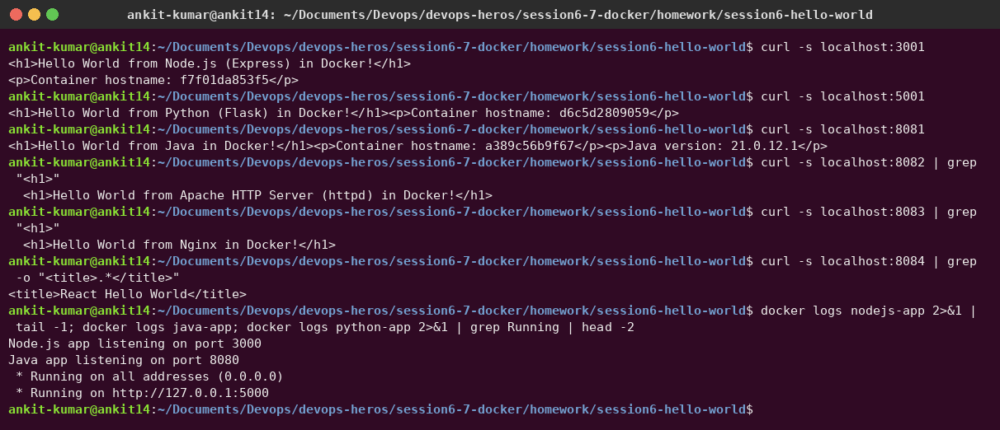
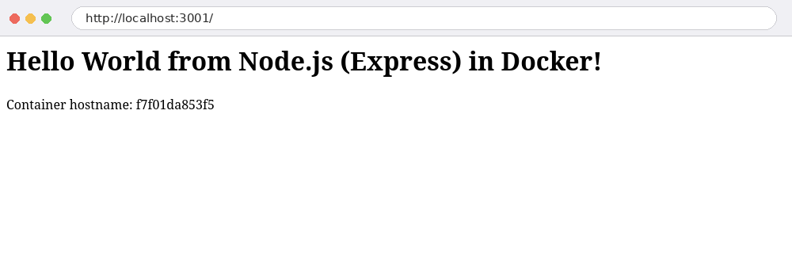
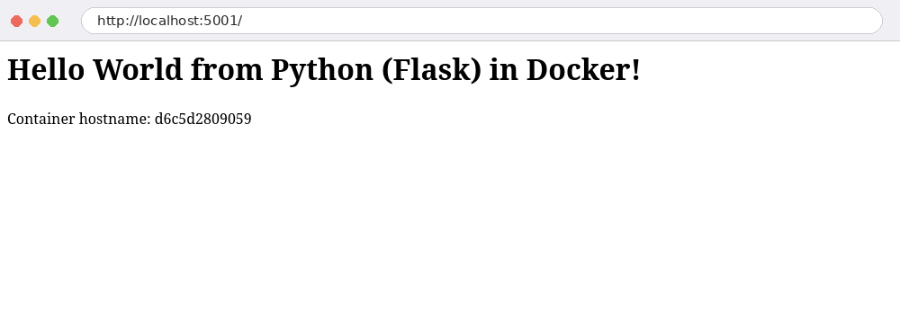
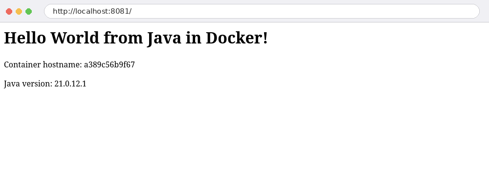
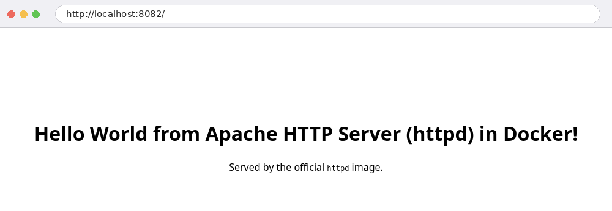
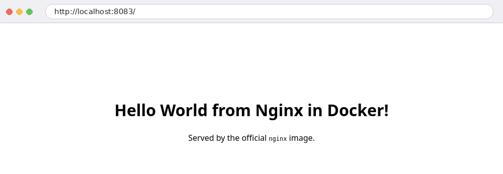
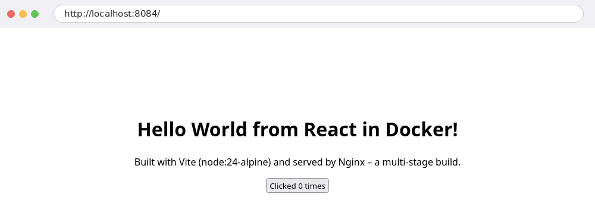

# Session 06 – Docker Fundamentals: Hello World Apps

**Author:** Ankit Kumar
**Docker:** 29.1.3 on Ubuntu 26.04

I built six **Hello World** web applications, each in its own folder with its source code and a `Dockerfile`. Each one was built into an image, run as a container and checked in the browser.

| Folder | Stack | Base image(s) | Container port → host port |
|---|---|---|---|
| [`nodejs-app`](nodejs-app) | Node.js + Express | `node:24-alpine` | 3000 → **3001** |
| [`python-app`](python-app) | Python + Flask | `python:3.12-slim` | 5000 → **5001** |
| [`java-app`](java-app) | Java 21 (built-in `HttpServer`) | `eclipse-temurin:21-jdk-alpine` → `21-jre-alpine` (multi-stage) | 8080 → **8081** |
| [`Apache-app`](Apache-app) | Apache httpd static page | `httpd:2.4-alpine` | 80 → **8082** |
| [`nginx-app`](nginx-app) | Nginx static page | `nginx:alpine` | 80 → **8083** |
| [`React-app`](React-app) | React 19 + Vite, served by Nginx | `node:24-alpine` → `nginx:alpine` (multi-stage) | 80 → **8084** |

## Folder structure

```text
session6-hello-world/
├── nodejs-app/   Dockerfile  package.json  package-lock.json  server.js  .dockerignore
├── python-app/   Dockerfile  app.py  requirements.txt
├── java-app/     Dockerfile  HelloWorld.java
├── Apache-app/   Dockerfile  index.html
├── React-app/    Dockerfile  nginx.conf  package.json  package-lock.json  vite.config.js  index.html  src/{main,App}.jsx
├── nginx-app/    Dockerfile  index.html
└── screenshots/
```

## Dockerfiles

<details><summary><b>nodejs-app/Dockerfile</b></summary>

```dockerfile
# syntax=docker/dockerfile:1
FROM node:24-alpine
WORKDIR /app
COPY package*.json ./
RUN --mount=type=cache,target=/root/.npm npm ci --omit=dev
COPY server.js .
EXPOSE 3000
CMD ["npm", "start"]
```
</details>

<details><summary><b>python-app/Dockerfile</b></summary>

```dockerfile
FROM python:3.12-slim
WORKDIR /app
COPY requirements.txt .
RUN pip install --no-cache-dir -r requirements.txt
COPY app.py .
EXPOSE 5000
CMD ["python", "app.py"]
```
</details>

<details><summary><b>java-app/Dockerfile</b> (multi-stage: JDK to compile, JRE to run)</summary>

```dockerfile
FROM eclipse-temurin:21-jdk-alpine AS build
WORKDIR /src
COPY HelloWorld.java .
RUN javac HelloWorld.java

FROM eclipse-temurin:21-jre-alpine
WORKDIR /app
COPY --from=build /src/*.class ./
EXPOSE 8080
CMD ["java", "HelloWorld"]
```
</details>

<details><summary><b>Apache-app/Dockerfile</b></summary>

```dockerfile
FROM httpd:2.4-alpine
COPY index.html /usr/local/apache2/htdocs/index.html
EXPOSE 80
```
</details>

<details><summary><b>nginx-app/Dockerfile</b></summary>

```dockerfile
FROM nginx:alpine
COPY index.html /usr/share/nginx/html/index.html
EXPOSE 80
CMD ["nginx", "-g", "daemon off;"]
```
</details>

<details><summary><b>React-app/Dockerfile</b> (multi-stage: Node builds, Nginx serves)</summary>

```dockerfile
# syntax=docker/dockerfile:1
FROM node:24-alpine AS build
WORKDIR /app
COPY package*.json ./
RUN --mount=type=cache,target=/root/.npm npm ci
COPY . .
RUN npm run build

FROM nginx:alpine
COPY nginx.conf /etc/nginx/conf.d/default.conf
COPY --from=build /app/dist /usr/share/nginx/html
EXPOSE 80
CMD ["nginx", "-g", "daemon off;"]
```
</details>

## Step 1 – Build the images

```bash
for app in nodejs-app python-app java-app Apache-app React-app nginx-app; do
  name=$(echo $app | tr A-Z a-z)          # image names must be lowercase
  docker build -t hello-$name:1.0 $app
done
```



The React image is only **93.9 MB** although it is built with Node. The multi-stage build copies only the static `dist/` folder into the Nginx image and throws away `node_modules`.

## Step 2 – Run the containers

```bash
docker run -d --name nodejs-app -p 3001:3000 hello-nodejs-app:1.0
docker run -d --name python-app -p 5001:5000 hello-python-app:1.0
docker run -d --name java-app   -p 8081:8080 hello-java-app:1.0
docker run -d --name apache-app -p 8082:80   hello-apache-app:1.0
docker run -d --name react-app  -p 8084:80   hello-react-app:1.0
docker run -d --name nginx-app  -p 8083:80   hello-nginx-app:1.0
docker ps
```



## Step 3 – Verify Hello World

With `curl` and the container logs:



In the browser:

| Node.js | Python |
|---|---|
|  |  |
| **Java** | **Apache** |
|  |  |
| **Nginx** | **React** |
|  |  |

## Problems I hit (and fixed)

1. **`npm install` failed inside `docker build` with `EAI_AGAIN registry.npmjs.org`.** My WiFi's DNS server kept timing out. I fixed it by setting DNS on the WiFi connection (`nmcli connection modify ... ipv4.dns "8.8.8.8 8.8.4.4"`). I also switched the Node Dockerfiles to `npm ci` with a committed `package-lock.json` and a BuildKit cache mount (`--mount=type=cache,target=/root/.npm`), so a retry doesn't re-download everything.
2. **Image names must be lowercase.** `docker build -t hello-Apache-app` fails, which is why the loop runs `tr A-Z a-z`.
3. **Flask listens on 127.0.0.1 by default**, which isn't reachable from outside the container. `app.run(host="0.0.0.0")` fixes it.

## What I learned

- `-p HOST:CONTAINER` publishes a container port. `EXPOSE` only documents it.
- Multi-stage builds keep build tools (JDK, Node, npm) out of the final image: smaller and more secure.
- Copy `package*.json` and install **before** `COPY . .`, so Docker reuses the dependency layer when only source code changes.
- `.dockerignore` keeps `node_modules`/`dist` out of the build context.
