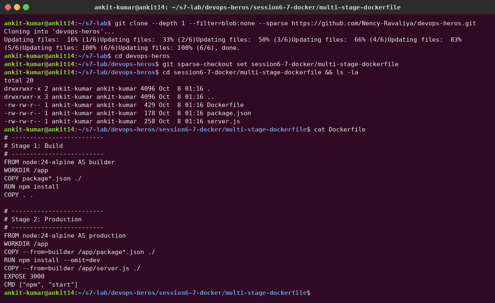
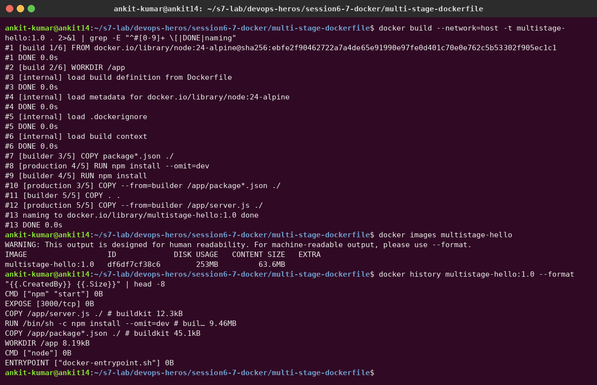
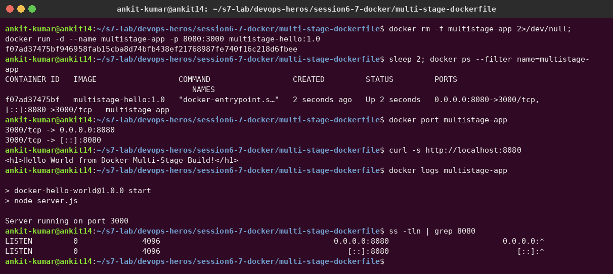
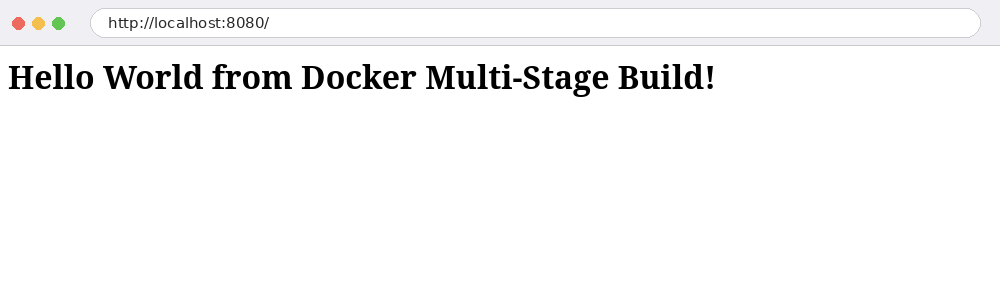
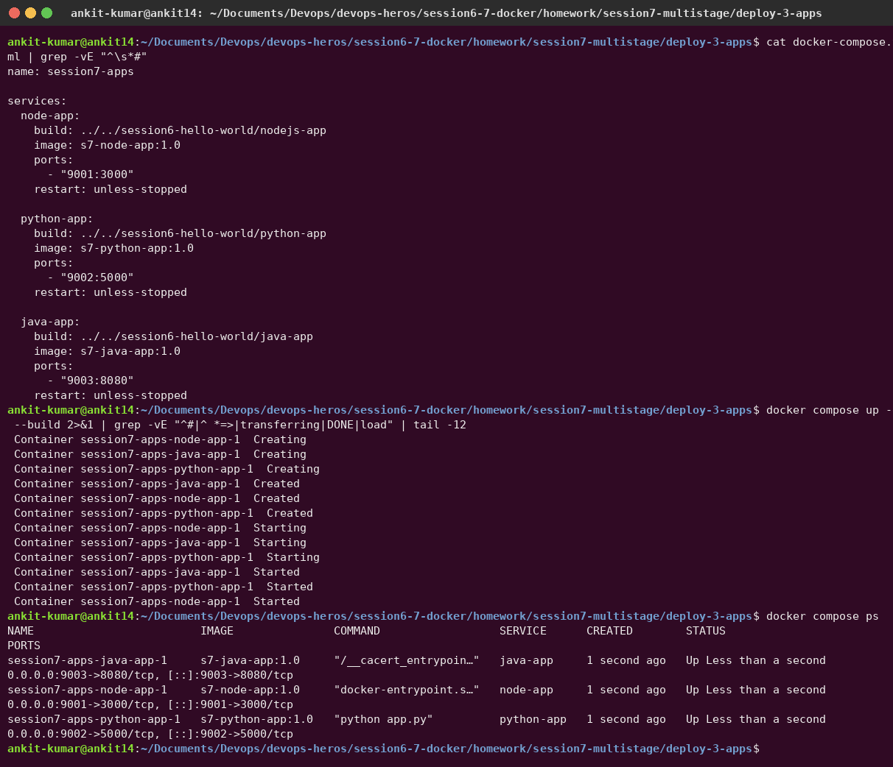
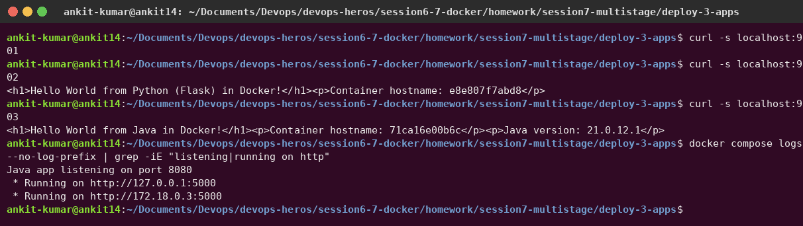
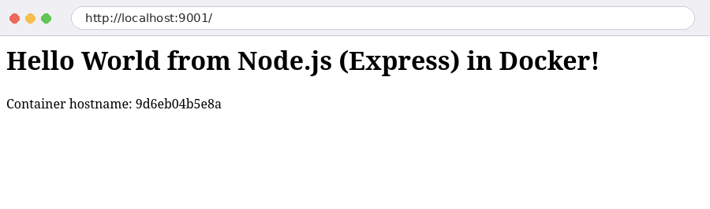
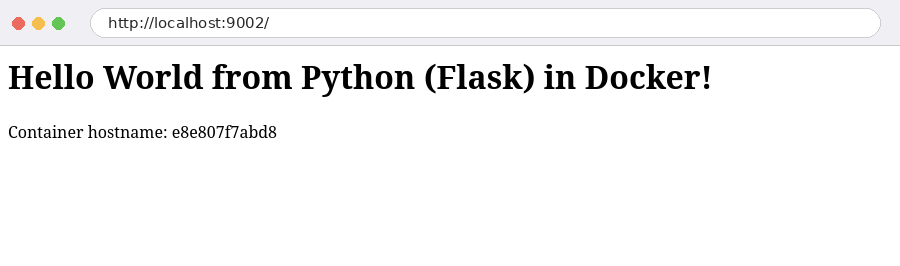
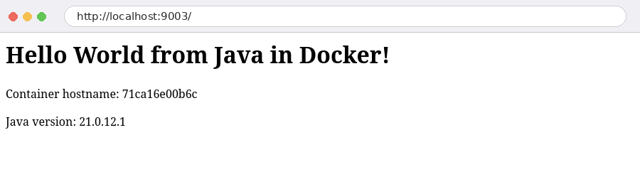

# Session 07 – Dockerfiles & Images: Multi-Stage Build

| | |
|---|---|
| **Name** | Ankit Kumar |
| **Enrollment number** | `<ENROLLMENT-NO>` |
| **GitHub** | [ankit14-dev/devops-heros](https://github.com/ankit14-dev/devops-heros) |

---

## Task 1 – Run the multi-stage Dockerfile

### 1. Clone the repository

I made a sparse, shallow clone of the instructor's repo that downloads only the `multi-stage-dockerfile` folder:

```bash
git clone --depth 1 --filter=blob:none --sparse https://github.com/Nency-Ravaliya/devops-heros.git
cd devops-heros
git sparse-checkout set session6-7-docker/multi-stage-dockerfile
cd session6-7-docker/multi-stage-dockerfile
```



### 2. Build the image with the multi-stage Dockerfile

```dockerfile
# Stage 1: Build
FROM node:24-alpine AS builder
WORKDIR /app
COPY package*.json ./
RUN npm install
COPY . .

# Stage 2: Production
FROM node:24-alpine AS production
WORKDIR /app
COPY --from=builder /app/package*.json ./
RUN npm install --omit=dev
COPY --from=builder /app/server.js ./
EXPOSE 3000
CMD ["npm", "start"]
```

```bash
docker build -t multistage-hello:1.0 .
```

The build log shows both stages (`[builder x/5]` and `[production x/5]`). `docker history` shows that the final image contains only the production layers. Dev dependencies and the builder's `COPY . .` are left out.



### 3. Run the container and confirm it's on port 8080

The app listens on **3000** inside the container. I published it on host port **8080**:

```bash
docker run -d --name multistage-app -p 8080:3000 multistage-hello:1.0
docker ps --filter name=multistage-app
docker port multistage-app
curl http://localhost:8080
```

`docker ps` shows `0.0.0.0:8080->3000/tcp`, and `ss -tln` confirms the host is listening on 8080:



### 4. Access the application – "Hello World from Docker multi-stage build"



Text output:

```text
$ curl -s http://localhost:8080
<h1>Hello World from Docker Multi-Stage Build!</h1>

$ docker ps --filter name=multistage-app
CONTAINER ID   IMAGE                  COMMAND                  STATUS         PORTS                                         NAMES
f07ad37475bf   multistage-hello:1.0   "docker-entrypoint.s…"   Up 2 seconds   0.0.0.0:8080->3000/tcp, [::]:8080->3000/tcp   multistage-app
```

### Why multi-stage?

| Single-stage | Multi-stage |
|---|---|
| Build tools, dev dependencies and source end up in the final image | Only what is needed at runtime is copied with `COPY --from=builder` |
| Bigger image, larger attack surface | Smaller image, fewer CVEs, faster pulls |
| One `FROM` | Several `FROM ... AS name` stages; only the last one is shipped |

My Session 6 [Java app](../session6-hello-world/java-app/Dockerfile) (JDK → JRE) and [React app](../session6-hello-world/React-app/Dockerfile) (Node → Nginx, final image 93.9 MB) use the same pattern.

---

## Task 2 – Documentation

This file covers it: name, enrollment number, the application running successfully (screenshots 3 and 4) and `docker ps` showing the container on port 8080 (screenshot 3).

---

## Task 3 – Deploy 3 different types of applications

I deployed **Node.js, Python and Java** apps together with Docker Compose. [`deploy-3-apps/docker-compose.yml`](deploy-3-apps/docker-compose.yml) builds each image from my Session 6 app folders:

| Service | Language | Host port → container port |
|---|---|---|
| `node-app` | Node.js / Express | 9001 → 3000 |
| `python-app` | Python / Flask | 9002 → 5000 |
| `java-app` | Java 21 (multi-stage JDK → JRE) | 9003 → 8080 |

```bash
cd deploy-3-apps
docker compose up -d --build
docker compose ps
```





| Node.js – :9001 | Python – :9002 | Java – :9003 |
|---|---|---|
|  |  |  |

Clean up:

```bash
docker compose down
docker rm -f multistage-app
```
