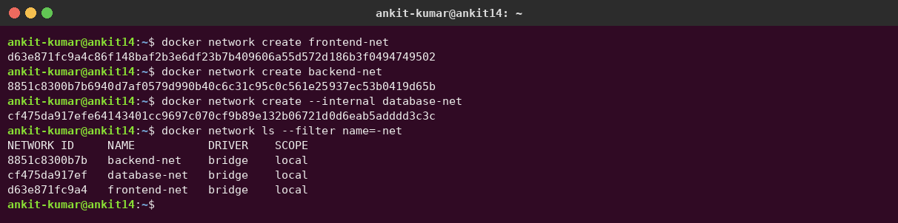
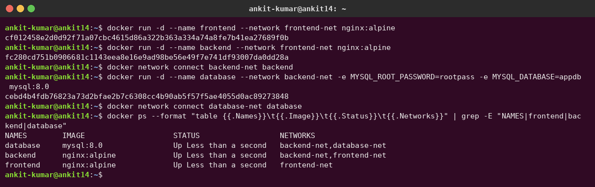
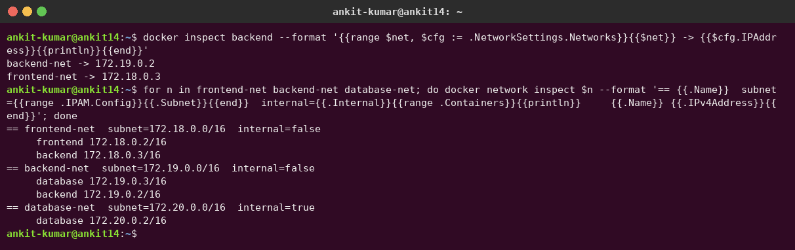
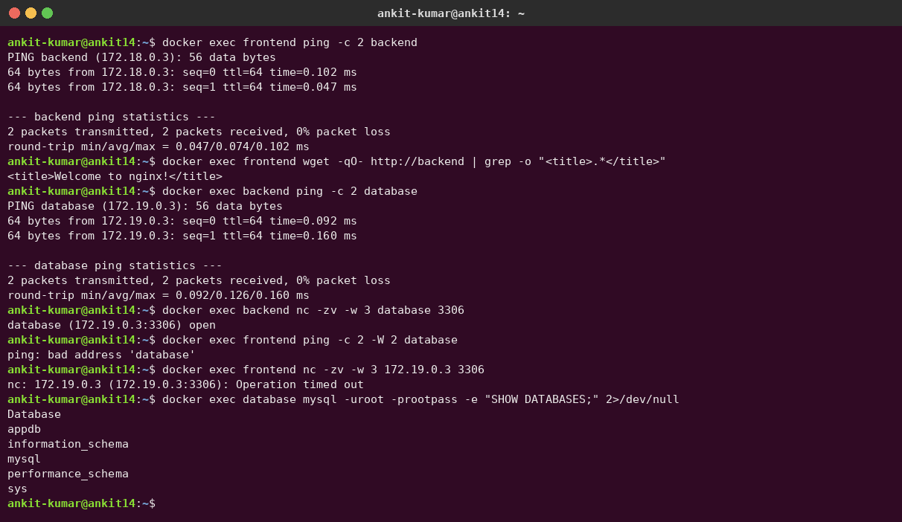
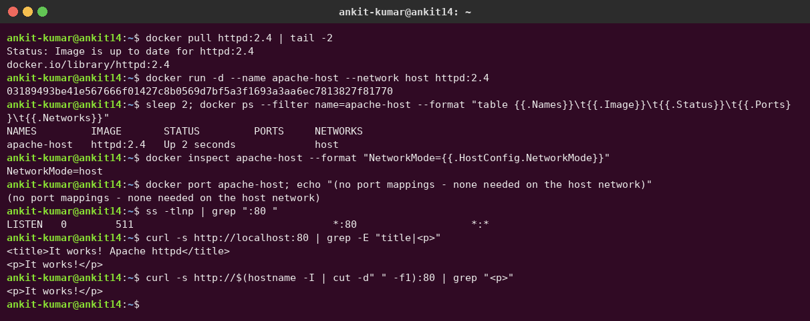
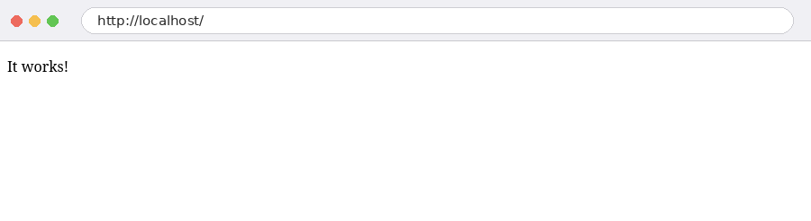
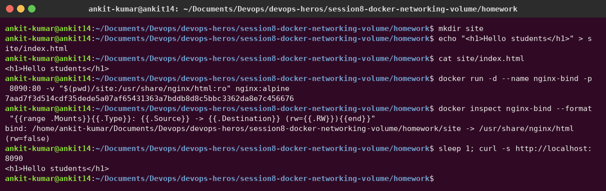
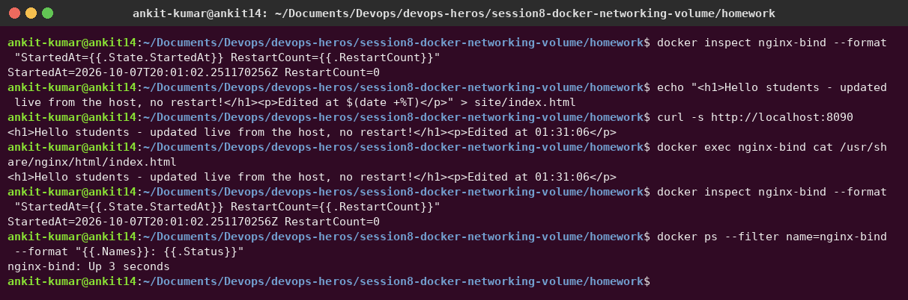

# Session 08 – Docker Networking & Volumes

**Author:** Ankit Kumar
**Docker:** 29.1.3 on Ubuntu 26.04

---

## Task 1 – Container networking: frontend, backend, database

### Design

```text
            frontend-net (172.18.0.0/16)          backend-net (172.19.0.0/16)       database-net (172.20.0.0/16, --internal)
        ┌───────────────────────────────┐    ┌────────────────────────────────┐    ┌─────────────────────────┐
        │  frontend        backend ─────┼────┼──── backend        database ───┼────┼──── database           │
        │  nginx:alpine    nginx:alpine │    │                    mysql:8.0   │    │   (no internet access)  │
        └───────────────────────────────┘    └────────────────────────────────┘    └─────────────────────────┘
```

- **3 networks:** `frontend-net`, `backend-net`, and `database-net` (`--internal` = no route to the internet).
- **backend is on 2 networks** (`frontend-net` + `backend-net`), so it is the only bridge between the web tier and the data tier.
- frontend and database share **no** network, so they must not be able to talk to each other.

### Create the networks

```bash
docker network create frontend-net
docker network create backend-net
docker network create --internal database-net
```



### Create the 3 containers and attach backend to a second network

```bash
docker run -d --name frontend --network frontend-net nginx:alpine
docker run -d --name backend  --network frontend-net nginx:alpine
docker network connect backend-net backend            # backend is now on 2 networks
docker run -d --name database --network backend-net \
  -e MYSQL_ROOT_PASSWORD=rootpass -e MYSQL_DATABASE=appdb mysql:8.0
docker network connect database-net database
```



`backend` has one IP per network (172.18.0.3 and 172.19.0.2):



### Check connectivity

| From → To | Shared network? | Result |
|---|---|---|
| frontend → backend (ping + HTTP) | frontend-net | ✅ reachable, DNS name `backend` resolves |
| backend → database (ping + MySQL port 3306) | backend-net | ✅ `database (172.19.0.3:3306) open` |
| frontend → database (by name) | none | ❌ `ping: bad address 'database'` – no DNS entry |
| frontend → database (by IP 172.19.0.3:3306) | none | ❌ `Operation timed out` – the networks are isolated |



**Observation:** user-defined bridge networks give **automatic DNS by container name** and **isolation between networks**. Putting the backend on two networks is the classic 3-tier pattern: the frontend can never reach the database directly.

---

## Task 2 – Apache2 on the host network

```bash
docker pull httpd:2.4
docker run -d --name apache-host --network host httpd:2.4
curl http://localhost:80
```

With `--network host` the container shares the host's network stack: there is no container IP, no `-p` mapping and `docker port` is empty. Apache binds **directly to port 80 of my laptop** (`ss -tlnp` shows `*:80`), so it is reachable on `localhost:80` and on my LAN IP.





| Bridge (`-p 8080:80`) | Host (`--network host`) |
|---|---|
| Own network namespace and IP | Shares the host namespace |
| NAT/port-mapping via iptables | No NAT, slightly faster |
| Can run many containers on the same container port | Port conflicts with the host and other containers |

---

## Task 3 – Bind mount

```bash
mkdir site
echo "<h1>Hello students</h1>" > site/index.html
docker run -d --name nginx-bind -p 8090:80 \
  -v "$(pwd)/site:/usr/share/nginx/html:ro" nginx:alpine
curl http://localhost:8090
```




**Modify the file on the host. No restart needed.** I edited `site/index.html`. `curl` and `docker exec cat` immediately show the new content, while `StartedAt` and `RestartCount=0` prove the container was **not** restarted:




The folder used is [`site/`](site). I mounted it `:ro` (read-only), so the container can't change my files.

| Bind mount | Named volume |
|---|---|
| `-v /host/path:/container/path` | `-v myvol:/container/path` |
| Any host folder, managed by me | Stored under `/var/lib/docker/volumes`, managed by Docker |
| Great for development and config files (live edits) | Great for databases and persistent app data (e.g. `db_data` in [`../docker-compose.yml`](../docker-compose.yml)) |

---

## Task 4 – Overlay network research

The full write-up, with a hands-on single-node swarm demo, is in **[overlay-network.md](overlay-network.md)**.

Summary: an **overlay** network spans **multiple Docker hosts**. Containers on different machines get IPs in one virtual subnet. Traffic is wrapped in **VXLAN** (UDP 4789), the swarm control plane (TCP 2377, TCP/UDP 7946) shares which container lives where, and `--opt encrypted` adds IPsec. It's used for Docker Swarm services and multi-host microservices. Kubernetes uses CNI plugins (Flannel VXLAN, Calico) for the same job.


---

## Cleanup

```bash
docker rm -f frontend backend database apache-host nginx-bind
docker network rm frontend-net backend-net database-net
```
