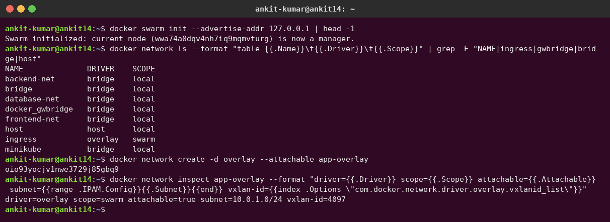
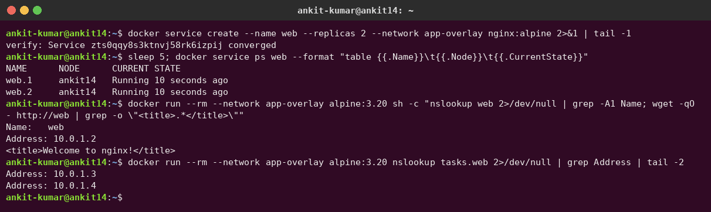
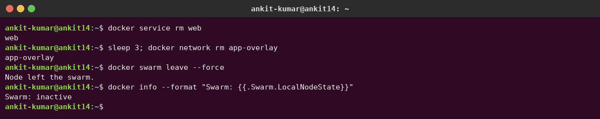

# Task 4 – Research: Docker Overlay Networks

**Author:** Ankit Kumar

In the hands-on tasks I used **bridge** networks (frontend/backend/db) and the **host** network (Apache). Both of those only work on a *single* Docker host. This note is my research on the **overlay** driver, which is how Docker connects containers that live on *different* hosts.

---

## 1. What is an overlay network?

An overlay network is a **virtual Layer-2 network stretched across multiple Docker hosts**. Containers attached to the same overlay get IPs from one subnet (for example `10.0.1.0/24`) and can talk to each other by name, even though they physically run on different machines.

The real (physical/cloud) network between the hosts is called the **underlay**. The overlay is built "on top" of it by **encapsulating** container packets inside UDP packets (VXLAN) that travel host-to-host over the underlay.

Overlay networks are a feature of **Docker Swarm mode**. A host must be part of a swarm (`docker swarm init` / `join`) before it can create or use one.

---

## 2. Docker network drivers compared

| Driver | Scope | How it works | Container IP | Typical use case |
|---|---|---|---|---|
| `bridge` | Single host | Linux bridge (`docker0` or a user-defined bridge) + NAT/iptables to reach outside | Private (e.g. `172.18.0.x`) | Default for standalone containers; Compose apps on one machine |
| `host` | Single host | Container shares the host's network namespace – no isolation | Same as host | Max network performance, apps that need many ports (my Apache task) |
| `none` | Single host | Only a loopback interface | None (just `127.0.0.1`) | Fully isolated jobs, batch processing, security testing |
| `overlay` | **Multi-host (swarm)** | VXLAN tunnels between hosts, control plane via Swarm | Private overlay subnet (e.g. `10.0.1.x`) | Swarm services, microservices spread across nodes |
| `macvlan` | Single host (attached to the physical LAN) | Each container gets its **own MAC address** on a parent NIC | Real LAN IP | Legacy apps that must look like physical devices on the LAN |
| `ipvlan` | Single host (attached to the physical LAN) | Containers share the parent NIC's MAC; L2 or L3 mode | Real LAN IP (L2) or routed subnet (L3) | Like macvlan but where switches limit MACs per port / no promiscuous mode |

Quick notes I want to remember:

- Only **user-defined** bridges give automatic DNS by container name; the default `docker0` bridge does not.
- With `macvlan`, the host itself cannot reach its own macvlan containers by default (the parent interface blocks host-to-child traffic) unless you add a macvlan sub-interface on the host.
- `overlay` is the only built-in driver whose scope is `swarm` instead of `local`.

```bash
docker network ls   # the SCOPE column shows "local" vs "swarm"
```

Real output on my machine after `docker swarm init`: `ingress` is the only network with `overlay`/`swarm` scope, and `docker_gwbridge` appeared automatically.



---

## 3. Use cases

1. **Swarm services across hosts** – a `web` service with 3 replicas on node1 and an `api` service on node2 can reach each other as `http://api:8080` because both are on the same overlay. Swarm's built-in DNS resolves the service name to a virtual IP (VIP).
2. **Multi-host microservices** – each tier (frontend, backend, db) can get its own overlay, the same isolation idea I used with bridges in Tasks 1–3, but now spanning the whole cluster.
3. **Attachable overlays for standalone containers** – an overlay created with `--attachable` lets a normal `docker run` container (not a service) join it. Useful for debugging (`docker run --rm -it --network my-overlay nicolaka/netshoot`) or for gradually migrating standalone containers into a swarm.
4. **Isolating sensitive traffic** – an encrypted overlay (`--opt encrypted`) protects traffic between hosts when the underlay is not trusted (e.g. across data centers).

---

## 4. How overlay works across multiple hosts

### 4.1 Data plane – VXLAN

- Each overlay network gets a **VXLAN Network Identifier (VNI)**.
- When a container on Host A sends a packet to a container on Host B, the packet goes into a VXLAN tunnel endpoint (VTEP) inside a hidden network namespace on Host A.
- The original Ethernet frame is wrapped in **VXLAN header + UDP + outer IP** (Host A IP → Host B IP), sent over **UDP port 4789**, and unwrapped on Host B.
- The encapsulation adds ~50 bytes, so the effective MTU inside the overlay is usually **1450** when the underlay MTU is 1500.

### 4.2 Control plane – how hosts learn "who is where"

- **Raft (managers only, TCP 2377):** manager nodes keep the cluster state (services, networks, tasks) in a replicated Raft log. Workers join and talk to managers on TCP 2377.
- **Gossip (all nodes, TCP/UDP 7946):** nodes exchange overlay network information (which container IP/MAC lives on which host) using a gossip protocol, so every host can program its VXLAN forwarding tables without a central lookup per packet.
- Network state is only pushed to a worker when that worker runs a task attached to that network – overlays are created lazily on workers.

### 4.3 Ports that must be open between nodes

| Port | Protocol | Purpose |
|---|---|---|
| 2377 | TCP | Swarm cluster management (to managers) |
| 7946 | TCP + UDP | Node discovery / gossip control plane |
| 4789 | UDP | VXLAN data plane (overlay traffic) |
| IP protocol 50 (ESP) | – | Only if using encrypted overlays (IPsec) |

### 4.4 The ingress network and routing mesh

`docker swarm init` automatically creates a special overlay called **`ingress`**. When a service publishes a port (`-p 8080:80`), **every node** in the swarm listens on 8080, even nodes not running a replica. Incoming traffic is load-balanced (IPVS) through the `ingress` overlay to a healthy task somewhere in the cluster. This is the **routing mesh**. It can be bypassed with `--publish mode=host`.

### 4.5 docker_gwbridge

Also created automatically: a local **bridge** network named `docker_gwbridge`. It connects overlay containers to the host's physical network, so a container on an overlay can reach the internet (egress) and the ingress traffic can enter the container. Each overlay container therefore usually has two interfaces: one on the overlay, one on `docker_gwbridge`.

### 4.6 Encrypted overlays

```bash
docker network create -d overlay --opt encrypted secure-net
```

- Encrypts **data-plane** (container-to-container) traffic with **IPsec ESP** (AES-GCM) between nodes.
- Swarm managers generate and rotate the keys automatically (every 12 hours).
- Control-plane traffic (Raft/gossip) is always encrypted with TLS anyway; this option is about application traffic.
- Costs CPU; not supported for Windows nodes.

### 4.7 Diagram – two hosts on one overlay

```text
          Host A (192.168.1.10)                        Host B (192.168.1.11)
 +-------------------------------------+     +-------------------------------------+
 |  +-----------+      +-----------+   |     |   +-----------+                     |
 |  |  web.1    |      |  web.2    |   |     |   |  api.1    |                     |
 |  | 10.0.1.3  |      | 10.0.1.4  |   |     |   | 10.0.1.5  |                     |
 |  +-----+-----+      +-----+-----+   |     |   +-----+-----+                     |
 |        |   overlay "app-net"  |     |     |         |  overlay "app-net"        |
 |  +-----+----------------------+--+  |     |  +------+------------------------+  |
 |  |  br0 + VXLAN VTEP (VNI 4097)  |  |     |  |  br0 + VXLAN VTEP (VNI 4097)  |  |
 |  +---------------+---------------+  |     |  +---------------+---------------+  |
 |                  |  eth0            |     |                  |  eth0            |
 +------------------+------------------+     +------------------+------------------+
                    |                                           |
                    |   [outer IP 192.168.1.10 -> .11]          |
                    +====[ UDP 4789 | VXLAN | inner frame ]=====+
                              physical / cloud underlay
   Control plane:  TCP 2377 (Raft, managers)   TCP/UDP 7946 (gossip, all nodes)
```

`web.1` sends to `10.0.1.5`; it never knows that `api.1` is on another machine.

---

## 5. Example commands

```bash
# On the manager (Host A)
docker swarm init --advertise-addr 192.168.1.10
# prints a "docker swarm join --token SWMTKN-... 192.168.1.10:2377" command

# On the worker (Host B)
docker swarm join --token <worker-token> 192.168.1.10:2377

# Back on the manager
docker node ls

# Create an attachable overlay with a custom subnet
docker network create -d overlay --attachable --subnet 10.0.1.0/24 app-net

# Run services on it
docker service create --name api --network app-net --replicas 2 hashicorp/http-echo -text="hello from api"
docker service create --name web --network app-net --replicas 3 -p 8080:80 nginx:alpine

# See where tasks landed
docker service ps web

# Standalone container joining the same overlay (works because of --attachable)
docker run --rm -it --network app-net alpine sh -c "nslookup api && wget -qO- http://api:5678"

# Inspect the network (subnet, VNI, peers)
docker network inspect app-net
```

### What I actually ran (single-node swarm)

I created an attachable overlay `app-overlay` (VXLAN ID 4097, subnet 10.0.1.0/24), started a 2-replica `web` service on it, and then attached a standalone `alpine` container. `web` resolves to the service **VIP** (10.0.1.2), while `tasks.web` returns the individual task IPs (10.0.1.3, 10.0.1.4):



Cleanup:



Cleanup:

```bash
docker service rm web api
docker network rm app-net
docker swarm leave --force
```

---

## 6. Limitations

- **Needs Swarm mode.** Overlay is tied to Swarm; without a swarm you can't create one (the old external key-value store mode is removed in modern Docker).
- **MTU / performance overhead.** VXLAN adds ~50 bytes per packet; if the underlay MTU is already small (some VPNs/clouds), you must lower the overlay MTU (`--opt com.docker.network.driver.mtu=1400`) or you get hanging connections and fragmentation.
- **Firewall requirements.** Ports 2377, 7946, 4789 (and ESP for encryption) must be open between all nodes; cloud security groups often block them.
- **Encryption cost.** `--opt encrypted` adds CPU overhead and is not available on Windows nodes.
- **Subnet exhaustion / overlap.** Default address pool is `10.0.0.0/8` split into `/24`s; it can collide with corporate or VPC ranges if not planned (`docker swarm init --default-addr-pool`).
- **Debugging is harder.** Traffic lives in hidden namespaces and tunnels; `tcpdump` on the host shows only UDP 4789.
- **Smaller ecosystem.** Swarm is stable but much less used than Kubernetes, so fewer tools target it.

---

## 7. Docker overlay vs Kubernetes CNI

Kubernetes doesn't use Docker's network drivers at all. It defines the **CNI (Container Network Interface)** and lets a plugin implement the "every Pod can reach every other Pod without NAT" model.

| Aspect | Docker overlay (Swarm) | Flannel (VXLAN backend) | Calico |
|---|---|---|---|
| Orchestrator | Docker Swarm | Kubernetes (CNI) | Kubernetes (CNI), also VMs/bare metal |
| Encapsulation | VXLAN, UDP 4789 | VXLAN, UDP 8472 by default (Linux kernel default) | None (pure BGP routing), or IP-in-IP, or VXLAN |
| Control plane | Swarm Raft + gossip | Subnet leases stored in the Kubernetes API (or etcd) | BGP between nodes (BIRD) + datastore (K8s API/etcd) |
| Network model | Per-network subnets, multiple overlays | One flat Pod CIDR, a `/24` per node | One flat Pod CIDR, IP pools/blocks |
| Network policy | No (only network-level isolation) | No (pair with Calico = "Canal") | Yes, full NetworkPolicy + its own policies |
| Encryption | IPsec via `--opt encrypted` | Optional (WireGuard / IPsec backends) | Optional WireGuard |

Conceptually Docker overlay and Flannel-VXLAN are very similar (L2-over-UDP tunnels between hosts). The big difference is that Kubernetes separates the **orchestrator** from the **networking plugin**, so you can swap Flannel for Calico, Cilium, etc., and add NetworkPolicy, which Swarm overlays do not offer.

---

## 8. Summary

- `bridge`, `host`, `none`, `macvlan`, `ipvlan` are **single-host**; `overlay` is the **multi-host** driver.
- Overlay = **VXLAN data plane (UDP 4789)** + **Swarm control plane (Raft on 2377, gossip on 7946)**.
- Swarm gives you the `ingress` overlay (routing mesh) and `docker_gwbridge` (egress) for free.
- `--attachable` lets standalone containers join; `--opt encrypted` adds IPsec.
- In Kubernetes the same job is done by CNI plugins like Flannel and Calico.
