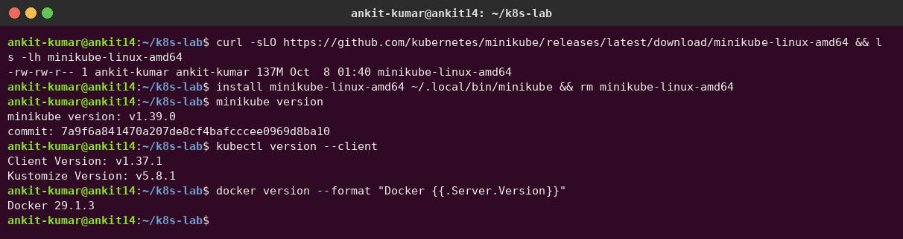
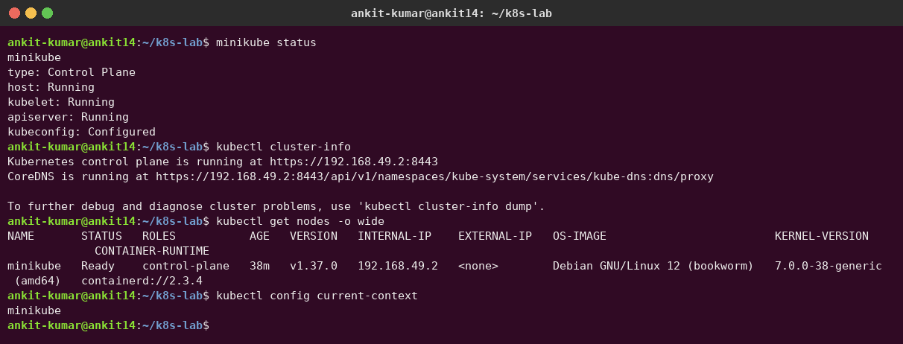
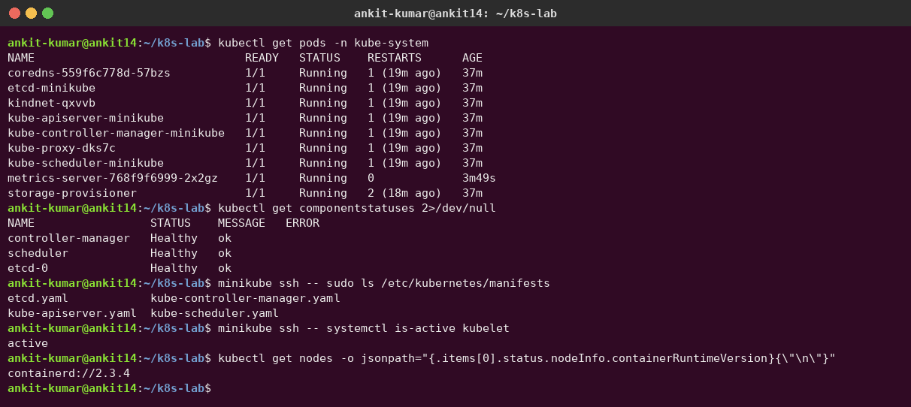
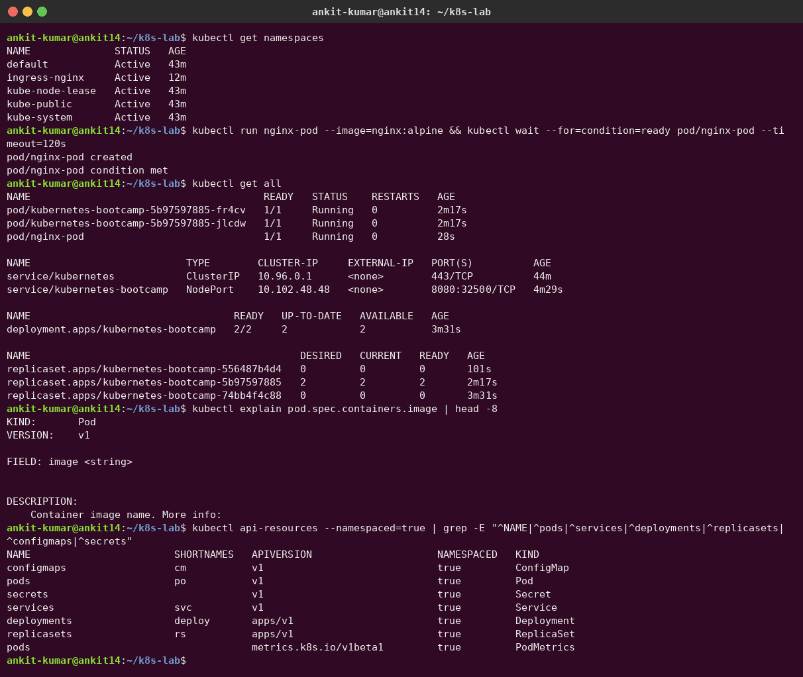
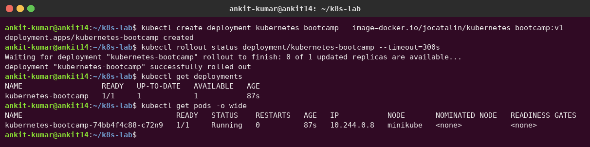
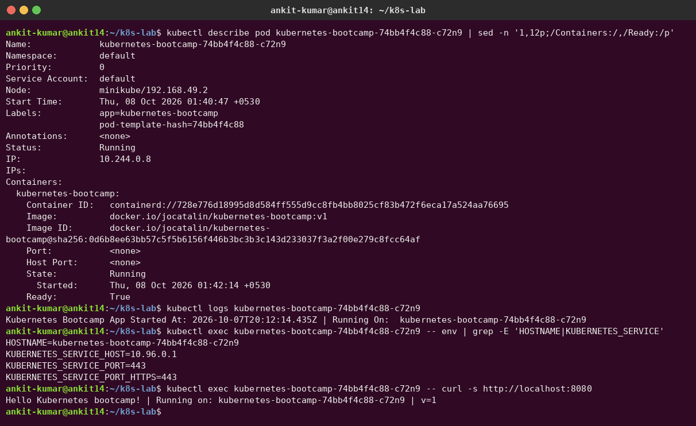
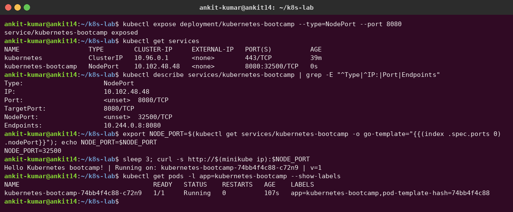
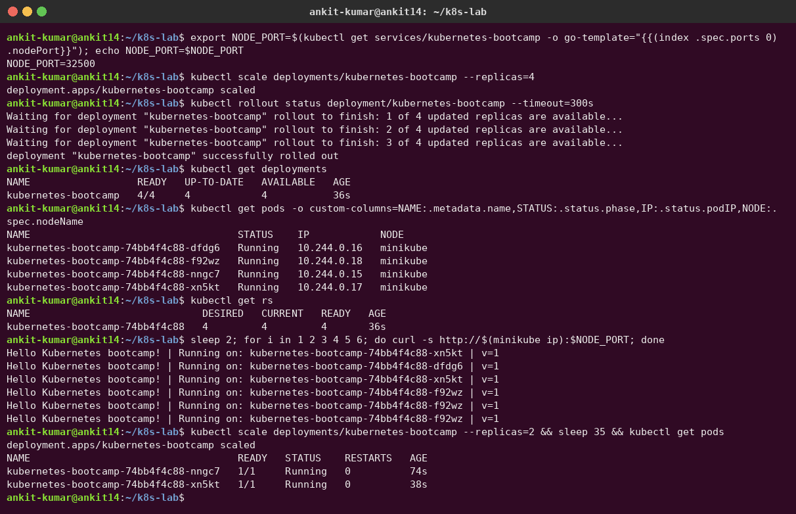
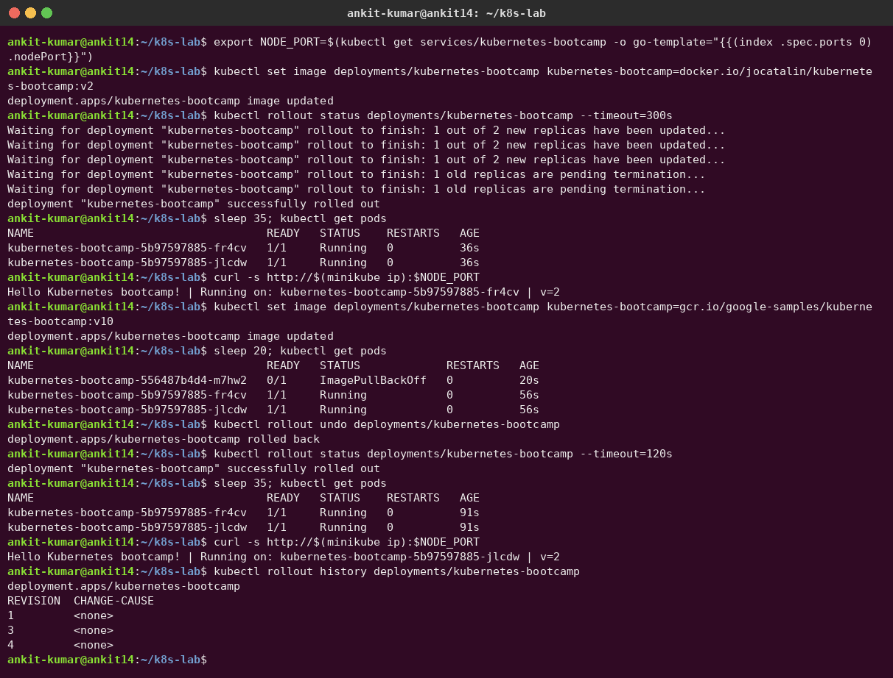
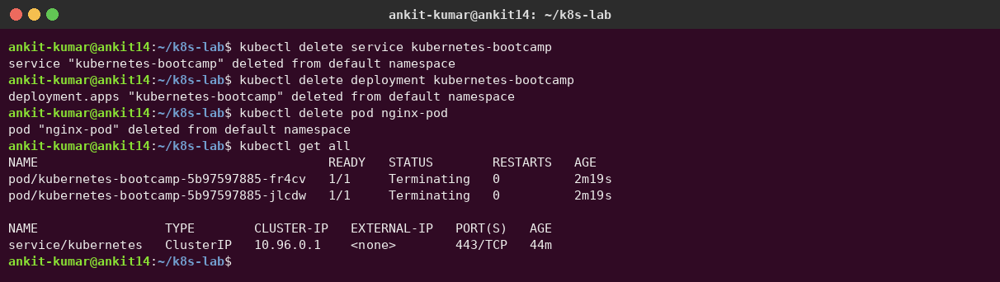

# Session 09 – Kubernetes Fundamentals

**Author:** Ankit Kumar
**Cluster:** minikube v1.39.0 (Docker driver), Kubernetes v1.37.0, containerd 2.3.4, kubectl v1.37.1

My architecture notes from class are also in [`../submission.md`](../submission.md).

---

## 1. Install and configure Minikube

```bash
curl -LO https://github.com/kubernetes/minikube/releases/latest/download/minikube-linux-amd64
install minikube-linux-amd64 ~/.local/bin/minikube        # no sudo needed: ~/.local/bin is on my PATH
curl -LO "https://dl.k8s.io/release/$(curl -sL https://dl.k8s.io/release/stable.txt)/bin/linux/amd64/kubectl"
install kubectl ~/.local/bin/kubectl
minikube start --driver=docker --cpus=4 --memory=6144
```



## 2. Verify cluster status

```bash
minikube status
kubectl cluster-info
kubectl get nodes -o wide
```



## 3. Explore the Kubernetes architecture

Every control-plane and node component runs on my single minikube node:



```text
                 ┌──────────────────────── CONTROL PLANE ────────────────────────┐
 kubectl ──────► │ kube-apiserver ◄──► etcd (cluster state, key-value store)     │
   (HTTPS)       │      ▲   ▲                                                    │
                 │      │   └── kube-scheduler (picks a node for new pods)       │
                 │      └────── kube-controller-manager (desired == actual?)     │
                 └──────┼────────────────────────────────────────────────────────┘
                        │ watch / report status
                 ┌──────▼──────────────────── WORKER NODE ───────────────────────┐
                 │ kubelet ──► containerd ──► Pods (containers)                  │
                 │ kube-proxy (Service → Pod rules)   CNI: kindnet (pod network) │
                 │ CoreDNS (cluster DNS, runs as pods)                           │
                 └───────────────────────────────────────────────────────────────┘
```

### Short notes

| Component | Where | Job |
|---|---|---|
| **kube-apiserver** | control plane | Front door of the cluster. Every `kubectl` command and every component talks only to it (REST over HTTPS). It validates requests and stores the result in etcd. |
| **etcd** | control plane | Consistent key-value store that holds the **whole cluster state** (desired + current). Back it up! |
| **kube-scheduler** | control plane | Watches for pods with no node and picks the best node (resources, affinity, taints). |
| **kube-controller-manager** | control plane | Runs control loops (Deployment, ReplicaSet, Node, Job…) that keep **actual state = desired state**. |
| **kubelet** | every node | Agent that makes sure the containers of the pods assigned to its node are running and healthy. It reports back to the API server. |
| **kube-proxy** | every node | Programs iptables/IPVS rules so traffic to a **Service** IP reaches a healthy pod. |
| **Container runtime** | every node | Actually runs containers (here **containerd**, via the CRI). |
| **CNI plugin** | every node | Gives every pod an IP and connects pods across nodes (here **kindnet**). |
| **CoreDNS** | pods in kube-system | Cluster DNS: `my-svc.my-ns.svc.cluster.local`. |

On minikube the control-plane parts are **static pods**: the kubelet starts them directly from the YAML files in `/etc/kubernetes/manifests` (`etcd.yaml`, `kube-apiserver.yaml` …), as the screenshot shows.

**Flow of `kubectl create deployment`:** kubectl → API server → etcd stores the Deployment → the Deployment controller creates a ReplicaSet → the ReplicaSet controller creates Pods → the scheduler assigns a node → the kubelet on that node asks containerd to start the container → the status flows back to the API server.

## 4. Basic objects and commands



| Object | Purpose |
|---|---|
| **Pod** | Smallest deployable unit: one or more containers sharing a network namespace and volumes |
| **ReplicaSet** | Keeps N identical pods running |
| **Deployment** | Manages ReplicaSets and gives rolling updates and rollbacks |
| **Service** | Stable IP and DNS name plus load balancing in front of pods |
| **Namespace** | Virtual cluster for isolating and organizing resources |
| **ConfigMap / Secret** | Configuration / sensitive data injected into pods |

| Command | What it does |
|---|---|
| `kubectl get <kind> [-o wide\|yaml]` | List resources |
| `kubectl describe <kind> <name>` | Details + events |
| `kubectl logs <pod>` | Container logs |
| `kubectl exec -it <pod> -- sh` | Run a command inside a container |
| `kubectl create deployment / run / expose` | Create resources imperatively |
| `kubectl apply -f file.yaml` | Create or update resources declaratively |
| `kubectl scale`, `kubectl set image`, `kubectl rollout status/undo/history` | Scale, update, roll back |
| `kubectl explain <field>` | Built-in documentation for any field |
| `kubectl delete <kind> <name>` | Delete resources |

## 5. Kubernetes Basics tutorial – hands-on

I followed all modules of the [official tutorial](https://kubernetes.io/docs/tutorials/kubernetes-basics/) on my minikube cluster.

### Module 2 – Create a Deployment

```bash
kubectl create deployment kubernetes-bootcamp --image=docker.io/jocatalin/kubernetes-bootcamp:v1
kubectl get deployments
```



### Module 3 – Explore the app (describe, logs, exec)



### Module 4 – Expose the app with a Service (NodePort)

```bash
kubectl expose deployment/kubernetes-bootcamp --type=NodePort --port 8080
export NODE_PORT=$(kubectl get services/kubernetes-bootcamp -o go-template='{{(index .spec.ports 0).nodePort}}')
curl http://$(minikube ip):$NODE_PORT
```



### Module 5 – Scale the app

I scaled to 4 replicas. Repeated `curl` calls are answered by **different pods** (`xn5kt`, `dfdg6`, `f92wz`), so the Service load-balances across them. Then I scaled back down to 2.



### Module 6 – Rolling update and rollback

- `set image … :v2`: the pods are replaced one at a time, so the app stays available. `curl` now returns `v=2`.
- `set image … :v10` (an image that doesn't exist): the new pod gets stuck in `ImagePullBackOff`, but the **old v2 pods keep serving traffic**. A rolling update never takes down everything at once.
- `kubectl rollout undo`: back to the working revision.



### Cleanup



## What I learned

- Kubernetes is **declarative**: I describe the desired state and controllers keep reconciling to it (deleted pods come back, failed updates don't take the app down).
- Pods are disposable and their IPs change. **Services** give a stable endpoint.
- `describe` + `logs` + events are the first tools for debugging (e.g. the `ImagePullBackOff` above).
